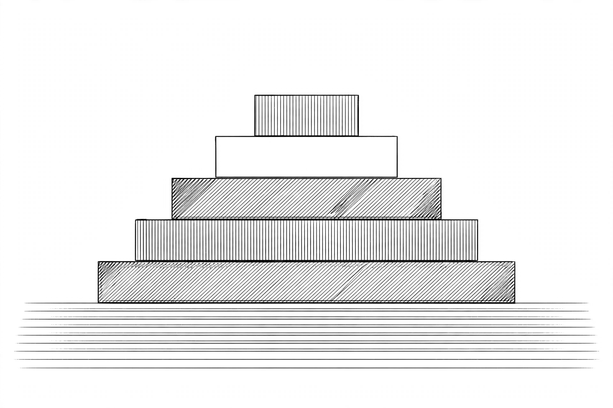
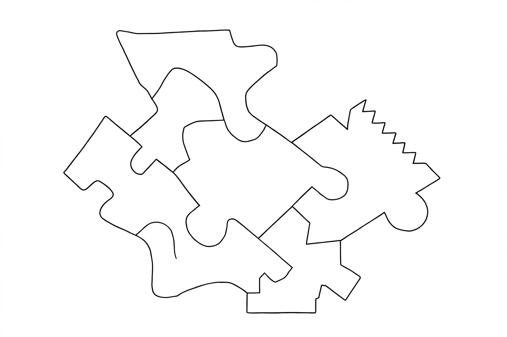
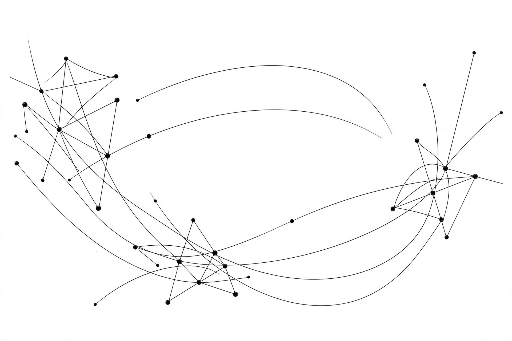
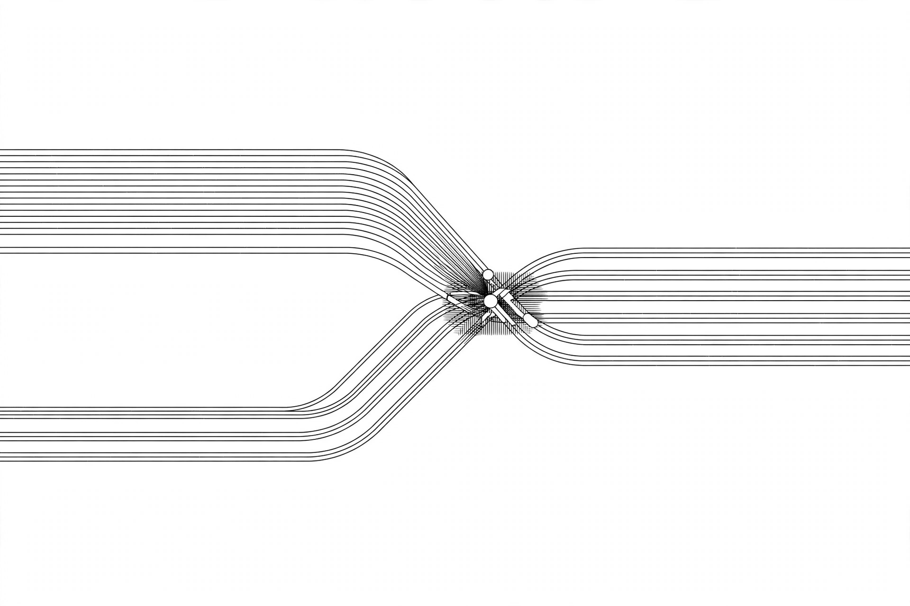

# Software Architecture

# Front Matter {-}


<div class=" page-break "></div>

## Preface {-}


这本书写给那个总被要求"拿个主意"的开发者。

你一定经历过那个时刻：团队围在白板前。单体还是微服务？SQL 还是别的？同步还是异步？所有人都看着你，你突然意识到，答案不在任何框架文档里。答案是一个判断——而你得做出它，为它辩护，然后跟它一起生活好几年。

这就是架构师的工作。不是画方块图。是做出经得起变化、经得起团队、经得起规模的决策。

这本书直接教这门手艺。十章，五十节。每一节讲一个你真正用得上的想法：它是什么，为什么重要，在真实的 C# 代码里长什么样，以及盲目套用会在哪里咬你一口。代码全部是 .NET 8+ 风格——Minimal API、record、依赖注入——因为架构思想只有落在你可能亲手写的代码里，才算真的。

关于怎么读这本书，有三点说明：

第一，各章是递进的，但各节独立。如果你已经知道 ADR 是什么，直接跳过那一节。等你需要说服团队开始写 ADR 时再回来。

第二，跟这本书抬杠。每一节结尾都有一个权衡或陷阱，因为架构思想没有免费的。如果某一节让你不舒服，很好——那种不舒服，就是做真实决策的感觉。

第三，练。第十章给了架构 kata 和设计评审的方法。决策是一种技能，技能靠练，不靠读。

还有一件事：做这份工作不需要头衔里带"架构师"。从你开始对结构、边界和权衡做决策，并为其后果负责的那一刻起，你就是在做架构。这本书只是让你做得更清醒。

开始吧。

<div class=" page-break "></div>

<p class=" chapter-number ">Chapter 1</p>

# Foundations & Role




架构不是挂在墙上的那张图。它是那组难以更改的决策：谁依赖谁、承重墙砌在哪里、无人值守时系统必须如何表现。

本章打地基。我们把架构定义为决策，而非图纸。我们厘清真正做决策的人——架构师、资深开发、技术负责人——各自负责什么，界线在哪里模糊。我们点名压在每一座结构上的那些力：质量属性、没人看但一慢就致命的非功能需求，以及决定"好"到底是什么意思的干系人和约束。

贯穿全章只有一根线：架构是在约束之下做决策。你作为架构师的工作，是把重要的决策摆到台面上，把系统必须成为什么量化清楚，并且在真正不得不关门之前，尽可能让选项保持开放。

# 贯穿案例 · 好食光

2015 年，三个人的外卖点餐应用"好食光"上线了。

老陈写后端，阿 May 写前端，大刘是兼职运维——白天在另一家公司上班，晚上才回消息。应用很简单：附近餐馆列表、点菜、下单、电话通知商家。三个人挤在一间合租办公室里，一台云主机加一个 Postgres，六周把第一版怼上线。

上线那天没人意识到，他们其实做了一次架构决策：选 Postgres 做唯一的数据存储。这个决策以后会像承重墙一样，十年里每一次"要不要换库""要不要分库""要不要加缓存"的争论，都得先绕过它。它几乎没花一分钱，却是全书第一个"难以逆转的决策"。

三个人的分工也值得记住。老陈拍板技术选型——他是事实上的架构师；阿 May 把功能拆成迭代、顶着商家改需求——她是事实上的技术负责人；大刘半夜被告警叫醒，修好了 Postgres 的慢查询——他是事实上的资深开发。没有任命，没有头衔，但决策权已经各就各位。

代价？几乎为零。一台云主机，一个数据库，三个人。但从这一天起，每一次"先这样，以后再说"，都会在后面的章节里连本带利地回来找他们。

<div class=" page-break "></div>

## What Architecture Actually Is


问十个开发者"软件架构是什么"，你会得到十一个答案，而且错法都一样：把架构和结构、和图纸、和框架搞混了。装满方框和箭头的文件夹不是架构，那只是架构的画像，就像户型图只是房子的画像。

架构是决策。具体说，是那些一旦定下来就很难改的决策。

## 是决策，不是图纸

Ralph Johnson 说得好：架构就是重要的东西，不管那是什么。Grady Booch 把它磨得更锋利：架构代表塑造系统的重大设计决策，而"重大"用变更成本来衡量。如果一个东西周二下午就能换掉还没人发现，那它从来就不是架构层面的东西。

选 React 还是 Blazor？架构级——它把团队、招聘、部署故事锁定好几年。局部变量叫什么名字？不是架构级。检验方法很简单：如果选错了意味着要重写系统的一大块，那它就属于架构讨论。

这就是为什么资深开发者会为"用微服务还是模块"吵个没完。吵的不是品味，是可逆性。拆分良好的模块化单体以后还能拆；分布式单体拆开就合不回去了。保留可逆性的那个决策，早期几乎总是对的。

## 结构应该尖叫出它的意图

另一半在这里：决策定下来之后，结构必须把它们喊出来。这就是 "screaming architecture" 的意思。打开一个电商系统的仓库根目录，你应该看到 Cart、Checkout、Inventory、Pricing——而不是 Controllers、Models、Helpers。

大多数代码库尖叫的是框架。你打开顶层，看到的是当年流行哪个 Web 框架的供状：`Controllers/`、`ViewModels/`、`DTOs/`。框架只是交付机制，是细节。业务才是正事。结构喊出业务，新人逛一圈文件夹就懂了领域；结构喊出框架，新人除了知道你选了什么技术栈，什么也学不到。

## 让你的决策看得见

有个小习惯能让看不见的东西看得见。把你的架构决策声明成数据——就放在代码库里，让它们没法被无视：

```csharp
// 架构决策记录（ADR）：存在 docs/adr，代码评审时强制执行
public record ArchitectureDecision(
    int Number,
    string Title,
    string Status,      // proposed | accepted | superseded
    string Context,
    string Decision,
    string Consequences);

var adr4 = new ArchitectureDecision(
    Number: 4,
    Title: "Modular monolith over microservices",
    Status: "accepted",
    Context: "团队 6 人。没有专职运维。部署预算只有一条流水线。",
    Decision: "限界上下文变成程序集。上下文之间不允许网络调用。",
    Consequences: "以后可以把某个模块拆成服务；反过来几乎不可能。");
```

这就是 Architecture Decision Record，ADR。写它花十分钟，省的是几个月的考古时间。半年后有人问"当初为什么不用微服务"，答案不在某个 Slack 记录里，它是一个文件。

为什么重要：没写下来的决策会被重新决策一遍，而且通常决策得更差，因为做决策的人没有当初的上下文。每个团队都有这种故事：某个"聪明"的重写，生产挂掉之后才重新发现老设计为什么长那样。

## 反模式

最常见的错误用法：把 ADR 做成文书工作。

开始得很体面：模板、编号、评审流程。三个月后，选个日志库都要走一遍"提议—评审—批准"，十二个必填字段。工程师开始抄模板交差——记录越来越厚，没人看了，因为里面全是"选用 Serilog 而非 NLog"这种事。

为什么诱人：文书看起来像严谨。写了五十份 ADR 的人，没法被指责不够认真。

真实代价：仪式感杀死了记录本身。难逆转的决策反而没人写——写一份要填十二个字段、等三个人评审。真正的架构决策退回走廊和聊天记录。更糟的是，团队把"写了 ADR"当成"做了决策"：纸面上有，现实里没有。

**Trade-off:** 记录决策是有成本的。每个选择都写 ADR 的团队会被仪式感淹死，最后啥也交付不了。ADR 只留给那些难以逆转的决策——选什么数据库、什么部署拓扑、模块边界划在哪。五个好的 ADR 胜过五十个琐碎的。陷阱是把架构做成文书工作，而不是判断力。

<div class=" page-break "></div>

## Architect vs Senior vs Tech Lead


这三个头衔老被搞混，因为同一个人经常戴不止一顶帽子。但职责是不同的，没人知道谁决定什么的时候，决策要么被做两遍，要么没人做。两种都很贵。

## 每个人到底负责什么

资深开发负责代码。他的关注单元是模块、类、Pull Request。他让系统正确、可读、测试充分。他的时间跨度是当前这个迭代。

技术负责人负责团队。他的关注单元是人和交付：扫清阻塞、排工作顺序、保证构建常绿、保证五个开发者不会撞在同一个文件里。他的时间跨度是一个季度。

架构师负责那些难以逆转的决策。他的关注单元是跨团队、跨时间的结构：模块边界、数据归属、系统必须满足的质量属性。他的时间跨度按年算。

注意这个清单里没有什么：架构师并不拥有所有决策。每个 PR 都要评审的架构师，是个戴着高级头衔的瓶颈。健康的分工是：架构师只定那几件搞错了代价很高的事，其他的明确授权出去。

## 决策权，写下来

模糊的归属是角色死亡的地方。下面这种紧凑的写法能把决策权说清楚，适合放进团队的工作协议里：

```csharp
public enum DecisionScope { Code, Team, Architecture }

public record DecisionRight(
    DecisionScope Scope,
    string Owner,        // 谁拍板
    string Consulted,   // 拍板前必须听谁的
    string Examples);

var rights = new DecisionRight[]
{
    new(DecisionScope.Code, "资深开发", "技术负责人",
        "命名、算法、测试策略、模块内部的重构"),
    new(DecisionScope.Team, "技术负责人", "架构师",
        "迭代排期、代码归属、结对轮换、合并策略"),
    new(DecisionScope.Architecture, "架构师", "技术负责人 + 资深开发",
        "模块边界、数据库选型、跨服务契约、NFR 预算"),
};
```

这是 RACI 表的骨架版。"Consulted" 这一列和 "Owner" 一样重要：不跟技术负责人通气就重划模块边界的架构师，会很疼地发现团队按新结构根本交付不出来。

为什么重要：最常见的故障模式是决策漂移。没有写下来的权责，架构师会慢慢变成爱管闲事的资深开发（天天抠 PR），技术负责人会变成项目经理（没有技术话语权），资深开发会变成 ticket 机器（不参与设计）。大家都很忙，但没人去定那些难的事。

## 他们在哪里碰撞

碰撞是正常的。有意思的碰撞有这么几种：

**架构师 vs 技术负责人。** 架构师想要一条干净的新边界；技术负责人知道团队已经淹死了，这个季度付不起重构的账。两个都对。解法不是投票，而是把 trade-off 摆到台面上：边界先欠着，但把这笔技术债写进 ADR——代价是什么、触发偿还的条件是什么。说出口的债可控，藏起来的债是惊吓。

**资深开发 vs 架构师。** 资深开发看到了架构师没看到的更简单的设计。这是礼物，不是威胁。容不下资深开发挑战的架构师，会把系统做成化石。但挑战要发生在设计评审里，而不是某个"顺手重构了一切"的 PR 里。分歧要在正确的层级处理。

**技术负责人 vs 资深开发。** 技术负责人要全库一致；资深开发要局部最优。基础设施代码通常一致性赢，领域代码通常局部适配赢。把这句话说出口，能省掉一百次小争吵。

## 反模式

最常见的错误用法：把头衔当分工。

公司设了"架构师"岗，配了高薪。从此他不再写代码、不跟发布，只产出评审意见和架构图。而真正做难逆转决策的资深开发没有决策权——他的设计要"报架构师审批"，排队两周。

为什么诱人：头衔比清晰便宜。发个头衔，不用回答"到底谁拍板"，皆大欢喜。

真实代价：决策权和责任彻底脱钩。画图的人做的决策由别人买单，做决策的人没有名分，只能私下拍板——于是出现"影子架构"：正式的图一套，实际跑的代码另一套。最贵的不是工资，是从此没人对难的事负责。

**Trap:** 最大的陷阱是不写代码的"架构师"。没有实现反馈的架构是占星术。如果你挂着架构师的头衔，就必须定期亲身体验自己决策的后果——在你自己设计的架构里写代码、赶 deadline、跟团队一起交付。否则你的边界会很漂亮但没法建，资深开发们会悄悄绕开你。写代码的架构师保持诚实，只画图的架构师多领几个月工资，然后变得无关紧要。

<div class=" page-break "></div>

## Quality Attributes & -ilities


功能需求告诉你系统做什么。质量属性——那些 "-ility"——告诉你它必须做得多好，以及在什么样的折磨之下。两个系统可以实现完全相同的功能，却是完全不同的架构，因为它们的 -ility 不同。原型和支付系统不是靠功能区分的，是靠可用性、安全性和可审计性区分的。

## 真正驱动结构的 -ilities

-ility 的完整清单长到没用。下面这些是会改变架构的：

**可扩展性（Scalability）**——10 倍负载下系统的表现。驱动无状态、分区、异步处理。

**可用性（Availability）**——系统能服务请求的时间占比。驱动冗余、故障转移，以及"请求路径上不放单点"的铁律。

**可维护性（Maintainability）**——改系统的便宜程度。驱动模块边界、依赖规则，以及本书讲 clean code 的一切。

**可测试性（Testability）**——验证行为的便宜程度。驱动依赖注入、接缝、策略与机制的分离。

**可部署性（Deployability）**——发布的安全程度和频率。驱动可独立部署的单元、特性开关、向后兼容的契约。

**安全性（Security）**——系统抵抗对手的能力。驱动认证边界、最小权限，以及"任何一层都不信任输入"的决定。

**性能（Performance）**——通常指负载下的延迟有多快。驱动缓存、索引，以及把复杂度花在哪里的痛苦选择。

注意每个 -ility 都把结构往不同方向推。可扩展性要无状态节点，安全性要关卡和检查。它们永远在打架，调停这场架就是架构师真正的工作。

## 量化不了的，就不算拥有

"系统必须快"不是需求，是愿望。-ility 只有被量化成场景之后才能驱动设计：刺激、环境、响应、度量。

反面："系统必须可扩展。"
正面："5000 个并发结账用户（刺激），在当前集群上（环境），结账 p99 延迟保持在 800ms 以内（度量）。"

量化版告诉你该建什么：压测、弹性策略、结账路径上不许有同步调用慢依赖。模糊版什么都不告诉你，团队会在生产环境、凌晨两点、从愤怒的客户那里发现真正的数字。

把它们写成质量属性场景，贴在团队看得见的地方。然后把关键的变成可执行的检查。不被测试的 -ility 是谣言。

## 让 -ility 可执行

下面是一个延迟预算——把 NFR 变成测试，架构漂移时构建直接变红：

```csharp
// 延迟预算：下单接口 p99 必须 < 800ms。
// 每晚在预发布环境、用录制流量加压后运行。
public sealed class LatencyBudgetTests
{
    private const int P99BudgetMs = 800;

    [Fact]
    public async Task PlaceOrder_P99_UnderBudget()
    {
        var latencies = await LoadDriver.PlaceOrdersAsync(
            concurrentUsers: 500,
            duration: TimeSpan.FromMinutes(5));

        var p99 = latencies.OrderBy(ms => ms)
                           .ElementAt((int)(latencies.Count * 0.99));

        Assert.True(p99 < P99BudgetMs,
            $"p99 延迟 {p99}ms 超出预算 {P99BudgetMs}ms。" +
            "架构漂移嫌疑：检查下单热路径是否新增了同步依赖。");
    }
}
```

这个测试干两件事：验证 -ility，而且失败信息直接指向头号嫌疑人——有人在热路径里加了同步调用。架构靠测试守护，不靠没人读的文档。

为什么重要：我调查过的每一次生产事故，背后都是一个没被量化的 -ility。系统"应该"是可用的、快的、安全的，但没人把这些词写成数字，所以没人发现它们什么时候不再是真的。

## 反模式

最常见的错误用法：售前式承诺——把所有 -ility 拉满写进方案。

投标书写"99.99% 可用、毫秒级延迟、军工级安全"，没人敢质疑。立项后发现每个 -ility 都要花钱：可用性要多机房，安全要审计链，性能要压测。钱和人都不够，每个都做一半。

为什么诱人：全都要，在会上永远正确。说"这个我们做不到"需要勇气，说"我们全都要"只需要一张嘴。

真实代价：没有优先级等于没有架构。资源摊成薄饼，真正决定生死的 -ility 拿到的投入，和"管理后台配色"差不多。凌晨两点的事故不认投标书，只认实际建了什么。

**Trap:** 把每个 -ility 都拉满，就是什么都建不出来。你最大化的每个 -ility 都在吃掉别的：可用性吃复杂度，安全性吃速度，性能吃可维护性。挑出决定生死的两三个，量化它们，其他的做到"够用"就行。承诺"高可用、极快、还极好维护"的架构师在卖独角兽。把你的优先级排序写出来，这个排序本身就是架构。

<div class=" page-break "></div>

## Functional vs Non-Functional Reqs


功能需求描述行为："用户可以下单。"非功能需求描述对行为的约束："下单 99 分位延迟必须低于 800ms，且任何订单都不许被重复扣款。"

开发者爱功能需求，具体、可测、能演示。产品经理写它们，干系人看得懂。而它们在架构上恰恰是简单的部分：几乎任何合理的结构都能下单。能同时做到 800ms 内下单、扛住机房故障、还产出审计轨迹的结构，没几个。

## 行为是演示，约束才是系统

有个扎心的真相：搞死项目的很少是功能需求，项目都死在非功能上。功能在演示里跑得好好的，到生产就化了；QA 全过，安全审计挂了；发布成功，第一次流量高峰就把系统拍死了。

非功能需求是架构师真正的活，因为约束结构的是它们。延迟预算逼着设计里出现异步处理和缓存；可审计性逼着核心里出现事件日志；"发布不停机"逼着向后兼容的契约和蓝绿基础设施。这些东西不会从"一个 ticket 一个功能"里长出来，必须一开始就设计进去，因为事后补等于穿着维护外衣的重写。

## 一个 NFR 如何塑造真实代码

假设延迟预算：下单接口 p99 必须低于 800ms。天真的实现是同步调支付网关——简单、正确，而且慢到 1200ms。NFR 逼出一个结构决策：先同步接单，异步扣款。

```csharp
// NFR：下单 p99 < 800ms。支付网关 p99 约 1200ms。
// 决策（ADR-007）：同步接单并返回，
// 通过 outbox 异步扣款。请求路径永不阻塞在第三方上。

var builder = WebApplication.CreateBuilder(args);
builder.Services.AddSingleton<IOrderOutbox, SqlOrderOutbox>();
builder.Services.AddHostedService<PaymentProcessor>();
var app = builder.Build();

app.MapPost("/orders", async (PlaceOrderRequest req, IOrderOutbox outbox) =>
{
    var order = Order.Create(req);          // 纯领域逻辑，无 I/O
    await outbox.EnqueueAsync(order);       // 一次快速的 DB 写入
    return Results.Accepted($"/orders/{order.Id}", new { order.Id });
    // 202 Accepted："收到了，正在处理。"
    // 扣款由 PaymentProcessor 在后台完成。
});

app.Run();

public sealed record PlaceOrderRequest(string CustomerId, string Sku, int Quantity);

public sealed class Order
{
    public Guid Id { get; } = Guid.NewGuid();
    public string Status { get; private set; } = "Accepted";

    private Order() { }

    public static Order Create(PlaceOrderRequest req)
    {
        ArgumentException.ThrowIfNullOrWhiteSpace(req.CustomerId);
        if (req.Quantity <= 0) throw new ArgumentOutOfRangeException(nameof(req.Quantity));
        return new Order();
    }
}
```

看 NFR 干了什么：它改了 HTTP 语义（202 而不是 200），引入了 outbox，加了后台 worker，还逼着领域模型把"已接单但未扣款"做成一等状态。这些没有一条来自功能需求"用户可以下单"，全部来自八百毫秒。

为什么重要：每个 NFR 都是这个套路。安全需求加认证边界，可用性需求加冗余，可审计性加事件日志。如果你指着代码说不出"这行存在是因为那条约束"，那条约束就不是真的，是 wiki 上的装饰。

## 反模式

典型错误用法：会上当好好先生，接英雄级 NFR。

产品方问"能不能 99.999%？"，架构师点头。没人提，工程师也会自己加戏："这系统得抗双十一"，实际日单两百。

诱人之处：点头不用算账。

真实代价：英雄级 NFR 一出口就是终身税。99.999% 要多活、演练、值班，三人玩不起，只能偷工。自己加戏更隐蔽：为不存在的流量，复杂三倍。

**Trade-off:** 你接受的每条 NFR，都是对它之下所有功能的征税。上面的 outbox 方案对延迟预算是对的——但它让"下个单"这件事的编写、测试、调试复杂度翻了三倍。最终一致性会漏进 UI（"您的支付处理中"）、漏进客服工具、漏进每个新人的 onboarding。所以谈 NFR 要像谈需求范围一样谈，因为它就是范围。"800ms 以内"是带着工程成本的产品决策，让产品方签字。陷阱是为了在会上显得好说话而接下英雄级 NFR，然后在系统的整个生命周期里连本带利地还。

<div class=" page-break "></div>

## Stakeholders, Constraints & Drivers


架构决策从来不是在真空中做的。每个结构背后都站着一群人、一些动不了的现实，以及两三个真正说了算的驱动力。看不见这三样东西的架构师，设计出来的东西会在第一次评审会上被现实撕碎。

## 干系人：谁有发言权

干系人是任何能影响系统成败、或被系统成败影响的人。点名：

**用户**要好用、要快。他们不关心你的模块边界，只关心按钮点下去发生什么。

**产品/业务方**要上市速度和可扩展的商业模式。他们是功能需求的来源，也是 deadline 的来源。

**运维/平台团队**要半夜不被叫醒。他们关心可观测性、部署安全、故障恢复——也就是可用性和可部署性那两个 -ility。

**安全/合规**要不出事。他们带来一堆"必须"：数据加密、审计日志、等保合规，谈判余地很小。

**管理层**要成本可控。他们问的第一个问题永远是"要多少人、多少钱"，第二个是"什么时候"。

**开发者（未来的你）**要改得动。这是唯一一个替未来说话的干系人，也是最容易被牺牲的——因为未来的人不在会议室里。

为什么要点名：每个被忽略的干系人都会在后期以"需求变更"的形式回来报复，而且越晚越贵。安全团队在上线前一周才被想起来，比在设计第一天就坐进来贵十倍。

## 约束：什么动不了

约束是架构决策的边界条件，分三种：

**技术约束**——已经定了的东西。"必须跑在客户的内网 Windows Server 上"、"只能用 Postgres，运维只会这个"。别跟约束讲道理，绕着它设计。

**业务约束**——钱、时间、人。"三个月上线"、"团队就四个人"、"预算只够一台云主机"。这是最诚实的约束，也是架构师最该尊重的：六个人的团队不配拥有微服务。

**法规约束**——法律说了算。GDPR 的数据删除权、支付的 PCI DSS、医疗数据的本地化存储。违反的代价不是重构，是罚款和坐牢，没有商量余地。

约束和需求的区别：需求描述想要什么，约束描述什么不行。好的架构师先把约束列出来，因为约束直接砍掉一大片设计空间，剩下的才是值得讨论的选项。

## 驱动力：真正说了算的两三个

干系人很多，约束很多，但**架构驱动力（architectural drivers）**只有两三个：那些对结构影响最大的需求和约束的组合。找到它们，架构就找到了主心骨。

识别驱动力的方法：问"如果这个变了，架构要推倒重来吗？"如果答案是 yes，它就是驱动力。

```csharp
// 架构驱动力登记：只记那两三个真正说了算的
public record ArchitecturalDriver(
    string Name,
    string Source,          // 来自哪个干系人 / 哪条约束
    string StructuralImpact // 它逼着架构长成什么样
);

var drivers = new ArchitecturalDriver[]
{
    new("上线前必须通过等保三级",
        "约束：法规（合规团队）",
        "所有用户数据落盘加密；管理后台独立部署、独立鉴权；全链路审计日志进不可变存储。"),
    new("大促 10 倍流量，p99 下单 < 800ms",
        "需求：业务方 + NFR",
        "下单路径无同步第三方调用；outbox + 异步扣款；读多写少的商品页走缓存。"),
    new("团队 4 人，无专职运维",
        "约束：业务（管理层）",
        "单体优先，单条流水线部署；任何需要多集群、多中间件的方案直接出局。"),
};
```

看这三个驱动力怎么塑造决策：等保三级逼出独立的管理后台和加密；延迟预算逼出 outbox；四人团队一票否决了微服务。架构图还没画，架构已经定了七成。剩下的只是把这三个驱动力的后果画出来、写成代码。

为什么重要：没有驱动力的架构讨论会发散成"什么都想要"。驱动力是吵架时的裁判：两个方案争执不下，就问哪个更好地服务驱动力。答不上来的方案出局，不需要再吵。

## 反模式

最常见的错误用法：把干系人愿望清单裱起来当驱动力。

架构评审开场，PPT 第一页"架构驱动力"列了十二条：高可用、低延迟、易扩展、国产化、技术先进、成本最优……每个干系人都被照顾到了，没人有意见。然后这十二条被打印出来，再没人看过。

为什么诱人：说"不"要当场得罪人，列十二条只需复制粘贴。皆大欢喜的会，开完等于没开。

真实代价：十二个"最高优先级"等于零个优先级。真到方案二选一，没人知道该为什么买单——于是嗓门最大的干系人赢了。架构不是被设计出来的，是被音量决定的。半年后复盘，每条"驱动力"都只有一半做到，因为资源从来只够做两三件。

**Trap:** 最大的陷阱是把所有干系人的愿望都当成驱动力。驱动力清单超过五个，等于没有驱动力——因为五个"最高优先级"意味着没有优先级。架构师的工作不是满足所有人，是诚实地告诉某些人"你的需求这次排不上"。说"不"是架构师最难也最重要的技能，比画任何图都难。

## Key Takeaways


- **架构是那组难以更改的决策，不是图纸。** 检验标准只有一个：选错了要不要重写一大块。把难逆转的决策写成 ADR，难改的东西才配叫架构。
- **结构要尖叫出业务意图，而不是框架。** 打开仓库根目录应该看到 Cart、Checkout、Inventory，而不是 Controllers、Models、Helpers。框架是交付细节，业务才是正事。
- **架构师、资深开发、技术负责人的分工是决策权，不是头衔。** 架构师定难逆转的事，资深开发定代码内的事，技术负责人定团队的事。写下来，贴出来，否则决策要么做两遍，要么没人做。
- **-ility 和 NFR 必须量化成数字，否则就是愿望。** "要快"不算需求，"p99 < 800ms" 才算。把关键 -ility 变成会变红的测试，让构建替你守住架构。
- **架构驱动力只有两三个，找出来，剩下的靠边站。** 干系人很多、约束很多，但真正塑造结构的就那几个。对着驱动力做决策，答不上来"服务了哪个驱动力"的方案直接出局。

## 架构 Kata

三道"换你来决策"的思考题。没有标准答案——但你的每个答案都得说出"为什么"。

**Kata 1：识别决策。** 你接手一个跑了三年的电商单体。老板说"明年业务要翻三倍，你看着办"。团队五人，无专职运维，数据库是单台 MySQL。预算只够加一台服务器，停机不能超过 4 小时。
选项：A. 拆微服务；B. 模块化单体 + 读写分离；C. 什么都不动，先补监控和压测。
问：哪一个是"难以逆转的决策"？你先拍板哪一件，为什么？

出题人提示：先区分可逆和不可逆——A 一旦动手几乎没有回头路。先问"三倍的到底是什么"：流量、SKU、还是团队人数？不能量化的"翻三倍"只是愿望，不是驱动力。愿望不配驱动架构。

**Kata 2：角色分工。** 架构师要重划模块边界，技术负责人说团队这个季度交付已经满了、付不起重构的账，资深开发提出了一个更简单的局部方案。三个人都对，吵了一周。
选项：A. 架构师拍板强推；B. 边界先欠着，写成 ADR 技术债，约定偿还触发条件；C. 采用资深开发的简化方案。
问：这个决策的 Owner 应该是谁？Consulted 一列里必须有谁？为什么？

出题人提示：回到 RACI 骨架——Owner 拍板，Consulted 必须被听到，缺一不可。注意 B 的潜台词：拖延决策本身也是一种决策，不写下来就是"紧急变永久"。

**Kata 3：NFR 量化。** 产品方要求"系统要快、要稳"。团队四人，无专职运维，下个月上线。
选项：A. 接下"p99 < 200ms、99.99% 可用"；B. 只承诺"p99 < 800ms、99.9% 可用"，其余做到够用；C. 先上线，NFR 以后再说。
问：你选哪个？每条 NFR 的"税"是什么？谁来为这笔税签字？

出题人提示："快"和"稳"不是需求，是愿望——翻译不成数字就别接。99.99% 的税是多活、演练、值班体系，四个人交不起。C 看似省事，代价是 NFR 会在凌晨两点以事故的形式回来收税。

## War Story


## 上线前夜，没人拍板

（改编自真实事件。）

上线前 36 小时，会议室里三拨人吵成一团。

运维出身的老周坚持用自建机房："核心交易放云上？出了事找谁？"架构师阿哲要全量上云，还要顺手切微服务："长痛不如短痛，现在不拆以后更拆不动。"CTO 拍桌子："先上线！用什么都行，周五必须见用户。"

三个方案，三个人拍板，零个书面决策。会开完，"先上线"赢了——但没人定义"先上线"到底用什么。于是各干各的：阿哲的团队按微服务拆了三个新模块，老周在机房装好了物理机，CTO 以为一切都在"云上"。

上线前夜 11 点，联调炸了。订单服务在云上，库存服务在机房，中间隔着一条没人申请过的专线。延迟 800ms，超时重试把同一批库存扣了三次。凌晨两点，CTO 在群里问："到底谁定的这个拓扑？"群里安静了五分钟。没人定过。

最后是老周开车去机房，亲手掐掉重试；阿哲连夜把三个服务合并回一个进程。天亮前系统"能用"了，发布会照常开，PPT 上写着"云原生微服务架构"。台下没人知道，跑在生产上的，是一个被连夜缝回去的单体。

疼的不只是那一夜。之后半年，每次故障复盘都会回到同一个问题：这个边界是谁定的？答案永远是"当时情况紧急"。紧急，成了永久架构。

如果当时有人把决策写下来——哪怕只有三行：谁拍板、选了什么、为什么——那场架根本吵不起来。架构是决策，而决策必须有个主人。没写下来的决策权，等于把方向盘交给了嗓门最大的人。这正是本章的两句话能避开的坑：架构是那组难以逆转的决策；决策权，写下来。

<div class=" page-break "></div>

<p class=" chapter-number ">Chapter 2</p>

# Architectural Thinking


架构不是画方框和箭头。谁都会画图。架构是做决策——而在真实世界里，每个决策都要付出代价。

这一章讲的是架构师如何思考，而不是架构师知道什么。这里没有模式目录，只有区分"挂着架构师头衔的人"和"真正的架构师"的思维习惯：把权衡摆到台面上而不是任其发生，把决策写下来让未来的人能跟你辩论，用自动化守住自己的规则让它们熬过人员流动，把技术债当作借来的钱而不是道德污点，以及承认组织结构图本身就是一份设计文档——不管你喜不喜欢。

贯穿全章的主题很简单：架构就是在不确定性下做决策，而决策的质量取决于你思考的质量，而不是你图表画得有多漂亮。

# 贯穿案例 · 好食光

2016 年，"好食光"团队 8 个人，单体跑得好好的。有人在会上提议："拆微服务吧，大厂都这么干。"

老陈没急着反对。他花了一个下午，写了团队的第一份 ADR——《ADR-004 为什么继续单体》。

背景里写的是约束：6 个开发（另两个人是产品和设计），没有专职运维，一条 CI 流水线，日单峰值 800。备选方案里写的是微服务，然后一条一条算账：独立部署买来的是发布自由，付出的是 8 个人要维护 N 条流水线、N 个数据库、服务发现和分布式追踪——账算完，自由是负的。

后果一节他写得最诚实。好：团队把时间花在业务上。坏：单体继续长大，模块边界全靠自觉。风险：日单翻 10 倍那天，这份 ADR 作废，重审。

代价是一个下午。收获是半年后来了三个新人，没一个人再问"为什么不用微服务"——ADR 自己回答了。更重要的是，团队从此有了一个习惯：**重大决策不靠嗓门，靠纸面**。

这一章的三个工具，第一次在"好食光"集齐：ADR 把决策写下来，权衡分析把账算清楚，技术债登记表把"单体继续长大"这笔债记下来、排好还款顺序。工具箱，就这样一件一件攒起来的。

<div class=" page-break "></div>

## Trade-off Analysis (No Free Lunch)


软件架构里没有免费的午餐。你做的每一个决策，都在买进一些东西，同时也在付出另一些东西。微服务买来的是独立部署，付出的是运维复杂度。同步调用买来的是简单，付出的是可用性耦合。关系型数据库买来的是事务，付出的是横向扩展的痛苦。

开发者可以假装不是这样。架构师不行。

## 把交易摆到台面上

大多数架构灾难不是因为选错了答案，而是因为做决策时根本不知道价格。团队选了事件驱动，不是因为想要最终一致性，而是因为它听起来很酷。团队选了 monorepo，不是因为算过 CI 变慢的账，而是因为它看起来整齐。决策本身没问题，有问题的是那个"没想到"。

决策矩阵是最简单的武器。列出你的选项，列出你的标准，打分，然后争论分数——而不是争论结论。真正的思考都藏在分数里。

```
                        | 延迟   | 简单性 | 故障爆炸半径 | 成本
------------------------|--------|--------|----------------|------
同步 HTTP               |   9    |    9   |       3        |  7
异步（队列）            |   6    |    5   |       8        |  5
```

不需要什么正式流程，你需要的是习惯：说出你在买什么，说出你在付什么，在动手之前大声说出来。

## 同步 vs 异步：经典交易

想象一个订单服务调用库存服务。同步 HTTP 直观、好调试。但库存一慢，结账就慢。你把两者的可用性绑在了一起。

异步方案——往队列里发一个 `OrderPlaced` 事件——买来的是解耦和韧性。代价是：客户拿不到即时确认，你现在要自己处理消息顺序和重复投递，调试靠的是 correlation ID 而不是堆栈。这是一个货真价实的权衡，不是技术细节。不算清最终一致性的账就选异步，理由是"更具扩展性"，那你迟早要跟业务解释：为什么两个客户买走了最后一件商品。

## 一致性 vs 延迟

强一致性意味着所有读者在同一时刻看到同一份数据。它好理解，也好卖给业务。代价是协调：写操作必须等节点间达成一致，分区故障时写操作可能直接失败。CAP 定理不是学术玩具——它是每一次异地用户等待 800 毫秒写复制时，你正在付的账单。

放宽一致性买来的是速度和可用性。代价是一个必须容忍读到旧数据的业务流程。"您的余额可能是几秒前的"不是技术细节，它是穿着技术外衣的产品决策。

```csharp
// 把权衡写进代码：Polly 策略精确声明了
// 你愿意承受多少延迟之痛，来换取可靠性。
var retryPolicy = Policy
    .Handle<HttpRequestException>()
    .OrResult<HttpResponseMessage>(r => !r.IsSuccessStatusCode)
    .WaitAndRetryAsync(
        retryCount: 3,
        sleepDurationProvider: attempt => TimeSpan.FromMilliseconds(100 * Math.Pow(2, attempt)),
        onRetry: (outcome, delay, attempt, _) =>
            Console.WriteLine($"第 {attempt} 次重试，等待 {delay}：{outcome.Exception?.Message}"));

// 你买到了韧性，付出的是延迟：最多约 700 毫秒的额外等待。
// 如果你的 SLA 是 200 毫秒，这个策略本身就是违约。
```

## 沉默的代价

你不做权衡分析，权衡照样发生。只不过它发生在深夜三点的生产环境里，由别人来定价。那个因为"行业默认"就上 Kubernetes 的团队，交着运维税，却从没决定过要交。那个"就用默认配置"的团队，照样做了一个架构决策——只不过是靠"不决策"做出来的。

架构师做的权衡不比开发者少。他们只是在白天、在纸上做，让所有人都能看到账单。

## 反模式

最常见的错误用法叫**分析瘫痪**：权衡矩阵列了二十个维度，分数打到小数点后两位，开了三个月会，最后业务等不及，自己用脚投票上线了。

它为什么诱人？因为分析看起来像严谨。列得越多，越像尽到了架构师的职责。讨论越激烈，越像在做正事。但权衡分析的产物不是论文，是**一小时内达成的、可行动的共识**。

真实代价有两层。第一层是明账：市场窗口不是无限期的，三个月后再做"最优决策"，输给一个星期后做的"足够好决策"。第二层是暗账：团队发现分析从不收敛，往后任何决策都不再摆到台面上——全改走深夜三点的捷径。分析瘫痪毒化的不只是速度，是团队对"把交易摆到台面上"这件事本身的信任。

判断标准很简单：如果权衡分析花的时间超过了决策本身价值的一半，它已经不是分析，是逃避决策。写矩阵、吵分数、定案、动手。一小时拿不到共识，说明分歧不在技术，在利益——那就该由人拍板，而不是由表。

**Trade-off:** 显式的权衡分析会拖慢你前期的速度——一张矩阵加一场讨论，是一小时本可以用来写代码的时间。但它买来的是对后果的共同 ownership。账单到期那天，没人会说"你当初没告诉我们"。这种信任，是架构师能买到的最便宜的保险。

<div class=" page-break "></div>

## Architecture Decision Records (ADRs)


每个项目都有一座坟场，埋着没人能解释的决策。为什么这个是微服务、那个不是？为什么这里用 Postgres、那里用 Mongo？为什么账单模块直连那台上古主机？

当初的架构师知道答案。然后他离职了。现在团队在维护后果，却不理解原因，每一次改动都变成小规模的考古发掘。

Architecture Decision Record（架构决策记录）就是来治这个病的。它很短——通常一页纸——记录一个重要的决策：背景、决策本身、后果。不是设计文档，不是会烂掉的 wiki 页面，是记录。

## ADR 里写什么

经典格式来自 Michael Nygard 的模板，五部分：

1. **标题**——简短、能说明问题。
2. **状态**——提议中、已接受、已废弃、被取代。
3. **背景**——当时有哪些力量在博弈，问题是什么，约束是什么。这是最有价值的一节。未来的读者需要知道：*做决定那一刻，世界是什么样的*。
4. **决策**——我们要做什么。
5. **后果**——好的、坏的、丑的，照单全收。上一节的权衡分析，就住在这里。

一份真实的 ADR 长这样：

```markdown
# ADR-0042：订单服务使用 PostgreSQL 作为事务存储

## 状态
已接受

## 背景
订单服务必须保证 ACID：扣款和锁库存必须同成功同失败。
流量中等（峰值约 200 单/分钟），单节点数据库绰绰有余。
团队已经在另外两个服务里运维着 Postgres。

考虑过的备选：MongoDB（否决——我们用的版本不支持多文档 ACID），
CockroachDB（否决——本季度没有人手扛住它的运维复杂度）。

## 决策
订单服务使用 PostgreSQL 16 作为事务存储，
部署在现有的托管 Postgres 集群上。

## 后果
好：完整的 ACID 事务，团队熟悉工具链，
监控和备份现成。
坏：纵向扩展有天花板；订单量翻 10 倍时必须重新审视这个决策。
风险：订单服务加入了共享集群——必须监控邻居噪音问题。
```

注意它不写什么：没有图，没有 API 规范，没有实现细节。它记录的是*决策*，不是设计。

## 什么时候写

当一个决策难以逆转、改动昂贵，或者一年后很可能有人质疑，就写 ADR。数据库选型、服务间通信模式、安全模型、跨团队边界的一切，都算数。选个日志库就别写了——那是 PR 描述干的活。

有个实用的判断标准：如果你发现自己第三次跟新同事解释同一个决策，它早该是一份 ADR 了。记录存在的意义，就是让这场对话只发生一次——用文字——未来的人不用开会就能拿到答案。

## 把决策当数据

ADR 本质上就是文件夹里按序号排列的 Markdown 文件。既然结构固定，你也可以给它建模——想查询决策历史、想给审计生成决策日志时，这就派上用场了。

```csharp
// 最小的 ADR 模型：决策是数据，而不只是文档。
public enum AdrStatus { Proposed, Accepted, Deprecated, Superseded }

public record Adr(
    int Number,
    string Title,
    AdrStatus Status,
    string Context,
    string Decision,
    string Consequences,
    DateOnly DecidedOn,
    string[] Supersedes = null!
);

// 上面那份 ADR，用代码表示：
var adr42 = new Adr(
    Number: 42,
    Title: "订单服务使用 PostgreSQL 作为事务存储",
    Status: AdrStatus.Accepted,
    Context: "订单服务需要 ACID：扣款 + 锁库存同成功同失败。" +
             "峰值 200 单/分钟，单节点够用。团队已在运维 Postgres。",
    Decision: "PostgreSQL 16，部署在现有托管集群上。",
    Consequences: "好：ACID、工具链熟悉。坏：纵向扩展天花板，" +
                 "10 倍流量时重审。风险：共享集群的邻居噪音。",
    DecidedOn: new DateOnly(2026, 9, 14));
```

这不是必读内容——Markdown 才是真正的工件。但这个模型说明了一件事：决策是架构的一等公民，一等公民配得上一个类型。

## 反模式

最常见的错误用法是**补写历史式 ADR 马拉松**：流程热情最高涨的那周，团队加班把过去三年的重大决策"补"成五十份 ADR，还立规矩——每个 PR 必须附 ADR。然后就没有然后了。

它为什么诱人？因为"把历史都记下来"听起来像负责。文档越齐，越像正经团队。但 ADR 记录的从来不是历史，是**当下的博弈**：当时有什么约束、否决了什么、代价是什么。补写的背景是回忆，不是记录——你记下的大多是美化过的版本。

真实代价：没人读的五十份文档迅速变成坟场。更糟的是，它给团队一种"我们已经记录了"的幻觉，新决策开始跟旧决策打架，冲突藏在"没人读"后面，比不写还难发现。写文档的那个周末，本来是唯一一次能把决策变好的机会——应该用来讨论，而不是用来补作业。

ADR 写的是**下一个决策**，不是**上一个**。评审时翻一翻，代码里后果发作的地方链过去——活的实践是五个人在读。

**Trap:** 没人读的 ADR 坟场。团队在一阵流程热情里连写五十份 ADR，然后再也不看，新决策悄悄跟旧决策打架。没人读的 ADR 是日记，不是记录。架构评审时翻一翻，代码注释里在后果发作的地方链过去。活的 ADR 实践是五个人在读；死的 ADR 实践是文件夹里躺着五十份文档。

<div class=" page-break "></div>

## Fitness Functions


每个架构都有规矩。展示层不许碰数据库。不许依赖已废弃的模块。消息必须向后兼容。

每个架构也都有工期。发布前夜十一点，某个开发者会为了上线绕过你的规矩。不是恶意，是务实。问题是绕过去就再也没绕回来，三年后没人记得它当初应该是临时的。

适应度函数（fitness function）就是守护架构意图的自动化测试。这个词来自演化式架构（Ford、Parsons、Kua）：像遗传学里的适应度函数一样，它持续评估系统是否还"适应"预期的形态。它把你的架构从一张图，变成一条可执行的断言。

## 好的适应度函数长什么样

好的适应度函数有三个特征。**客观**——通过就是通过，失败就是失败，没有"酌情"。**自动化**——每次提交都在 CI 里跑，而不是在季度评审里靠人看。**聚焦**——只守一条具体的架构特性，比如分层、耦合度或者性能预算。

能收租的例子：`Web` 项目里任何命名空间不许引用 `Data` 项目里的命名空间。单个服务暴露的同步 API 不许超过三个消费者。结账接口的 P99 延迟必须低于 400 毫秒。支付模块的测试覆盖率必须保持在 85% 以上。

它们的共同点：每一条都曾经是架构文档里的一句话，所有人都点头，没人执行。

## C# 里的架构测试

最常见的适应度函数是依赖规则。下面这条用反射写成 xUnit 测试，不需要任何第三方库：

```csharp
using System.Reflection;
using Xunit;

public class ArchitectureFitnessTests
{
    private static readonly Assembly WebAssembly =
        typeof(Web.Startup).Assembly;

    [Fact]
    public void WebLayer_MustNotReferenceDataLayer_Directly()
    {
        // Web 层不许直接引用数据层：必须经过应用层。
        var dataNamespace = typeof(Data.DbContext).Namespace;
        var webNamespace = typeof(Web.Startup).Namespace;

        var violations = WebAssembly.GetTypes()
            .Where(t => t.Namespace?.StartsWith(webNamespace!) == true)
            .SelectMany(t => t.GetMethods(
                BindingFlags.Public | BindingFlags.NonPublic |
                BindingFlags.Instance | BindingFlags.Static))
            .Where(m => m.ReturnType.Namespace?.StartsWith(dataNamespace!) == true
                     || m.GetParameters().Any(p =>
                         p.ParameterType.Namespace?.StartsWith(dataNamespace!) == true))
            .Select(m => $"{m.DeclaringType?.Name}.{m.Name}")
            .ToList();

        Assert.True(violations.Count == 0,
            "UI 层绕过了应用层，直连数据层：\n - " +
            string.Join("\n - ", violations));
    }
}
```

这条测试只做一件事：有人把数据访问类型直接连进 Web 层的那一刻，构建就失败。那个深夜十一点写捷径的开发者，第二天早上会看到失败信息，连同违规的方法名一起。架构自己执行自己。

真实项目里常用 NetArchTest.Rules，API 更干净，但原理一模一样：架构意图即代码。

## 适应度函数不是单元测试

别搞混。单元测试验证行为：给定这个输入，期望那个输出。适应度函数验证*结构*：系统演化的过程中，形态是否还符合架构师的意图。单元测试回答"它能工作吗"，适应度函数回答"它还是我们想建的那个系统吗"。

这个区分很重要，因为结构腐化对功能测试是隐形的。你的结账流程可以全绿，同时代码库正慢慢塌成一团大泥球。适应度函数就是发现这一点的免疫系统。

## 反模式

最常见的错误用法叫**警报装饰**：适应度函数写了一大堆，CI 面板红了一片，团队的统一动作是点"稍后修复"放行。红灯常亮，没人抬头看一眼。

它为什么诱人？因为写测试比守住测试容易得多。把规矩写成代码的那一刻，架构师感觉自己尽到了责任——"我守了"。守不住的守，是表演。

真实代价是双重的。第一层：架构继续腐化，只是现在你手里多了一张没人看的腐化清单。第二层更毒：团队学会了无视红灯——连带真正的回归测试一起。一次放行，败坏的是整套自动化的信誉。往后你再写任何自动化，团队的第一反应都是"反正会放行"。

适应度函数的数量上限，就是团队愿意被它拦住的数量。一条被执行到底的规矩，胜过五十条"建议"。先从一条开始，让它快、让它正当、让它失败就拦住合并——守住一条，团队才信第二条。

**Trap:** 适应度函数表演——一堆架构测试，所有人都不理，因为它们 flaky、跑得慢，或者守的是没人认同的规矩。适应度函数必须快到每次提交都能跑，正当到失败能拦住合并。如果团队习惯性点"稍后修复"放行失败，你就没有适应度函数，你只有建议。

<div class=" page-break "></div>

## Technical Debt & Evolutionary Pressure


Ward Cunningham 提出了"技术债"这个比喻，行业花了三十年误解它。技术债不是烂代码的同义词。技术债是*杠杆*：你现在用走捷径借来时间，以后用更慢的改动、更难的调试连本带息还回去。

杠杆本身不邪恶。公司借钱扩张，团队借设计质量抢市场窗口。问题从来不是借，问题是借了*没打算还*——杠杆就是这样变成破产的。

## 审慎的债 vs 意外的债

审慎的债是一个决策。"税率先硬编码上线，规则引擎第二季度再做。"它有负责人、有理由，最好还有一份带还款日期的 ADR。你可以不同意这个决定，但你能找到它、争论它、排期它。

意外的债发生在你不知道自己在干什么的时候。把 Stack Overflow 上的代码抄进支付模块的团队不是在借钱，是在赌博。为了"更快"跳过测试的团队不是在加杠杆，是在花自己都不知道存在的本金。意外债的标志是：没人能说清它什么时候借的、为什么借。它就是这么长出来的。

实用的检验方法：问一句"为什么是这样的"。如果答案是一个日期加一个理由，那是审慎的债。如果答案是耸肩，那是意外的债。耸肩的那个更贵。

## 利率比本金重要

不是所有债都以同样的速度复利。每周都改的模块里的一处捷径，利息残暴：每次改动都要碰那个 hack，每个 hack 都让下一次改动更慢。三年没人碰的代码里的一处捷径，利息几乎为零。

所以"还清所有债"是个糟糕的策略。先还利率最高的债——也就是你改得最频繁的代码里的债。其他的放着别动。要求把稳定的祖传模块全部重写的架构师，是在还一笔根本没收利息的贷款。

## 记账与还款

看不见的债还不了。最低 viable 的系统简单得可笑：一份看得见的债的登记表，每条有负责人、有利息估计、有还款触发条件。

```csharp
// 债的登记表写成代码：可查询、可评审、丢不了。
public enum DebtKind { Deliberate, Accidental }

public record TechDebt(
    string Id,
    string Description,
    DebtKind Kind,
    string Owner,
    string RepaymentTrigger,   // "结账 v2 上线前"、"2027 年 Q2"
    int InterestEstimate);     // 1-5：每次后续改动有多痛

public static class DebtRegister
{
    public static readonly TechDebt[] Items =
    {
        // 审慎的债：税率硬编码，扩张到第二个税区前必须还。
        new("TD-014", "CheckoutService 里税率硬编码",
            DebtKind.Deliberate, "billing-team",
            "扩张到第二个税区之前", 4),
        // 意外的债：订单查询绕过读模型，仪表盘 N+1。
        new("TD-021", "订单查询绕过读模型（仪表盘 N+1）",
            DebtKind.Accidental, "platform-team",
            "仪表盘 p99 超过 2 秒时", 5),
    };

    // 利息高的先还：这就是还款顺序。
    public static IEnumerable<TechDebt> ByInterestDescending() =>
        Items.OrderByDescending(d => d.InterestEstimate);
}
```

把登记表放进仓库。规划会上翻一翻。还款触发条件一到，它就变成和其他工作一样的 backlog——排期、估算、做完。登记表把债从一种模糊的愧疚感，变成一张有限的、排好序的清单。有限的清单是可以还完的。

## 反模式

最常见的错误用法是**重构圣战**：架构师把技术债当道德污点，要求代码库一尘不染，凡有债必还——不管它是利息为零的祖传模块，还是利息残暴的热点代码。还完债，才能上新功能。

它为什么诱人？因为"干净"是一种纯粹的快乐。重构看得见、摸得着，PR 里全是绿色。而"带着债上线"是妥协，妥协不性感。

真实代价有三笔。第一笔：团队永远在重构，永远不上线——商业窗口不等人，竞争对手带着债先跑了。第二笔：你在还一笔根本没收利息的贷款。三年没人碰的模块，重写一遍的唯一收益是心理舒适。第三笔最贵：你失去团队。开发者能忍受债，忍受不了永远还不完的债单——他们会先走，你再失去争论。

债是工具。工具的用处是借得看得见、还得起，不是消灭它。登记、排序、先还利率最高的——剩下的，放着别动。

**Trap:** 洁癖十字军。把所有债都当道德污点、要求代码库一尘不染的架构师，会失去团队、失去工期，最后失去争论。债是商业工具，你的工作是让借款看得见、让利息付得起，不是消灭它。带着记账的债上线的团队，赢过永远在重构、永远不上线的团队。

<div class=" page-break "></div>

## Conway's Law & Team Topology


1967 年，Melvin Conway 发现：组织设计出来的系统，会镜像组织自身的沟通结构。三个后端团队加一个前端团队的公司，会以令人沮丧的可靠性，造出三个后端服务加一个前端。这就是康威定律，它不是建议，是重力。

常见反应是把它当诅咒："组织结构图毁了我们的架构。"架构师的做法是反过来用。既然系统无论如何都会镜像组织，那就*把组织设计成你想要的架构的镜像*。这叫逆康威 maneuver（inverse Conway maneuver），是你手里最有力的工具之一。

## 组织结构图就是设计文档

看一个经典翻车：管理层想要"松耦合的微服务"，却把开发者编进一个大团队、共用一个 backlog。沟通又密又频繁。他们造出来的服务会共用一个数据库、互相调同步接口、一起部署——因为沟通结构只能产出这个。然后所有人怪技术选型。

解法不是换个更好的消息中间件。解法是让团队边界对上服务边界：小团队端到端拥有一个服务，团队之间的沟通走显式的 API——正是他们的服务之间用的那些显式 API。团队的接口*就是*服务的接口。对了这一步，架构和组织互相加固，而不是互掐。

## 团队拓扑：四种模式

Matthew Skelton 和 Manuel Pais 的《Team Topologies》给了我们描述理想组织的词汇：

**流对齐团队（stream-aligned teams）**是默认形态。跨职能团队端到端拥有一条工作流——一个产品、一个功能域、一条用户旅程。"你建的，你运维。"你大部分团队都应该是这个。

**平台团队（platform teams）**存在的意义是让流对齐团队更快。他们建内部平台：CI/CD、可观测性、部署基础设施。他们的客户是其他团队，就该拿出对待客户的样子——文档、SLA、产品思维。只发号施令不服务的平台团队，是披着好心外衣的瓶颈。

**赋能团队（enabling teams）**是临时专家，教完就走。安全团队嵌入一个季度把水位拉上去，然后撤。他们不拥有生产代码，只提升能力。

**复杂子系统团队（complicated-subsystem teams）**啃真正硬的骨头——计费引擎、物理仿真——深厚的专业知识没法摊到每个团队。慎用。每一个复杂子系统团队，都是一笔你主动选择支付的协调税。

经验法则：如果你的架构图和团队结构图看起来像两个系统，其中一张在撒谎，撒谎的通常是架构图。

## 把边界建模出来

逆康威 maneuver 可以表达成一条设计约束——顺应本章的主题，也可以写成一条适应度函数：

```csharp
// 组织结构图即架构断言：
// 每条服务边界都必须对上一条团队边界。
public record Team(string Name, string[] OwnedServices);

public static class OrganizationTopology
{
    public static readonly Team[] Teams =
    {
        new("checkout", new[] { "Checkout.Api", "Checkout.Worker" }),
        new("billing",  new[] { "Billing.Api" }),
        new("platform", new[] { "Shared.Observability", "Shared.Deploy" }),
    };

    // 没有团队拥有的服务是孤儿。
    // 被两个团队拥有的服务是未来的故障。
    public static IEnumerable<string> ValidateOwnership(string[] allServices)
    {
        var ownership = Teams
            .SelectMany(t => t.OwnedServices.Select(s => (Service: s, Team: t.Name)))
            .GroupBy(x => x.Service)
            .ToDictionary(g => g.Key, g => g.Select(x => x.Team).ToList());

        foreach (var service in allServices)
        {
            if (!ownership.TryGetValue(service, out var owners))
                yield return $"孤儿：{service} 没有归属团队。";
            else if (owners.Count > 1)
                yield return $"共管：{service} 被 {string.Join("、", owners)} 共同拥有——拆了它，或者定一个主人。";
        }
    }
}
```

代码故意写得很简单。重点不在代码，在习惯：把团队结构当作架构的一部分，像其他东西一样可评审、可版本化。

## 反模式

最常见的错误用法是**重组表演**：每读完一本讲团队拓扑的畅销书，就重组一次组织结构图。盒子画对了，架构好像就对了。汇报材料里全是箭头和新名字。

它为什么诱人？因为重组看起来像果断行动。技术债难啃、架构难改，但发一封"组织调整"邮件只需要一个下午。领导力 get，问题还在。

真实代价：每次重组都清空一批隐性知识——"那个服务为什么这么怪"的人走了，或者被分到了不相关的团队。交付停摆两三个月，所有人都在适应新汇报线。而架构和团队的错位一点没变，因为错位的原因从来不是盒子画得不够好看，是沟通结构和架构结构不匹配——你对齐了一次图纸，没对齐现实。

逆康威 maneuver 是手术，不是健身操。只在目标架构稳定、错位的痛苦被量化（延迟、故障、扯皮工时）时动手。其他时候，忍住。

**Trap:** 把重组当架构。改组织结构图很诱人，因为它感觉像果断行动，但每次重组都会摧毁隐性知识、让交付停摆几个月。逆康威 maneuver 要*审慎而少用*：在目标架构已经稳定、错位的痛苦已经量化（而不是凭感觉）时，才对齐团队和架构。每年跟风重组一次追最新 topology 畅销书，那不叫演进，叫折腾——只不过带了参考文献。

## Key Takeaways


- **把每笔权衡摆到台面上。** 架构决策没有免费的。动手之前，在白天说出你在买什么、在付什么——账单迟早要付， surprise 的那种最贵。
- **用 ADR 写下决策。** 背景、决策、后果、状态。未来的人应该能跟你的推理辩论，而不是靠考古。同一件事解释到第三遍，它早该是一份记录了。
- **用适应度函数守住意图。** 只活在文档里的架构规矩，第一个工期就死了。把重要的变成自动化测试，每次提交都跑，失败就拦住合并。
- **把技术债当杠杆，不当原罪。** 审慎地借，用负责人和还款触发条件记账，先还利息最高的债——也就是你改得最频繁的代码里的债。
- **像设计系统一样设计组织。** 康威定律是重力，不是诅咒。让团队边界对上服务边界，组织结构图和架构图互相加固——重组要少、要审慎，只在错位被量化时动手。

## 架构 Kata

三道"换你来决策"的思考题。没有标准答案，只有你愿意为你的选择付的代价。

**Kata 1：写，还是不写？**
你接手一个 6 人团队的遗留单体，要上线一个新支付渠道。老代码里有一处"所有人都知道、但没人说得清"的支付重试逻辑。你有两周时间。选项 A：先花两天把已知的关键决策补写成 ADR，再动手；选项 B：直接动手，ADR 等"有空再说"（你知道不会有空）。你选哪个？为什么？如果选 A，你会为哪几个决策写 ADR——判断标准是什么？

> 出题人提示：想想"第三次解释"的规则。两天换的是什么——是文档，还是未来每次改动前少开的一场会？"有空再说"的真实利率是多少？

**Kata 2：守哪条规矩？**
你的团队只能负担三条适应度函数，多了 CI 就慢、大家就开始无视。候选有五条：分层依赖规则、API 消费者数量上限、核心接口 P99 延迟预算、测试覆盖率红线、数据库迁移必须向后兼容。你选哪三条？落选的那两条，为什么可以用别的方式守住（或者干脆不守）？

> 出题人提示：适应度函数的上限是"团队愿意被拦住的数量"。想想哪条规矩一旦被绕过、后果不可逆；再想想哪条靠 code review 就够了——自动化的子弹，要留给人工守不住的东西。

**Kata 3：借哪笔债？**
大促前三周，压测发现结账接口 P99 超了 400 毫秒。根因是订单查询绕过了读模型（N+1）。根治要重写查询层，至少两周；打补丁（加一层缓存）两天能上线，但会在你改得最频繁的代码里再埋一处 hack。你借这笔债吗？如果借，登记表上"还款触发条件"那一栏你写什么？负责人写谁？

> 出题人提示：先问利率——这段代码你改得有多频繁？再问还款日期——"大促后"算日期吗？负责人写团队名和写具体的人，催收效果一样吗？

## War Story


> 改编自真实事件。

2023 年春天，一家做 SaaS 订阅的公司决定重写支付模块。旧模块是五年前写的，耦合严重，谁都不想碰。新来的技术负责人小周拍板：推倒重来，用事件驱动重做——支付成功发事件，账单、通知、风控各自订阅。干净，现代，教科书。

评审会上，老员工老陈皱了皱眉："我们五年前试过事件驱动。"没人接话。没有文档，没有 ADR，只有老陈的眉头。小周心想：五年前的技术栈跟现在能一样吗？继续。

三个月后上线。第一个月风平浪静。第二个月，对账开始对不上：同一笔扣款，账单系统记了两次。查下来是经典问题——事件重复投递，消费者没做幂等。当初为了"快"，幂等键的设计被排到了"二期"。

第三个月，更大的来了：一次网络分区，支付网关的回调事件延迟了四十分钟才到。用户付完钱，页面却显示"支付中"，客服电话被打爆。产品经理问：为什么支付成功了用户却看不到？答案是最终一致性——但产品当初承诺的是即时确认。

修修补补又花了两个月。第五个月，老陈在清理旧代码时翻出一封 2018 年的邮件：当年团队评估过事件驱动方案，结论是**否决**——理由正是这两条：重复投递的幂等成本，和最终一致性对"即时确认"承诺的冲突。当年的决策是对的，代价是有人在五年后亲手验证了一遍。

没人写下来。五年前做决策的人走了，理由只活在老陈的眉头里。眉头不会出现在评审会上。

这个故事里缺的不是技术判断，是本章三样工具里最便宜的一样：**一份 ADR**。把"否决事件驱动"写下来——背景、否决的理由、代价——小周在动手前就能读到。权衡分析已经在 2018 年做过一次了，2023 年只需要重读，不需要重付。

技术债的登记表能防住"忘了还"，适应度函数能防住"悄悄绕"，但"忘了当初为什么"——只有文字能防。架构腐化的第一步，永远是遗忘。

<div class=" page-break "></div>

<p class=" chapter-number ">Chapter 3</p>

# Design Principles


设计原则不是装饰品，是生存策略。你写的每一个系统都会被改，而改它的人就是六个月后的你自己——凌晨两点，盯着一段你曾发誓只是"临时方案"的代码。

本章的所有原则都在回答同一个问题：怎么让软件保持柔软？怎么让改动便宜而不是可怕？SOLID 给你五条战术规则。边界告诉你线画在哪里。依赖倒置告诉你线应该朝哪个方向。简单原则阻止你建造空中楼阁。复杂度预算提醒你，聪明是有限资源——花在刀刃上。

这些都不是法律，是胜率很高的权衡。改动压力真实存在的地方就用它，不存在的地方就别用。好的架构师懂原则，伟大的架构师知道什么时候打破它们。

# 贯穿案例 · 好食光

好食光是个虚构的电商网站，专卖农副产品。这一幕发生在 2017 年。

那年代码涨到 20 万行，团队 12 个人。一个看起来人畜无害的需求："满减规则加一个会员等级上限。"开发组估了三天，第五天还在联调。改价格逻辑的时候牵出三个 bug：优惠券的计算藏在三处，购物车的税率在另一处，"会员价"和"活动价"散落在五个文件里。修好一个，漏掉两个。

那天下午，老板叫停所有新功能两周——做"边界清理"。第一周只干一件事：按模块分包。价格、订单、支付、库存，一包一件事，包和包之间只能通过接口说话，循环依赖直接报错。第二周做依赖倒置：订单核心不再引用数据库驱动，所有外部依赖翻成端口。SOLID 的战术只用在真正会变的地方——价格引擎是业务的心脏，配得上讲究；报表和审计日志继续保持无聊。

代价很真实：两周零交付，老板在站会上拍了两次桌子。收获也很真实：两个月后，又一个价格需求下来——"大促期间免邮门槛动态调整"——这次只动了一个包。改动的影响停在了线里，回归测试从三天缩到半天。

本幕的知识点：内聚耦合（一起变的东西住一起，改一个地方坏三个地方就是耦合太紧）、边界（变化到此为止的线）、复杂度预算（两周的清理预算，全砸在了价格引擎这条差异化上）。

<div class=" page-break "></div>

## SOLID, Cohesion & Coupling


## 五条规则，底下是两股力量

SOLID 是五条原则。很多人背得下缩写，却很少问它们到底在讲什么。它们只讲一件事：依赖。谁知道谁，一个模块变了，哪些模块会跟着坏。SOLID 的每个字母都是一条排列依赖的规则，目的是让改动的影响停留在局部。

## 单一职责：只有一个改变的理由

一个类应该有且只有一个改变的理由。注意：不是"只做一件事"，而是"只有一个改变的理由"。一个既算账又生成 PDF 的报表类，会因为两种完全不同的需求被修改——业务规则变了要改它，输出格式变了也要改它，改它的可能是两个团队、两种节奏。每次动手都有可能弄坏另一边。

```csharp
// 两个改变的理由：计算逻辑和报表格式。
public class InvoiceService
{
    public decimal CalculateTotal(Order order) { /* ... */ return 0; }

    public string RenderPdf(Invoice invoice) { /* ... */ return ""; }
}

// 拆开。每个类现在只有一个变化轴。
public class InvoiceCalculator
{
    public decimal CalculateTotal(Order order) { /* ... */ return 0; }
}

public class InvoicePdfRenderer
{
    public string RenderPdf(Invoice invoice) { /* ... */ return ""; }
}
```

## 开闭、里氏替换、接口隔离：扩展的三条规则

开闭原则说，软件实体应该对扩展开放、对修改关闭。加行为靠加代码，而不是改旧代码。下面的策略模式就是教科书做法：新的折扣政策以新类的形式到来，永远不需要在那个神圣方法里加 `if` 分支。

里氏替换说，子类型必须能在不破坏调用者的前提下替换基类型。如果你的 `ReadOnlyFile` 在 `Write` 时抛 `NotSupportedException`，那它就是在谎称自己是个 `File`。这个继承关系是个谎言，每个调用者都得防着它。

接口隔离说，客户端不应该依赖它不用的方法。一个臃肿的 `IWorker` 同时有 `Work()` 和 `Eat()`，会逼着机器人实现类去实现"吃午饭"。把接口拆开，客户端只依赖它真正调用的东西。

```csharp
public interface IDiscountPolicy
{
    decimal Apply(decimal amount);
}

public class NoDiscount : IDiscountPolicy
{
    public decimal Apply(decimal amount) => amount;
}

public class LoyaltyDiscount : IDiscountPolicy
{
    public decimal Apply(decimal amount) => amount * 0.9m;
}

// 对修改关闭：新增折扣政策不需要动这里的一行代码。
public class Checkout
{
    private readonly IDiscountPolicy _policy;

    public Checkout(IDiscountPolicy policy) => _policy = policy;

    public decimal Total(decimal amount) => _policy.Apply(amount);
}
```

## 内聚与耦合：真正的两股力量

先把缩写忘掉。真正主宰设计的只有两股力量。内聚：一起变的东西住在一起。耦合：一个东西变了，会坏掉多少东西。

高内聚意味着模块的各部分朝着同一个目标协作，一次变更请求只动一个模块。低耦合意味着模块之间彼此了解得很少，一个模块的改动不会涟漪般扩散到十个模块。SOLID 的每个字母都是战术：提高内聚、降低耦合，或者两者兼顾。单一职责提高内聚，依赖倒置降低耦合，开闭原则两者都做。哪天你忘了那些字母，记住这两股力量就行：一起变的东西放一起，依赖关系能少则少。

```csharp
// 低内聚、高耦合：Order 什么都懂——支付、邮件、库存。
public class Order
{
    public void Process()
    {
        ChargeCreditCard();   // 支付方面的事
        SendEmail();          // 通知方面的事
        UpdateStock();        // 库存方面的事
    }
    /* ... */
}

// 内聚、解耦：每个关注点管自己的行为，
// 由协调者组装，而不是硬引用。
public class OrderProcessor
{
    private readonly IPaymentGateway _payments;
    private readonly INotifier _notifier;
    private readonly IInventory _inventory;

    public OrderProcessor(IPaymentGateway p, INotifier n, IInventory i)
        => (_payments, _notifier, _inventory) = (p, n, i);

    public void Process(Order order)
    {
        _payments.Charge(order.Total);
        _inventory.Reserve(order.Lines);
        _notifier.Send(order.Customer, "Your order shipped.");
    }
}
```

## 反模式

最常见的错误用法是 SOLID 仪式化：把原则当 checklist，每个新类都要套一遍拆分、接口、策略，然后宣布"符合 SOLID"。这很诱人：它看起来专业，评审时没人敢反对——毕竟谁愿意承认自己反对"好原则"？它还给了你一个躲起来的地方：不确定需求到底怎么变的时候，"为了可扩展"是最安全的说辞。

真实的代价是改动变贵了。读代码的人要穿过五六个类才能找到那行真正干活的逻辑，调试时栈追踪跨十层接口，新同学三天才看懂一个本来半天能交付的功能。更讽刺的是，真需要扩展的那一天，你会发现抽象的方向根本不对——你预测的扩展轴从来没发生，发生的变全是当初没拆的那边。

**Trap:** 把 SOLID 用在所有地方是一种病。为了实现一个函数的功能，搞出五个类三个接口，这不是设计，是仪式。这些规则用在改动真实发生的地方：边界上、易变的核心里。一个数据传输对象不需要接口。原则说的是"一个改变的理由"——如果什么都不会变，那就没有任何理由去拆。

<div class=" page-break "></div>

## Boundaries & Separation of Concerns


## 边界是变化到此为止的地方

边界是一条线，变化传到这条线就停了。线的一边是业务规则，另一边是数据库、UI 框架、第三方 SDK——那些会因为你控制不了的原因而变化的东西。供应商发了个破坏性版本，伤害停在边界处，你的核心逻辑毫不知情。

关注点分离，就是有意识地画这些线的纪律。不是按分层——"UI、业务、数据"像千层饼一样叠起来——而是按变化的轴线来分。问自己：什么东西会一起变，因为什么理由？那就是线的两边。

## 边界画在变化发生的地方

有个不太舒服的真相：你不可能在前期把所有边界都画对。针对想象中的未来变化画的边界，只是复杂度而已。正确的边界会在变化真实发生的地方自己显现——每个 sprint 都要改的那个模块，每个季度坏一次的供应商 SDK，发布节奏不一样的那个团队。

把边界画在易变的东西周围。支付供应商一年换两次，边界就画在结账逻辑和支付供应商之间。报表查询每周变，订单处理很稳定，那也是一条缝。你的组织和市场里的变化形态，会告诉你线画在哪里。无视它，你就会画出漂亮的分层，然后在第一个真实需求面前碎掉。

```csharp
// 没有边界：领域逻辑和某个具体的数据库 API 结了婚。
public class OrderRepository
{
    public void Save(Order order)
    {
        using var conn = new SqlConnection("...");
        conn.Execute("INSERT INTO orders ...", order); // Dapper、SQL Server，写死了
    }
}

// 画出边界：领域只依赖自己定义的接口。
// 换掉 SQL Server 不需要动领域代码的一行。
public interface IOrderStore
{
    void Save(Order order);
    Order? Load(OrderId id);
}

public class PlaceOrderUseCase
{
    private readonly IOrderStore _store;

    public PlaceOrderUseCase(IOrderStore store) => _store = store;

    public void Execute(Order order)
    {
        if (order.Lines.Count == 0)
            throw new InvalidOperationException("Empty order.");
        _store.Save(order);
    }
}
```

## 局部边界：整面墙太贵的时候

有时候你知道边界迟早要画，但变化还没来。整套家伙——接口、适配器、控制反转——今天就要付出真金白银的成本，回报却可能永远不来。局部边界就是折中方案。

经典的局部边界是策略模式：接口先定义好，实现先上一个，缝留着。或者外观模式：一个简单的类把领域和易变的库隔开，将来随时可以升级成完整的端口-适配器墙。花小钱买个缝，不搭脚手架。变化真来了，沿着这条缝扩展就行，不用对着一个早就长死的代码库动大手术。

纪律在于分清两者。局部边界是一次下注："这东西大概率会变，我要一个便宜的转身。"把注下在有变化前科的东西上——供应商 SDK、序列化格式、通知渠道。别下在自己稳定的领域逻辑上。

## 反模式

最常见的错误用法是防御性画线：在第一个真实变化到来之前，就给每个可能变化的地方建起接口、适配器和分包。架构评审会上没人会骂你——"为扩展预留"是政治正确。更微妙的是，它给了你"我已经想过架构了"的错觉，而实际上你只是在猜。

真实的代价是迷宫。改一个简单的需求要动五个文件、穿过四条缝，你得先把系统在脑子里全拼起来才能动手。边界本该让变化停在局部，可过多的边界让一切都在局部里迷路。更糟的是，真实的变化来了，你发现那些精心画好的线根本不在正确的位置——变化从你没画线的地方流过去了，你只能绕着自己的脚手架再打补丁。

**Trade-off:** 每条边界都是成本。间接层、文件、接口、认知负担，一样都少不了。边界太多的系统是个迷宫，改个简单的东西要动五个文件、理解四条缝。边界只有在变化真的从它上面流过时才回本。画少了，供应商的折腾会感染你的核心；画多了，架构本身就成了摩擦力。从少而锋利的边界开始，围住你确定会变的东西——剩下的让它自然长出来。

<div class=" page-break "></div>

## Dependency Inversion / Ports & Adapters


## 依赖抽象，而不是具体

依赖倒置是 SOLID 里被误解最深的一个字母。它不是"到处用接口"，而是：高层策略不应该依赖低层细节。依赖的方向应该指向抽象，而抽象应该由高层模块拥有。

大多数代码都搞反了。你的订单处理逻辑直接引用了 SQL 数据库驱动。策略——真正重要的东西、公司为之付钱的东西——依赖着细节。细节一变，策略就坏。这就是依赖箭头指反了。

把它翻过来。领域自己定义它需要什么——一个端口，一个接口。基础设施提供实现它的适配器。领域永远不知道用的是哪个数据库、哪个队列、哪家云。它只知道自己写下的那份契约。

## C# 里的端口与适配器

端口与适配器（六边形架构）就是依赖倒置的具体形态。应用核心坐在中间，它声明端口：描述它需要什么（订单存储、支付服务、时钟），以及它提供什么（外界可以调用的用例）。适配器住在外面：SQL 适配器、HTTP 适配器、控制台适配器，插到端口上。核心里的任何东西都不引用外面的任何东西。

```csharp
// --- 核心：端口。由领域拥有，按领域的需求塑形。 ---
public interface INotificationPort
{
    Task SendAsync(string recipient, string subject, string body);
}

public class OrderConfirmationService
{
    private readonly INotificationPort _notifications;

    public OrderConfirmationService(INotificationPort notifications)
        => _notifications = notifications;

    public async Task ConfirmAsync(Order order)
    {
        // 纯领域逻辑。这里看不到 SMTP、SendGrid、HTTP 客户端。
        var message = $"Order {order.Id} confirmed. Total: {order.Total:C}";
        await _notifications.SendAsync(order.CustomerEmail, "Order confirmed", message);
    }
}

// --- 基础设施：适配器。知道那些脏细节，但被端口藏在后面。 ---
public sealed class SmtpNotificationAdapter : INotificationPort
{
    private readonly SmtpClient _smtp;

    public SmtpNotificationAdapter(SmtpClient smtp) => _smtp = smtp;

    public async Task SendAsync(string recipient, string subject, string body)
    {
        using var mail = new MailMessage("noreply@shop.example", recipient, subject, body);
        await _smtp.SendMailAsync(mail);
    }
}
```

## 组合根：所有线汇合的地方

如果核心永远不引用基础设施，那总得有个地方把它们连起来。这个地方就是组合根——通常是你的 `Program.cs` 或启动代码。它是全系统唯一被允许知道一切的地方：它构造适配器，用这些适配器构造核心服务，然后启动应用。

这也是依赖注入容器的天然位置。端口到适配器的映射注册一次，容器负责组装整个对象图。组合根保持又薄又无聊：没有业务逻辑，没有条件分支，只有接线。哪天把 SMTP 换成 SendGrid，改的是一行注册。核心不用重新编译，不关心，也不知道。

## 反模式

最常见的错误用法是端口泛滥：给所有东西建端口——给一个从来不会换的单数据库建 `IRepository`，给只用过一次的时钟套个 `IClock`，给日志套 `ILoggingPort`。理由听上去无懈可击："方便测试""将来可替换"。

诱人之处是这个模式本身写起来很顺手。定义接口、写适配器、注册容器，行云流水。它还自带免死金牌：谁敢质疑解耦？

真实代价是每一处间接都让改动变远。看一个方法到底干了什么，要跳三次：调用处、端口、适配器。mock 倒是方便了，但你 mock 的大多是"永远不会换"的东西——付出真实的心智税，买虚构的保险。依赖倒置的目标是让策略独立于动荡的细节，把它用在无害的细节上，你买的是仪式，不是独立性。

**Trade-off:** 端口与适配器用间接层换独立性。每个端口都是要设计的接口、要写的适配器、要维护的映射。对一个稳定、单一数据库的 CRUD 应用来说，这套家伙纯属负担——直接调数据库就行。这个模式在外部世界动荡时才回本：多个部署目标、难 mock 的依赖需要测试替身、基础设施真有可能被替换。把会疼的依赖倒置过来，无害的就放它一马。

<div class=" page-break "></div>

## Simplicity (YAGNI, KISS, Deep Modules)


## YAGNI：你不会需要它

每个开发者都有一个抽象的坟场，埋的都是为从未到来的未来造的东西。给只带了一个插件的产品做的通用插件框架，给从没变过的配置做的配置引擎。YAGNI（You Aren't Gonna Need It，你不会需要它）就是不造这些东西的纪律。

投机性通用化的代价，不只是写它花掉的几个小时。而是之后每个读它、绕开它、在它里面 debug 的人，在整个代码库生命周期里持续付出的税。一个"以防万一"的功能，不管用不用得上，都会对每一次未来的改动征税。按今天的需求造，保持明天好改。这就是全部诀窍：简单且好改的代码，胜过猜中了变化的复杂代码。

## KISS，以及"简单"和"容易"的区别

保持简单，笨蛋。但简单不等于容易。Rich Hickey 划过这条线：simple（简单）是单股、不纠缠；easy（容易）是熟悉、顺手。把同样的五行代码复制到三个地方，很容易——你闭着眼都会。把共享的概念抽出来，很简单——改动只有一处——但需要动脑子。

代码会被读、会被改很多次，也就是说几乎永远：选简单，别选容易。容易的路会利滚利。三个副本变成三十个，每个都差一点点，每个都是陷阱——专坑那个改了二十九处就发布的倒霉蛋。

```csharp
// 容易：顺手、复制粘贴、正在悄悄分叉。
public decimal PriceForMembers(decimal amount) => amount * 0.9m;
public decimal PriceForVip(decimal amount) => amount * 0.85m;
public decimal PriceForStaff(decimal amount) => amount * 0.8m;

// 简单：一个概念，一个改动点。
public decimal ApplyDiscount(decimal amount, decimal rate) => amount * rate;

public static class DiscountRates
{
    public const decimal Member = 0.9m;
    public const decimal Vip = 0.85m;
    public const decimal Staff = 0.8m;
}
```

## 深模块，而不是浅模块

John Ousterhout 的定义最锋利：最好的模块是深的——小接口藏着大实现。浅模块反过来：大接口配小实现。浅模块是代码库的税吏，写起来便宜，用起来贵，因为它本该藏起来的复杂度全从臃肿的接口里漏了出来。

数一数你的类有多少公开方法。一个四十个公开方法、两百行代码的类是浅的——它把复杂度推给了调用者，调用者想干点啥都得先学完整套接口。一个三个公开方法、两千行代码的类是深的——它靠吸收复杂度证明自己的存在。设计模块时问自己：接口暴露了多少，实现藏起了多少？把这个比例做大。

```csharp
// 浅：活儿都是调用者在干。这个"模块"只是个薄包装，
// 套着四十个它不肯替你做决定的配置开关。
public class ShallowReportBuilder
{
    public string Font { get; set; } = "Arial";
    public int FontSize { get; set; } = 11;
    public string HeaderText { get; set; } = "";
    public bool ShowPageNumbers { get; set; }
    public string DateFormat { get; set; } = "yyyy-MM-dd";
    // ... 还有三十个开关 ...
    public string Build(IEnumerable<Row> rows) { /* ... */ return ""; }
}

// 深：三个方法，所有格式决策模块自己扛。
public class InvoiceReport
{
    public InvoiceReport(IEnumerable<Invoice> invoices) { /* ... */ }

    public string ToPdf() { /* ... */ return ""; }

    public string ToCsv() { /* ... */ return ""; }
}
```

## 反模式

最常见的错误用法有两种，都打着简单的旗号。一种是拿"简单"当不设计的借口："先 hack 上线再说，别过度设计"——结果是复制粘贴满天飞，三个月后每个副本都长出自己的小特例，谁改都心慌。另一种是迷信行数：以为代码越短越简单，于是把一个 60 行的解析器压成 20 行正则，全队只有写的那个人能看懂。

它们都诱人：前者让你今天交付得更快，后者让你在评审里赢得"简洁"的夸奖。代价都发生在未来：前者让每一次改动都变成寻宝游戏，后者让接手的人不敢碰那行"聪明"代码，只能绕着写。

**Trap:** 简单不是不设计。"先 hack 上线再说"写出来的代码好写难改——和简单正好相反。真正的简单需要更多的思考，而不是更少：在三个特例背后找到那一个概念，选出深的接口，删掉投机造的框架。陷阱在于把"代码少"当成"简单"。一个 20 行的正则可能比一个 60 行的解析器更难改。简单的意思是：好懂，改着不心慌。按这个量，别按行数。

<div class=" page-break "></div>

## Complexity Budget


## 复杂度是有限资源

每个系统都有一笔复杂度预算。它是团队在不把整个东西搞塌的前提下，能理解、能维护、能 debug 的聪明总量。预算由团队规模、经验、工具链和领域共同决定。借不来，超了就得还：线上事故、归零的迭代速度、不敢碰代码的开发者。

预算这个视角会改变问题。不再是"这个设计好不好"，而是"这个设计值不值"。分布式 saga 是个不错的设计，它值预算的百分之十吗？如果订单履约是你的竞争优势，也许值。如果只是发一封欢迎邮件，肯定不值。

## 本质复杂度 vs. 偶然复杂度

Fred Brooks 把复杂度分成两种。本质复杂度属于问题本身：税法是真的复杂，你的税务引擎也会复杂。偶然复杂度属于解法：你的税务引擎里的偶然复杂度，是那个手写的 ORM，是包着布尔值的四层抽象，是给一个本来没有网络分区问题的地方做微服务拆分、凭空造出来的网络分区。

本质复杂度消灭不了，只能管理——隔离它、命名它、派最强的人去啃。偶然复杂度是纯浪费，猎杀它是架构师的本职工作。你加的每一层、每个服务、每个框架，在自证清白之前都是偶然复杂度。让它自证：它吸收了哪部分本质复杂度？如果答案是"没有，但以后也许有用"，删掉它。

```csharp
// 偶然复杂度：一个函数就能干的事，非要上个框架。
// 三个接口、两个装饰器、一个工厂——就为了校验个邮箱。
public interface IValidationRule<T> { bool IsValid(T value); }
public interface IValidationPipeline<T> { bool Run(T value); }

public sealed class EmailRule : IValidationRule<string>
{
    public bool IsValid(string value) => value.Contains('@');
}

public sealed class ValidationPipeline<T> : IValidationPipeline<T>
{
    private readonly IEnumerable<IValidationRule<T>> _rules;
    public ValidationPipeline(IEnumerable<IValidationRule<T>> rules) => _rules = rules;
    public bool Run(T value) => _rules.All(r => r.IsValid(value));
}

// 本质复杂度，诚实地表达：规则就是规则。
public static class EmailValidation
{
    public static bool IsValid(string email) =>
        !string.IsNullOrWhiteSpace(email) && email.Contains('@');
}
```

## 把预算花在能让你赢的地方

纪律是这样的：有意识地分配复杂度。系统里让你赢的部分——定价引擎、推荐算法、客户为之付钱的东西——拿最大头的预算。它们配得上精巧的设计、考究的抽象和最强的工程师。其他一切都用最简单的东西：无聊的 CRUD、现成的库、一张数据库表。

但大多数团队的做法正好反过来。预算平均分配，或者更糟，花在基础设施的流行款上——给配置页面上事件溯源，给定时任务上 Kubernetes——而真正的业务逻辑烂在一个人人看不懂的三千行方法里。审计你的代码库就问一个问题：复杂度花哪儿了？如果花在了没差异化的地方，你被抢劫了，劫匪就是你自己的架构。

```csharp
// 预算花得值：复杂度集中在差异化点上。
// 这个定价引擎就是业务本身，它配得上这份讲究。
public sealed class DynamicPricingEngine
{
    public Money Quote(Order order, MarketConditions market)
    {
        var base_ = order.Lines.Sum(l => l.UnitPrice * l.Quantity);
        var demandFactor = market.DemandIndex switch
        {
            > 0.8m => 1.15m,
            > 0.5m => 1.05m,
            _ => 0.95m,
        };
        var loyaltyDiscount = order.Customer.Tier switch
        {
            Tier.Gold => 0.90m,
            Tier.Silver => 0.95m,
            _ => 1.0m,
        };
        return new Money(base_ * demandFactor * loyaltyDiscount);
    }
}

// 预算省下来：审计日志是没差异化的管道。
// 无聊、直白、一个方法，不上框架。
public sealed class AuditLog
{
    private readonly string _path;
    public AuditLog(string path) => _path = path;

    public void Append(string entry) =>
        File.AppendAllText(_path, $"{DateTime.UtcNow:o} {entry}{Environment.NewLine}");
}
```

## 反模式

最常见的错误用法是预算错配，而且永远是同一个方向：钱花在看得见的、时髦的地方，而不是赚回钱的地方。给配置页上事件溯源，给定时任务上 Kubernetes，给日志系统写一套插件架构——而核心的定价逻辑烂在一个三千行的方法里，没人敢动。

诱人之处很实在：这是"展示型"复杂度。技术分享、招聘、代码评审，都能拿出来讲。一个默默把定价引擎收拾干净的改动，谁夸你？

真实的代价是复式记账。展示型复杂度占的心智成本全是真的——部署、监控、升级、debug，超预算的地方最后以线上事故结账。而真正的差异化部分因为预算被挤占，只能继续在泥浆里滚——你的护城河，就这样被自己的架构偷走了。

**Trade-off:** 复杂度预算是个判断，不是测量。没人能告诉你预算是 100 个单位、saga 花 12 个。它的价值在于逼出那场对话：这东西花我们多少，值吗？从不问这个问题的团队闭着眼花钱，在生产环境里发现透支。问了的团队——哪怕在设计评审里粗估、哪怕靠拍脑袋——最终会把复杂度集中在赚得回本的地方。预算不是一个数字，是一种习惯。

## Key Takeaways


- **原则管的是依赖，不是代码。** SOLID、边界、端口与适配器，都是控制"谁依赖谁"的战术，让改动停留在局部、代价便宜。
- **内聚和耦合才是真正的两股力量。** 一起变的东西放一起；一个东西变了，少坏几个。哪天忘了所有缩写，记住这一条。
- **边界画在变化发生的地方。** 边界要花间接层的代价——把缝放在易变的东西周围赚回来，剩下的让它自然长出来。
- **简单是一种纪律，不是运气。** 别为想象中的未来造东西；要接口小、肚量大的深模块；记住简单不等于容易。
- **把复杂度预算花在差异化上。** 本质复杂度消灭不了——隔离它；偶然复杂度是偷窃——预算应该给核心业务逻辑，不是给管道。

## 架构 Kata

三道"换你来决策"的思考题。没有标准答案，有的只是你为自己的选择付的账单。

**第 1 题：这行代码要不要加接口？**

你接手一个订单系统，`Checkout` 类直接调用 `EmailSender.Send()` 发确认邮件。团队的新人在评审里说："按依赖倒置，应该抽 `IEmailSender` 接口，Checkout 只依赖抽象。"约束：邮件发送逻辑过去两年没变过，只在 Checkout 这一处调用；团队下个月要上线新支付方式，时间很紧。

选项 A：听新人的，加接口。选项 B：先不加，等邮件渠道真的要变了再抽。

*出题人提示：*
*问问自己"变化从哪里流过"：这条缝在为哪种真实变化付费？*
*接口是预防性保险——保费是每次改动多跳一层的心智成本，你愿意为从没发生过的事故投保吗？*

**第 2 题：单体里的边界画在哪？**

你的电商单体 30 万行，价格计算散落在订单、购物车、促销三个模块里，每次改价格都要三处联调。技术负责人提议："按微服务拆分，一个定价服务彻底解决。"约束：团队 6 个人，只有一个运维；定价规则是业务核心，每月都变；其他模块相对稳定。

选项 A：拆出定价微服务。选项 B：在单体内按模块分包，包之间通过接口隔离。

*出题人提示：*
*微服务是组织边界的解法，不是代码耦合的解法——先问问哪条变化轴在疼。*
*边界的代价是真实的部署和运维成本，6 个人加 1 个运维付得起吗？预算该花在哪条差异化上？*

**第 3 题：这个框架还留不留？**

代码库里有个三年前造的"通用规则引擎"，初衷是"所有业务规则都可配置"。现状：只有促销模块在用，其他模块各写各的 `if`；引擎本身 4000 行，文档过期，新人不敢碰。约束：明年计划扩展到三个国家，规则差异会变大；删掉它要两周重构，留着它每月花半天修它的 bug。

选项 A：删掉，回到直白的 `if`，让真实变化自己长出来。选项 B：留着并继续投资，让它配得上"通用"之名。

*出题人提示：*
*这是偶然复杂度还是本质复杂度？先证明它吸收了哪部分本质复杂度。*
*"以后也许有用"是最贵的句子——过去三年它证明的是什么？你愿意用两周的真实交付，换一个三年没兑现的承诺吗？*

## War Story


## 那个抽象，我们叫它"纪念碑"

改编自真实事件。名字改了，过程是真的。

那年我在一个做企业报销的团队。产品经理提了个需求，简单得不好意思估期："审批人请假时，把待审批的单子自动转给他的代理人。"我们看了一眼数据库：加个字段，写个转发查询，半天到一天的活。

但技术负责人摇头了："等一下。'审批人不可用'是个通用概念。现在是请假，以后可能有离职、调岗、权限冻结。我们不应该为一种情况写死代码。"他转身画了一张白板：`IAvailabilityPolicy`、`AvailabilityEvaluator`、`DelegationStrategy`……一个"人员可用性抽象层"，策略可插拔、行为可配置、架构可扩展。

没人反对。为未来造东西，总比为现在偷懒听起来高尚。

然后我们写了三天。五个类，三个接口，一个策略工厂，一张配置表。当代理人终于收到转过去的单子，测试说：单子卡住了。原因好笑得让人想哭——真实的请假只有一种形态：HR 系统里的一个字段。所有那些"未来可能"的情况，没有一种在真实的组织流程里存在。我们为想象中的扩展轴造了一整套脚手架，而真正的变化轴——请假审批流程本身——一处没碰，实际的转交逻辑最后还是写在最外层那个"临时"方法里。

更糟的在后面。两个月后，HR 系统换字段名，我们的"抽象层"纹丝不动——因为它压根抽象错了："请假"和"调岗"被当成同一种"不可用"塞进同一个策略接口，而在真实业务里它们根本不是一回事。我们花了一天绕过自己的抽象，用 `if` 分支修了这个 bug。三个月后，没人再敢动那五个类。它们成了代码库的纪念碑——每个人都绕着它走，直到它被项目迁移一起埋掉。

这次事故，本章有两个知识点能接住。第一个是 YAGNI：不为想象中的未来造东西。投机性通用化要交的税，不在写的那天，在之后的每一次改动里。第二是复杂度预算：预算是有限的，它被花在了一套从未被验证过的抽象上，真实的需求就只能靠"临时方法"对付。把预算花在真正疼的地方——真实的变化轴上，而不是你猜出来的那条。

<div class=" page-break "></div>

<p class=" chapter-number ">Chapter 4</p>

# Styles & Patterns


每个团队都会继承一种架构风格，不管当初有没有主动选择。问题在于，这个选择是不是深思熟虑的结果。

本章走一遍你真正会遇到的五种风格：分层架构、模块化单体、微服务与单体之争、六边形架构家族、事件驱动世界。

每种风格都是一组约束，而约束才是重点。风格告诉你接缝在哪里、谁依赖谁、你被禁止做什么。接缝放对了，变更就便宜；放错了，每次发布都像无麻醉手术。

我会把代价说得很直白。每种风格都买了点东西，也卖了点东西。架构的艺术，就是清楚自己在做什么交易，并且把真相告诉团队。

# 贯穿案例 · 好食光

第四幕 · 2018 年，模块化单体。

好食光上线两年，订单量涨了三十倍，代码库从"一个能跑的"变成"一个没人敢动的"。某天营销部门要上"买一赠一"，开发改了三天：下单逻辑里藏着三处价格计算，营销规则又散落在三个角落。没人说得清改哪一处不踩雷。

这次他们换了打法：不按技术分层拆，按业务的限界上下文拆。`Orders`（下单）、`Catalog`（菜单）、`Marketing`（营销）、`Fulfillment`（履约）——一个上下文一个程序集。`Orders` 可以引用 `Catalog.Contracts`，但敢直接引用 `Catalog` 本体，编译失败；跨模块偷调内部类的，CI 里一道依赖检查测试拦下。边界第一次有了牙齿。

代价很实在：构建从 2 分钟涨到 9 分钟，调试多跳两层接口。收获更实在：那年发布会上，团队最资浅的工程师站在台上，把"一次下单"的完整流程讲了四十分钟，全程没碰过一行营销代码。这正是本章的两个知识点：模块化单体的接缝，就是将来拆微服务时要沿着走的接缝；而下单核心对数据库一无所知——那是六边形架构的影子。

<div class=" page-break "></div>

## Layered / N-Tier


分层是书里最老的把戏。你把系统切成水平的薄片——表现层、业务逻辑层、数据访问层，上面可能再加个服务层——然后宣布一条简单的规则：每一层只能依赖它正下方的那一层。

这条规则就是整个架构。其他的都是注释。

它之所以重要，是因为它给了你一套问责的词汇。UI 出了问题，看表现层；SQL 跑得慢，看数据层。对一个做业务系统的小团队来说，这往往就够了。没人会迷路，代码的形状和心智模型一致，而这个心智模型能装进一个人的脑子里。

但依赖规则是承诺，不是编译器检查。而承诺是会腐烂的。

## 依赖规则

规则是这么说的：第 N 层只认识第 N-1 层，不反向认识，也不许跳层。表现层调业务层，业务层调数据层，谁都不许插队。

实际操作中，要看层与层之间到底在传什么。当你的"业务实体"和 Entity Framework 的模型是同一个类，又被直接序列化成 JSON 吐给 API 时，你并没有三层。你只有一层，穿了三件衣服。编译器看不出区别，因为根本没有区别。

真正的层有自己的类型。领域层定义 `Order`，数据层把自己的 `OrderRow` 映射成这个 `Order`，API 层再把 `Order` 映射成 `OrderDto`。三遍映射看着像浪费，直到某天数据库表结构变了，你才发现只有一层需要改。

```csharp
// 领域层：对 EF 和 HTTP 一无所知
public sealed record Order(Guid Id, string CustomerName, IReadOnlyList<OrderLine> Lines, Money Total);

// 数据层：把自己的持久化模型映射成领域类型
public sealed class OrderRepository(AppDbContext db) : IOrderRepository
{
    public async Task<Order> GetByIdAsync(Guid id, CancellationToken ct)
    {
        var row = await db.OrderRows
            .Include(r => r.Lines)
            .SingleOrDefaultAsync(r => r.Id == id, ct)
            ?? throw new OrderNotFoundException(id);

        return row.ToDomain(); // 映射住在数据层，这是它的地盘
    }
}
```

注意 `IOrderRepository` 这个接口是谁定义的：领域层。实现住在数据层。依赖的方向朝下。这个方向就是一切。

## 它在哪里烂掉

分层的腐烂方式是可以预测的。

第一，漏水的层。有人要在 UI 里取一小块数据库里的数据，于是"就这一次"绕过业务层直连数据库。然后又有下一次。一年之内，表现层直接查库，业务层变成透传，架构图成了虚构文学。每一个捷径，都是投给废除规则的一票。

第二，贫血的耦合。业务层最后变成一袋事务脚本——`OrderService` 里五十个方法，每个都是 repository 调用的薄包装——因为真正的逻辑没地方住。层与层之间按流程分了家，没按职责分家。你付了架构的仪式感，没拿到架构的好处。

第三，测试的谎言。团队宣称"分层是可单元测试的"，但层与层之间通过具体类、用 DI 容器硬连线。要给测试替掉某一层，需要的是当初没人写的那些接口。

## 反模式

分层最常见的烂法，是把"分层"当成仪式。每个请求不管简单到什么程度，都要过 DTO → Service → Repository → EF 四层大军，中间还站着个 `XxxManager` 传话。真正的业务逻辑只有两行，被一百行穿线代码淹没。改一个字段，四个文件一起改。团队每天花大价钱"走流程"，买到的只是"看着像架构"的安心。

这套戏诱人，是因为它便宜好教。新人看一周就会模仿，代码评审不用动脑子——"有没有三层？有，过。"但分层的全部价值在于依赖的方向。一旦 DTO 和 EF 实体是同一批类，一旦业务层只是转发调用，你的四层就是一层。付了穿线的税，没拿到隔离的好处。仪式感是最贵的空头支票。

**Trade-off:** 分层便宜、好讲，所以它能活到今天。但依赖规则只靠纪律维持，而纪律是 deadline 到来时第一个被花掉的东西。如果你的团队说不出用什么机制防止跳层——代码评审、依赖检查测试、物理上的包隔离——那你就没有分层架构，你只有一个愿望。

<div class=" page-break "></div>

## Modular Monolith


模块化单体是一个可部署单元，内部由边界清晰的模块组成。每个模块拥有自己的领域逻辑、自己的持久化、自己的公开接口。模块之间只通过显式发布的接口对话，其他一律私有。

再读一遍。这就是微服务的整套打法，只删掉了一行："然后把它们分开部署。"

它之所以重要，是因为大多数团队玩不转分布式系统，但玩得转单体。模块化单体给你两边的好处：设计的独立性、显式的边界、一次只推理一个模块的能力——而没有网络、没有最终一致性、没有运维马戏团。如果某条模块边界画错了，你用编译器重构它，而不是拿着跨十一个仓库的迁移计划去开会。

## 模块，不是文件夹

文件夹不是模块。模块是会还手的边界。

物理结构能帮上忙。解决方案里一个模块一个项目——`Billing.csproj`、`Shipping.csproj`、`Catalog.csproj`——项目引用形成单向图。`Billing` 可以引用 `Catalog.Contracts`（那个只装公开接口和 DTO 的小装配件），但不许引用 `Catalog` 本体。这条边界是构建系统强制执行的。凌晨两点赶发布，你也绕不过去。

模块内部，随便你怎么折腾。模块外部，只存在那个契约装配件。这正是分层架构求而不得的纪律：编译器会说不。

## C# 的模块边界

模式很简单。每个模块对外暴露内部实现和公开契约，其他模块只能依赖契约。

```csharp
// Catalog.Contracts —— 被其他模块引用，只装契约，零逻辑
namespace Catalog.Contracts;

public sealed record ProductInfo(Guid Id, string Name, Money Price);

public interface ICatalogFacade
{
    Task<ProductInfo?> GetProductAsync(Guid id, CancellationToken ct);
}
```

```csharp
// Catalog 模块本体 —— 其他一切都是 internal
namespace Catalog;

internal sealed class CatalogFacade(
    CatalogDbContext db,
    IProductPolicy policy) : ICatalogFacade
{
    public async Task<ProductInfo?> GetProductAsync(Guid id, CancellationToken ct)
    {
        var product = await db.Products.FindAsync([id], ct);
        if (product is null || !policy.IsVisible(product))
            return null;

        return new ProductInfo(product.Id, product.Name, product.Price);
    }
}
```

```csharp
// Catalog 的装配入口 —— 除 Contracts 外唯一的公开接缝
public static class CatalogModule
{
    public static IServiceCollection AddCatalog(this IServiceCollection services)
    {
        services.AddDbContext<CatalogDbContext>(o => o.UseNpgsql(...));
        services.AddScoped<ICatalogFacade, CatalogFacade>();
        // CatalogFacade 是 internal 的：只能通过接口解析到它
        return services;
    }
}
```

看这买到了什么。`Billing` 调 `ICatalogFacade.GetProductAsync`，拿到一个 `ProductInfo` 记录。它碰不到 `CatalogDbContext`，看不见 `ProductPolicy`。哪天 Catalog 团队把整个模块换成外部服务，契约——那个接口和那条记录——就是迁移时要沿着走的接缝。今天不付分布式系统的税，迁移的路还留着。

## 为什么它是默认选项

创业公司不需要微服务，需要发货。模块化单体让五到五十人的团队跑得飞快：调试器好使、事务能跨模块、部署只有一个产物。

真正的选择题不是单体对微服务，而是模块对面糊。一个模块化良好的单体，日后可以沿着已经在生产环境验证过的边界，一个模块一个模块地拆成微服务。一大团泥球除了重写，什么都变不成。

## 反模式

模块化单体最常见的死法，叫"万能 Common"。开头拆得很漂亮：`Billing.csproj`、`Shipping.csproj`，边界清晰。三个月后，多出来一个 `Common.csproj`，装着"临时"的工具类、共享的 DTO、连着一张"临时"的表。半年后，所有模块都依赖 Common，Common 也反向依赖所有模块，构建图成了死结。模块边界不是被攻破的，是被一刀一刀"就这一次"放行的。

它诱人，是因为每一步都合理：拷一个工具类进 Common，比好好想想它到底归谁快多了。而真实的代价是隐形的：边界软了之后，你失去的是当初拆模块的全部理由。改 Common 一行，整个系统一起重编；"一次只推理一个模块"变成翻两个项目找引用。编译器再也说不了不了。

防范办法就一句话：契约装配件只装契约，其他的一律不许放。看到 `Common` 出现在解决方案里，第一个就该警惕。

**Trade-off:** 你放弃的是独立部署和按模块伸缩。换回来的是原子事务、随手可用的调试器、一条部署流水线。对绝大多数团队，这笔交易都该做。除非你能说出一个具体的、带日期的理由必须分开部署——工程师超过五十人、合规要求的隔离、真正的伸缩热点——否则你就是在为没挣来的复杂度付钱。

<div class=" page-break "></div>

## Microservices vs Monolith


微服务不是一种架构。它是一种组织扩展策略，碰巧用到了网络。

想法是这样的：把系统拆成小服务，一个团队拥有一个，各自独立部署，各自按自己的节奏演进。机制是：用网络边界去对齐团队边界。康威定律，被故意武器化了。

这件事重要，是因为这个决定短期内几乎不可逆，而选错哪边都贵得离谱。选对了，团队互不踩脚地发货；选错了，你得到的是分布式单体：单体的全部耦合，加上网络的全部故障模式。

## 微服务什么时候挣回成本

三个条件，缺一不可。

第一，团队规模。一个团队拥有一个服务，这是真正的规则。如果五个工程师管十二个服务，你没有微服务，你有十二条部署流水线和没人值守的深夜。第二，独立部署，而且是真用的那种。如果每次发布还是要把 A、B、C 一起发，因为它们永远联动变更，那独立性就是演戏。检验方法很简单：A 团队能不能在周二自己发版，不用通知 B 团队？不能的话，边界就画错了地方。第三，真正不同的伸缩或生命周期需求。某个组件要扩到一百个实例，其他的两个实例就够；某个组件有合规要求必须数据隔离。这些是把进程分开的正当理由。

三个条件少一个，你都在交税——服务发现、分布式追踪、最终一致性、网络分区、版本化的契约、整个运维部门——却收不到好处。

## 分布式单体的陷阱

这是最常见的失败模式，也是当今业界最常见的"架构"。

它长这样：服务之间同步调用串成深链，改 A 必须联动改 B 和 C，跨服务边界直接读写同一张表，"独立"部署全挤在同一班发布列车上。延迟预算全花在跳来跳去的网络上，而那些本该是方法调用。一次数据库死锁横跨三个网络边界，谁也找不着。

识别特征是那个集成测试套件：测任何东西都要把整个系统拉起来。如果离了全世界你连一个服务都测不了，那你没有服务，你有一个需要 Kubernetes 的单体。

```csharp
// 陷阱的缩影：同步调用链，零自治
public sealed class OrderService(IInventoryClient inventory, IPaymentClient payment)
{
    public async Task<Guid> PlaceOrderAsync(Cart cart, CancellationToken ct)
    {
        // 三次网络往返，干了单体里一个事务的活。
        // 每次往返都加延迟、加一种故障模式、加一个版本问题。
        var reserved = await inventory.ReserveAsync(cart.Items, ct);
        var charged  = await payment.ChargeAsync(cart.Total, ct);
        // 如果扣款在这里失败，谁来解冻库存？恭喜，你现在需要 saga 了，
        // 而 saga 就是分布式单体写给你的道歉信。
        return await SaveOrderAsync(cart, reserved, charged, ct);
    }
}
```

## 诚实的记分牌

单体（模块化的）：一次部署、真正的事务、好使的调试器、跨边界修改便宜。代价：一个伸缩单元、一套技术栈、团队变大后发布要协调。

微服务：团队独立、部署独立、按服务伸缩、每个服务技术选型自由。代价：从此一切都是分布式系统问题。一致性是最终的。调试是考古。网络不可靠，而你的架构必须在每一次调用时都假设这一点。

注意这个不对称。单体的成本随团队规模增长，微服务的成本从第一天起就固定且高昂。这就是默认选项应该是单体的原因：只有当单体的协调税超过分布式税，你才去交那笔税。

## 反模式

微服务最常见的烂法，是"为了将来扩展"提前拆。十个工程师，二十个仓库，本地想跑通一个下单流程，要拉起半个数据中心。改个字段，要同步改三份 OpenAPI、发两次 PR、等三条流水线。而真实的发布节奏是：所有服务每个月被迫一起发，因为契约永远联动变更——独立部署只是幻觉，税却是按月交。

它诱人，是因为简历：微服务、Kubernetes、服务网格，写在 PPT 里显得团队"有格局"。真实的代价是账单：服务发现、分布式追踪、最终一致性下的脏数据、网络分区的深夜告警——每一项都要真金白银的运维人力。小团队没有运维部门，这份活儿就摊到每个开发者头上，每人少一半写业务代码的时间。

最坏的变体是按技术维度切服务：`frontend-service`、`data-service`。这不是康威定律的武器化，这是把三层架构用网络重新发明了一遍，每次调用多一次序列化、一种故障模式、一轮版本地狱。

**Trap:** "因为将来可能要扩展"而从微服务起步。你不会按自己想象的方式需要扩展。你需要的是发货，而微服务让小团队发货更慢。从模块化单体起步，把边界画实在，日后沿着生产环境验证过的接缝拆服务。那些把微服务玩成的团队，几乎都是从单体长出来的。这不是巧合。

<div class=" page-break "></div>

## Hexagonal, Onion & Clean Architecture


六边形架构、洋葱架构、整洁架构，是同一个思想穿了三件不同的外套。我把它们当一个讲：应用核心坐在正中央，所有依赖都指向内部。核心对数据库、Web 框架、消息队列、文件系统一无所知。

这不是分层方案，这是依赖纪律。框架和数据库是细节，业务规则才是宇宙中心。细节围着中心转，绝不反过来。

它之所以重要，是因为框架会死、数据库会被换掉，而业务规则是资产。核心不依赖任何外部东西，你测试它就不用起数据库；把 Entity Framework 换成 Dapper，把 REST 换成 gRPC，用例连眼皮都不眨。变更的成本被赶到了边缘——便宜的地方，而不是中央——贵的地方。

## 依赖规则

依赖指向内部。领域实体什么都不知道，用例认识实体，接口适配器认识用例，最外圈的控制器、仓储、网关认识用例。永远不许反向。

画成同心圆看：实体在圆心，用例围着它们，接口适配器再往外，框架和驱动在最边缘。箭头可以从外圈穿到内圈，往外穿就是违规。

让这成为可能的机制叫端口：一个由核心拥有的接口，适配器从外面来实现它。核心声明 `IOrderRepository`，基础设施项目提供 `SqlOrderRepository`。核心依赖的是自己拥有的抽象。这就是放大到架构尺度的依赖倒置原则。

## C# 里的端口与适配器

用例是一个只干一件事的类。依赖通过构造器以端口的形式进来，处理方法只做一件事。

```csharp
// 核心：端口。归应用层所有，在外部实现。
public interface IOrderRepository
{
    Task<Order?> GetByIdAsync(OrderId id, CancellationToken ct);
    Task SaveAsync(Order order, CancellationToken ct);
}

public interface IClock
{
    DateTimeOffset UtcNow { get; }
}
```

```csharp
// 核心：用例。只依赖端口和领域实体。
public sealed class PlaceOrder(IOrderRepository orders, IClock clock)
{
    public async Task<OrderId> Handle(PlaceOrderCommand cmd, CancellationToken ct)
    {
        var order = Order.Create(cmd.CustomerId, cmd.Lines, clock.UtcNow);

        await orders.SaveAsync(order, ct);

        return order.Id;
    }
}
```

```csharp
// 外圈：适配器。住在基础设施项目里。
internal sealed class SqlOrderRepository(AppDbContext db) : IOrderRepository
{
    public async Task<Order?> GetByIdAsync(OrderId id, CancellationToken ct)
    {
        var row = await db.OrderRows.FindAsync([id.Value], ct);
        return row?.ToDomain();
    }

    public async Task SaveAsync(Order order, CancellationToken ct)
    {
        db.OrderRows.Upsert(order.ToRow());
        await db.SaveChangesAsync(ct);
    }
}
```

看 `PlaceOrder` 不知道什么：没有 `DbContext`，没有 HTTP，没有配置，没有静态时钟。给它一个内存版的 `IOrderRepository` 和一个冻住的 `IClock`，所有业务规则几毫秒就测完，不用容器、不用数据库、不用网络。这种可测试性不是副作用，它是依赖规则成立的证明。

装配根（通常是 `Program.cs`）负责把端口和适配器接上线。那是核心与基础设施唯一碰面的地方。

## 三个名字，一种纪律

六边形管核心叫"应用"，边界叫"端口"，适配器从外面插进来；洋葱画同心圆；整洁架构给圆环起名：实体、用例、接口适配器、框架。词汇不同，规则就一条：圆心里的东西，对边缘的东西一无所知。

选一个你的团队愿意用的词汇，然后别再争论画哪种图。图不是架构，箭头的方向才是。

## 反模式

六边形最常见的烂法，是给 CRUD 也穿全套铠甲。一个纯粹的"把表单存进数据库"功能，也要接口、用例、映射、注册走一遍。新人入职三天，还没找到"真正干活"的那行代码在哪。业务规则只有一句"字段必填"，架构却有七个文件护航。

它诱人，是因为对称的美感和"最佳实践"的安全感：每个用例长得一样，评审时不用思考，每行代码都有"位置"。而真实的代价是变更税：改一个字段要动四层映射，调试要跳三次接口，删一个功能要收拾一堆仪式代码。更糟的是虚假的解耦——接口只有一个实现，却声称"可替换"；测试里 mock 了七个接口，测的还是那一句"字段必填"。

记住正文里那句话：这种风格是为"领域逻辑是资产"的地方准备的。定价引擎配六边形，是投资；留言板配六边形，是交智商税。架构风格和业务复杂度必须同级，否则仪式感就是开销。

**Trade-off:** 代价是仪式感。每次穿过边界，都要一个接口、一次映射、一行注册。对简单的 CRUD 应用，这纯属开销——为了把一行数据从表搬到屏幕，你要写三倍代码，而业务规则从来没复杂到值得保护。把这种风格用在领域逻辑是资产的地方：定价、排程、风控，任何出 bug 会真金白银赔钱的地方。其他地方，仪式感会给每次变更征税，却什么都买不到。

<div class=" page-break "></div>

## Event-Driven, CQRS & Event Sourcing


在事件驱动系统里，组件之间不直接调用，而是宣告发生了什么。一个 `OrderPlaced` 事件发出去，关心它的——计费、发货、通知——各自反应。生产者根本不知道消费者存在。

这把通常的耦合反过来了。在调用式系统里，加一个消费者意味着改生产者；在事件驱动系统里，加一个消费者意味着订阅。生产者不用再改了。这就是全部卖点，而且是个好卖点——直到你想起，"不用再改"也意味着你看不见谁依赖你，调试器里跟不完一个流程，"这个事件发出后会发生什么"只能靠搜索回答，靠调用图回答不了。

它之所以重要，是因为有些问题天生就是事件形状的：随时间发生的事、多方反应、审计轨迹、彼此不能认识的系统之间的集成。对这些问题，事件是诚实的模型。对简单的请求/响应流程，它是仪式感。

## 事件作为脊梁

纪律很小，但很严。事件是关于过去的事实，用过去时命名：`OrderPlaced`、`PaymentCaptured`、`ShipmentDelayed`。它们不可变，只陈述发生了什么，不下达"该做什么"的指令。消费者需要不同的数据，就发不同的事件——不许改那个大家共享的契约。

陷阱是把事件当命令使，只是换了个好听的名字。`ChargeCustomer` 不是事件，它是穿了过去时外衣的命令，耦合又回来了：生产者开始关心有没有人行动。让事件保持事实性、让消费者保持自治，做不到就承认自己在用 RPC，别交消息税。

## CQRS：读写分离

CQRS——命令查询职责分离——说的是：处理写操作的模型，不必和服务读操作的模型是同一个。写走富领域逻辑，落进规范化存储；读走专用投影：扁平、反规范化、快。

当读和写的需求分叉，这一刀就值了。写侧关心不变量：没付款的订单不能发货。读侧关心速度：订单历史页 50 毫秒内出来。一个模型同时伺候两个主子，最后哪个都伺候不好。

诚实的 CQRS 无聊但有用：命令由用例处理，查询由简单的投影回答，读库分开也行，不分也行。

```csharp
// 写侧：命令，带着完整的领域逻辑处理
public sealed record PlaceOrderCommand(Guid CustomerId, IReadOnlyList<OrderLine> Lines);

public sealed class PlaceOrderHandler(
    IOrderRepository orders,
    IEventBus bus,
    IClock clock)
{
    public async Task<OrderId> Handle(PlaceOrderCommand cmd, CancellationToken ct)
    {
        var order = Order.Create(cmd.CustomerId, cmd.Lines, clock.UtcNow);
        await orders.SaveAsync(order, ct);

        // 写侧宣告事实。谁来反应，不归它管。
        await bus.PublishAsync(new OrderPlaced(order.Id, order.Total, clock.UtcNow), ct);

        return order.Id;
    }
}
```

```csharp
// 读侧：投影，又笨又快
public sealed class OrderHistoryProjection(AppDbContext db)
{
    public Task<List<OrderSummaryDto>> GetForCustomerAsync(Guid customerId, CancellationToken ct)
        => db.OrderSummaries
            .Where(s => s.CustomerId == customerId)
            .OrderByDescending(s => s.PlacedAt)
            .Select(s => new OrderSummaryDto(s.OrderId, s.Total, s.Status, s.PlacedAt))
            .ToListAsync(ct);
    // 没有领域逻辑，没有不变量，只有一个长得像页面的查询。
}
```

CQRS 不需要事件溯源，不需要分开的数据库。它只需要一条纪律：别再拿写模型当读模型使。

## 事件溯源：状态是历史的折叠

事件溯源把事件思想推到极致：当前状态根本不存，只存产生它的事件序列。一个订单的当前状态，就是 `OrderPlaced`、`PaymentCaptured`、`ItemShipped` 在一个空起点上折叠出来的结果。

回报是真实的。完整的审计轨迹白送——每次状态变更都是一条带时间戳的事实记录。你能重建任意时间点的状态：上周二这个账户长什么样？你能修好投影里的 bug 然后重放历史来纠正。对那些历史本身就是产品的领域——银行、审计、合规——这不是功能，这是需求。

代价同样真实，动手前先数清楚。你的"数据库"现在是一个只追加的日志，意味着重放变慢了你就得做快照。模式演进变成事件版本管理：老事件永远活着，你的代码必须能读懂历史上写过的每一个版本。调试意味着重放。而读侧照样需要投影，因为没人会为了渲染一个页面去折叠一万个事件。

```csharp
// 极简事件存储草图：只追加，按聚合分流
public interface IEventStore
{
    Task AppendAsync(Guid streamId, long expectedVersion,
        IReadOnlyList<object> events, CancellationToken ct);
    Task<IReadOnlyList<object>> ReadStreamAsync(Guid streamId, CancellationToken ct);
}

public sealed class OrderAggregate
{
    private readonly List<object> _uncommitted = [];
    public long Version { get; private set; }
    public OrderStatus Status { get; private set; }

    // 重建：把每条历史事件折叠进 Apply
    public static OrderAggregate Rehydrate(IEnumerable<object> history)
    {
        var agg = new OrderAggregate();
        foreach (var e in history)
            agg.Apply(e);
        return agg;
    }

    public void CapturePayment(Money amount, DateTimeOffset at)
    {
        if (Status != OrderStatus.Placed)
            throw new InvalidOperationException("只有已下单的订单才能收款。");

        Raise(new PaymentCaptured(amount, at)); // 先记下事实，再应用它
    }

    private void Raise(object e) { _uncommitted.Add(e); Apply(e); }

    private void Apply(object e)
    {
        switch (e)
        {
            case OrderPlaced:      Status = OrderStatus.Placed; break;
            case PaymentCaptured:  Status = OrderStatus.Paid; break;
            case ShipmentSent:     Status = OrderStatus.Shipped; break;
        }
        Version++;
    }

    public IReadOnlyList<object> DequeueUncommitted()
    {
        var events = _uncommitted.ToList();
        _uncommitted.Clear();
        return events;
    }
}
```

`expectedVersion` 参数在干最重的并发活：两个写者同时往同一条流追加，一个赢、一个重试。这就是你的乐观并发控制，而且是承重的，别跳过它。

## 反模式

事件驱动最常见的烂法，是把所有流程都做成事件。一个"用户点保存"按钮，要经过五个订阅者、三个队列，页面刷新还得靠轮询。流程的可读性死了：想知道"下单之后发生什么"，得 grep 全仓库的订阅者；出一个 bug，调试器跟一半就断了——断在消息队列的另一头。

它诱人，是因为解耦的叙事太好听："生产者不用知道谁消费，以后加功能不用改旧代码。"真实的代价是看不见的耦合和运维地狱：消息顺序、重复投递、死信队列、某个消费者挂了没人发现、两个消费者对同一事件理解不一致。最惨的是排查：凌晨三点订单状态卡住，你面前是五个服务的日志和一句"消息可能丢了"。

更隐蔽的烂法是把事件当 RPC：`ChargeCustomer` 这种"命令穿过去时装"，让生产者开始关心"有人行动了吗"——耦合全回来了，消息的税一分没少交。如果你的流程是线性的、同步的、需要即时反馈的，老老实实用一次调用。事件是给"随时间发生、彼此不能认识"的系统准备的。

**Trap:** 因为"审计轨迹听起来很美"而上事件溯源。审计轨迹是最便宜的部分——一张 outbox 表加十行代码就有了。事件溯源只有在你需要时间旅行查询（"重建 X 日期当天的状态"）、需要可重放的投影作为核心能力时才挣回成本。否则你就是拿一个你懂的数据库，换了一个你要去运维、做版本、做快照、还要给每个新人解释的日志。先让事件跑在骨干上，底下用普通数据库。等历史本身变成需求而不是好奇，再升级成事件溯源。

## Key Takeaways


- **每种风格都是一组约束，约束才是重点。** 分层禁止跳层，模块禁止跨界访问，六边形禁止依赖向外，事件禁止直接调用。如果什么都不禁止，你就没有风格，你只有一张图。
- **默认选模块化单体。** 边界真实存在且由构建系统强制执行，事务和调试都简单，日后还能沿着生产环境验证过的接缝拆服务。只有当团队规模或真正的可独立部署需求逼你时，才去交分布式系统的税。
- **不管用什么词汇，依赖都指向内部。** 六边形、洋葱、整洁架构是同一条规则：核心拥有自己的端口，对外部一无所知。是箭头的方向——而不是图里画了几个圈——让业务逻辑可测试、让基础设施可替换。
- **拿合适的机制去配问题的形状。** 简单的请求/响应流程不需要事件，CRUD 不需要六边形的仪式感，审计历史不需要完整的事件溯源——一张 outbox 表就能给你轨迹，不必背上一个要版本管理、要做快照的日志。选最便宜且诚实合适的风格。
- **先把交易说清楚，再做。** 每种风格都买了点东西、卖了点东西：分层拿强制力换简单，微服务拿运维简单换团队独立，事件拿可见性换解耦。把交易写下来，告诉团队，条件变了就重新评估——条件一定会变。

## 架构 Kata

三道"换你来决策"的题。没有标准答案，有代价。

**Kata 1 · 拆还是不拆。** 你接手一个八人团队的电商后台：单体，十五万行代码，Jenkins 一键发布，偶尔周末加班修冲突。老板听说"微服务是趋势"，问你要不要拆。约束：未来半年团队只加两个人，没有专职运维，业务在猛涨，每周至少发两次。你的选项：(a) 直接拆成八个服务；(b) 先按限界上下文拆成模块化单体，边界编译期强制；(c) 什么都不动，先修发布流水线。你选哪个？为什么？那个"为什么"里，必须说清楚你在买什么、卖什么。

> 出题人提示：对着"三个条件"一个个过——团队规模、真独立部署、真伸缩需求，缺一不可。再想想：八个服务的本地开发体验是什么样？如果答案是"周末加班更多了"，那税就是你在交。

**Kata 2 · 六边形的边界。** 你的模块里有个定价引擎：促销规则、会员折扣、税率，四十多个分支，出 bug 公司真金白银赔钱。旁边还有个"系统公告" CRUD：增删改查，三年没变过。两个都用六边形架构写了——每个用例一个接口、一次映射、一行注册。约束：团队抱怨改个公告字段要动四个文件。你的选项：(a) 全保留，统一风格最重要；(b) 公告退回简单分层，定价引擎保留六边形；(c) 全退回分层，简单压倒一切。怎么选？评判标准是什么？

> 出题人提示：回看反模式那一节——仪式感是给"领域逻辑是资产"的地方准备的。统一风格是给谁看的？团队付的变更税，买回来什么了？

**Kata 3 · 事件还是调用。** 订单服务要通知三件事：扣库存、发短信、记积分。产品经理说"以后还要加，先解耦"。约束：如果扣库存失败，订单该不该建？这三件事必须在用户看到"下单成功"之前完成吗？你的选项：(a) 全走事件总线，彻底解耦；(b) 扣库存同步调用（强一致），短信和积分走事件（最终一致）；(c) 全同步调用，简单直接。画出每种方案下"失败一半"的样子，再选。

> 出题人提示：关键问题不是"解耦好不好"，而是"一致性要求是什么"。用户看到成功但库存没扣住，谁背锅？事件的税（顺序、重复投递、死信）换回来的解耦，值不值这单业务？

## War Story


改编自真实事件。人物和公司名虚构，凌晨三点的锅是真的。

2021 年秋，十个人的电商小团队"快买"发布 V2。CTO 在技术大会上听了一耳朵"微服务是未来"，回来拍板：单体是落后的，拆成微服务才有格局。八个开发，拆出十四个服务：用户、商品、订单、支付、库存、优惠券、通知、搜索、推荐、文件、网关、配置、认证、报表。剩下两个人，负责"中台"。拆分的理由写在 PPT 里很动人：团队独立、发布独立、技术选型自由。只可惜三个成立条件，一个都不占。

开发体验第一个崩。本地想跑通一个"下单"流程，要拉起十四个服务、三个数据库、一个 Kafka、一个 Redis。新人入职第一周，不是在学业务，是在学 docker-compose 的报错。有人本地只起五个服务"凑合调"，集成问题全攒到联调环境一起爆。

部署靠人肉。没有统一的发布火车，靠一张 Excel 表格：谁先发、谁后发、谁发了要通知谁。发布日那天，优惠券服务先发了，它依赖的订单服务没发，契约对不上，线上优惠券接口一片 500。回滚时发现，优惠券的数据迁移不可逆。凌晨一点，CTO 在群里说："都别睡了。"

最贵的教训在凌晨三点。订单状态卡住，日志散在五个服务里。查到最后，是库存服务重启时丢了一条消息——没有死信告警，没有人知道。全员通宵手动对账，天亮时才发现根因：一个服务把事件当 RPC 用，`ChargeCustomer` 发出去没人消费，生产者还以为成功了。

事后有人算过账：发布日之后半年，团队写业务代码的时间少了四成，全交了分布式的税。团队规模撑不起"一队一服务"；发布永远联动，"独立部署"是演戏；订单、库存、支付的伸缩需求，根本没差到要分开进程。

如果当时选的是本章的默认答案——模块化单体：一次部署，事务还是事务，本地一个 F5 全跑通；边界照样按限界上下文画，编译器守门。等团队真长到五十人，再沿着生产环境验证过的接缝拆服务。顺序是：先模块，后服务。顺序错了，交的是双倍的税。

<div class=" page-break "></div>

<p class=" chapter-number ">Chapter 5</p>

# Domain Modeling




大多数系统失败，不是因为技术选错了，而是因为没人真正理解业务。

领域建模，就是把业务现实变成软件结构的功夫。做得好，代码读起来像业务在说话：订单、发货、核保、保单。做得差，你得到的是一堆带存储过程的数据库 —— 业务规则被抹在控制器、服务和存储过程里，谁都看不懂。

这一章先讲战略。领域驱动设计不是撒在代码上的一把模式，而是一套决定「复杂度住在哪里、建模精力花在哪里」的战略。你会学到：把领域切成核心、支撑、通用三个子域；画出语言边界 —— 限界上下文；用上下文映射理清上下文之间的关系；用聚合守住一致性边界；和业务专家说同一种统一语言；用防腐层把你的模型和祖传系统隔开。

回报很实在：更少的偶然复杂度，更少的翻译 bug，新人入职读的是领域，而不是数据库 schema。

# 贯穿案例 · 好食光

2019 年，好食光请了一位外部教练来做 DDD 战略设计。第一天，教练在白板上写下「优惠」，问：这是什么意思？营销团队说：满减、优惠券、拉新红包 —— 是获客的手段。交易团队说：订单上的折扣金额 —— 是结算的数字。同一个词，两套含义，吵了三天。

第三天傍晚，教练画了一条线。线左边是营销限界上下文：「优惠」是一种促销规则，有投放时间、有人群、有预算。线右边是交易限界上下文：「优惠」是一个金额，有计算口径、有审计要求。两个上下文，各说各的词，互不翻译对方的内部概念。营销系统再要往下单主流程里塞促销逻辑，必须经过一道防腐层 —— 翻译成交易听得懂的金额，而不是把整套促销规则漏进来。

代价是三天会议，和两拨人各自让渡「这个词归我」的执念。收获是：「优惠」终于有了唯一含义 —— 在每个上下文内部唯一。营销的促销规则从此不再污染下单主流程，下单的人也不用再读懂营销的玩法。这就是本章的三个知识点一次落地的样子：限界上下文、统一语言、防腐层。

<div class=" page-break "></div>

## Domain-Driven Design (Strategic)


大多数项目把每个功能看得一样重。登录页和决定公司赚不赚钱的定价引擎，得到的是同等规格的架构关怀。结果就是：一个漂亮、测试覆盖率极高的认证模块，栓在一个没人敢碰的定价引擎上。DDD 的战略部分，就是来纠正这个错误的。

Eric Evans 的洞察很简单：复杂度才是真正的敌人，而你不可能在所有战线上同时开战。所以你要选战场：搞清楚系统的哪一部分就是业务本身 —— 软件做得更好公司就赢的那部分 —— 然后把建模精力砸进去。剩下的，用最便宜的够用方案解决。

## 核心、支撑、通用子域

任何大系统都能拆成三类子域。这个分类做对了，一半架构决策会自动成立。

**核心域**是公司存在的理由。货运公司是线路优化和定价，银行是风险评估。这里你要建丰富的领域模型，派最好的开发，做复杂度的取舍 —— 因为复杂度本身就是业务。

**支撑子域**为核心域服务，但不是差异化竞争力：货运公司的司机排班，银行的对账单生成。简单实现，朴素建模，不许镀金。

**通用子域**是已经被解决的问题：认证、邮件、支付。你去买、去租、用现成的库。你不建模、不创新，更不许高级开发花半年手写一套身份认证框架。

## 把钱花在疼的地方

分类决定人员、预算和代码评审标准。核心域的代码，要拉着领域专家一起写，大胆重构，测试覆盖拉满。通用子域的代码，就是对第三方库包一层薄薄的封装，外加一条铁律：这里永远不许加新功能。

看一个货运系统的例子。核心 —— 运费定价 —— 是充满业务规则的丰富模型。通用 —— 邮件通知 —— 是对基础设施的一行委托：

```csharp
// 核心子域：运费定价。公司在这里赢，也在这里输。
// 丰富模型，重投入，领域专家随叫随到。
public sealed class FreightQuote
{
    public Route Route { get; }
    public CargoManifest Manifest { get; }
    private readonly List<Surcharge> _surcharges = new();

    public FreightQuote(Route route, CargoManifest manifest)
    {
        Route = route;
        Manifest = manifest;
    }

    public void ApplyFuelSurcharge(FuelIndex index)
    {
        // 燃油指数过期了就不能用来定价：这是业务规则，不是校验参数。
        if (index.IsStale)
            throw new DomainException("Cannot price against a stale fuel index.");

        _surcharges.Add(Surcharge.Fuel(index.CurrentRate, Route.DistanceKm));
    }

    public Money Total()
    {
        var base_ = Route.BaseRate * Manifest.BillableWeightKg;
        return _surcharges.Aggregate(base_, (total, s) => total + s.Amount);
    }
}
```

```csharp
// 通用子域：通知。已经被解决的问题，不许在这里创新。
public sealed class SmtpNotificationSender : INotificationSender
{
    private readonly SmtpClient _client;

    public SmtpNotificationSender(SmtpClient client) => _client = client;

    public Task SendAsync(Notification notification, CancellationToken ct = default) =>
        _client.SendMailAsync(notification.ToMessage(), ct);
}
```

注意这种不对称。核心域得到的是不变量、领域语言和行为；通用域得到的是一次委托。如果有人提议给通知发送器加上重试策略、模板引擎和数据分析，战略上的回答是：去买个服务，我们是货运公司。

## 大多数团队栽在哪里

经典死法是投资倒挂。团队把通用域打磨得锃亮 —— 漂亮的后台 UI、手写的认证系统 —— 而核心域烂在一个三千行的 "Manager" 类里，谁都不敢动。会这样是因为通用问题做着舒服，核心问题难。舒服不是战略。

第二种死法是拒绝分类。「什么都重要」这句话一出口，就注定什么都得不到应有的关注。分类是一场下注，下注可能错 —— 但一个可以复盘的明确下注，胜过一场你永远察觉不到的隐性忽视。

## 反模式

**战术先行，战略缺席。**

这是最体面的错误用法。实体、值对象、仓储、工厂 —— 每一块都写得漂亮，测试覆盖率高，评审会上人人点头。诱人之处在于：它是看得见的产出。画子域、排优先级、承认「这个功能不重要」—— 全是看不见的慢功夫，还得罪人。

代价在几年后结账。邮件模板的领域模型丰富精美，定价引擎还是个没人敢碰的存储过程。模式没有错，错的是你把最好的工匠派去了最不重要的战场 —— 而真正的战场，连张像样的地图都没有。

**Trap:** 把 DDD 当成一套战术模式 —— 实体、仓储、工厂 —— 却跳过战略部分。结局是给错误的东西做了漂亮的结构：邮件模板的领域模型丰富精美、测试齐全，而决定公司生死的定价引擎至今还是个存储过程。没有战略的模式只是装饰。先分类，再建模。

<div class=" page-break "></div>

## Bounded Contexts & Context Maps


来看这个词：「订单」。在销售部，它是客户的一次购买；在仓库，它是一张拣货单；在财务，它是一笔可开票事件。三个部门，同一个词，三种含义，三套规则。如果你建一个 `Order` 类同时伺候三方，你没有建模领域，你造了一个对谁都撒谎的妥协品。

**限界上下文**就是某个模型为真的边界。在销售上下文里，`Order` 是客户的购买，模型自洽。仓库有自己的上下文和自己的模型。这个边界首先是语言上的 —— 标记词语在哪里变了意思 —— 然后才是技术上的：一个命名空间、一个模块、一个服务。

## 一个词，多种含义

这是 DDD 里最有用的诊断手段。当两个开发争论一个词是什么意思，而两边都对时，你就找到了一个上下文边界。这场争论不是要调和的分歧，而是一次发现。给每种含义一个自己的上下文，争论自然消失。

无视它的代价，就是大泥球最爱的那招：共享的 `Order` 实体长出 `WarehouseAisle`（库位）、`InvoiceNumber`（发票号）、`CustomerLoyaltyTier`（会员等级），直到没有团队敢改它而不弄坏另外两家。所有团队都减速到最谨慎的那个团队的速度。这就是「一个模型干三个活」要交的税。

## 画出地图

有了上下文，就要知道它们之间是什么关系。Evans 给了上下文映射（Context Map）—— 一张画出上下文及其关系的图。实践中最重要的几种模式：

**合作关系（Partnership）。** 两个团队一荣俱荣、一损俱损，于是紧密协作、共同演进共享接口。贵，但诚实。

**共享内核（Shared Kernel）。** 两个上下文共享一小部分模型 —— 比如一个公共的 `Money` 类型。便宜，但内核的每次改动都要两边同意，所以必须保持极小。

**客户方/供应方（Customer/Supplier）。** 上游上下文为下游提供服务。下游提需求，上游排期响应。只有上游团队真正对下游的需求做出承诺时才成立 —— 落成文字，否则迟早腐烂。

**遵奉者（Conformist）。** 下游原样采用上游的模型，不做翻译。快，适合上游是第三方或你动不了的祖传系统 —— 但你要接受他们的模型会塑造你的代码。

地图是活文档，不是墙上的装饰。关系变了 —— 供应方不再兑现承诺、合作关系解体 —— 地图要变，集成代码也要跟着变。

## 一个具体的例子

看一家电商公司。销售负责接单，仓库负责履约。这是合作关系：销售承诺次日达，仓库拣货跟不上，两边一起死。所以它们共享一个共同演进的接口 —— 但各自保留自己的模型。

在 C# 里，边界就是命名空间，合作关系就是一个两边共同拥有的翻译器：

```csharp
namespace Sales
{
    // 在销售上下文里，Order 是一次和客户的商业约定。
    public sealed record Order(
        Guid Id,
        CustomerId Customer,
        IReadOnlyList<OrderLine> Lines,
        Money Total,
        DateTimeOffset PlacedAt);
}

namespace Warehouse
{
    // 在仓库上下文里，"order" 是一张拣货单：SKU、数量、库位。
    // 同一个词，不同含义，不同模型。
    public sealed class PickList
    {
        public Guid SalesOrderId { get; }
        public IReadOnlyList<PickItem> Items { get; }

        private PickList(Guid salesOrderId, IReadOnlyList<PickItem> items)
        {
            SalesOrderId = salesOrderId;
            Items = items;
        }

        // 合作关系的接口：这个翻译两边团队共同拥有。
        public static PickList FromSalesOrder(Sales.Order order) =>
            new(order.Id,
                order.Lines
                    .Select(l => new PickItem(l.Sku, l.Quantity))
                    .ToList());
    }

    public sealed record PickItem(Sku Sku, int Quantity);
}
```

`PickList.FromSalesOrder` 就是整个合作关系，浓缩成一个方法。它显式、有版本、有测试。销售加了礼品包装，仓库团队会在自己评审的 PR 里看到翻译逻辑的变化 —— 而不是在凌晨两点发现共享表上莫名其妙多了一列。

## 反模式

**把上下文切成碎片。**

一旦学会「语言分叉处画边界」，有人就停不下来了。四十人的团队画出二十个上下文，每个小功能一个命名空间。诱人之处在于：它看起来很严谨 —— 边界越多，架构图越像教科书。

代价是翻译税。二十套翻译器、二十套版本、二十套同步，全是活代码，全要人养。更糟的是，大多数边界两侧说的根本是同一种话 —— 你为没人需要的区分买了单。边界是按语言的真实分裂来画的，不是按组织架构，也不是按「万一以后分开呢」。

**Trade-off:** 上下文边界是要花钱的。每个边界都是一段你要写、要维护、要做版本的翻译代码。上下文太少，你得到共享模型的泥潭，改一处坏一片；太多，你会被翻译器、事件和同步淹没，为没人需要的区分买单。只在语言真正分裂的地方画边界 —— 同一个词意思不同的地方 —— 别的地方不画。四十人的公司画二十个上下文，那不是严谨，是穿着戏服的 overhead。

<div class=" page-break "></div>

## Aggregates, Entities & Value Objects


对象图是无限的。订单有订单行，订单行有商品，商品有供应商，供应商有地址……如果你允许一次事务里随便改这张网上的任何节点，迟早有人在你更新订单行的时候改了商品的税率，而你的不变量检查还在睡大觉。

**聚合**就是你画的一条线：线里面，一次事务、一起存、一起保证一致；线外面，只能看，不能直接改。这条线不是技术划分，是业务的一致性边界 —— 哪些东西必须「要么一起对，要么一起错」。

## 实体与值对象：先分清身份

**实体**有身份。两个 `Customer` 对象即使所有字段都一样，只要 ID 不同，就是两个人。身份贯穿生命周期，属性可以变，人还是那个人。

**值对象**没有身份，只有值。`Money(100, "CNY")` 和另一个 `Money(100, "CNY")` 就是同一个东西，可以互换。值对象应该是不可变的：你不「改」一个金额，你用一个新的金额替换它。不可变消灭了一整类「谁改了我的对象」的 bug。

C# 的 `record` 几乎是为值对象量身定做的：值语义的相等、简洁的不可变声明，一个关键字解决：

```csharp
// 值对象：没有身份，不可变，相等只看值。
public sealed record Money(decimal Amount, string Currency)
{
    public static Money Zero(string currency) => new(0m, currency);

    public static Money operator +(Money a, Money b)
    {
        // 不同币种不能直接相加：这是业务规则，不是类型体操。
        if (a.Currency != b.Currency)
            throw new DomainException($"Cannot add {a.Currency} to {b.Currency}.");

        return new Money(a.Amount + b.Amount, a.Currency);
    }
}

public sealed record Sku(string Value);
```

## 聚合根的规矩

每个聚合有一个**聚合根** —— 唯一对外暴露的入口。规矩很简单，也很严格：

1. 外部只能通过聚合根改聚合内部。订单行没有独立的仓储，你想加行，走 `order.AddLine(...)`。
2. 聚合之间只许通过 ID 引用，不许直接持有对方的对象引用。`Order` 存 `CustomerId`，不存 `Customer`。
3. 一次事务只改一个聚合。需要跨聚合的「一致性」，用领域事件最终一致，而不是分布式事务。

违反这些规矩的代价很具体：聚合越画越大，加载一次订单拖出半个数据库；两个聚合互相引用，删一个级联出一场灾难。

## 实战：Order / OrderLine

订单是不变量的典型：行项目数量必须为正，同一个 SKU 不能出现两行（要改数量走改数量的方法），订单总额永远等于各行小计之和 —— 这个「之和」不能存在数据库列里等人去同步，它必须每次算出来。聚合根把这些规矩焊死在代码里：

```csharp
// 聚合根：Order。所有对订单的修改都经过它。
public sealed class Order
{
    public Guid Id { get; }
    public CustomerId CustomerId { get; } // 只存 ID，不直接引用 Customer 聚合。

    private readonly List<OrderLine> _lines = new();
    public IReadOnlyList<OrderLine> Lines => _lines;

    public Order(Guid id, CustomerId customerId)
    {
        Id = id;
        CustomerId = customerId;
    }

    public void AddLine(Sku sku, int quantity, Money unitPrice)
    {
        // 不变量 1：数量必须为正。
        if (quantity <= 0)
            throw new DomainException("Quantity must be positive.");

        // 不变量 2：同一 SKU 只允许一行，改数量请走 ChangeQuantity。
        if (_lines.Any(l => l.Sku == sku))
            throw new DomainException($"SKU {sku.Value} already exists; change its quantity instead.");

        _lines.Add(new OrderLine(sku, quantity, unitPrice));
    }

    // 总额永远现场计算，不存、不缓存、不等人同步。
    public Money Total(string currency) =>
        _lines.Aggregate(Money.Zero(currency),
            (total, line) => total + line.LineTotal);
}

// OrderLine 是聚合内部实体：有身份（行号），但没有独立生命周期。
public sealed class OrderLine
{
    public int LineNumber { get; }
    public Sku Sku { get; }
    public int Quantity { get; private set; }
    public Money UnitPrice { get; }

    internal OrderLine(Sku sku, int quantity, Money unitPrice)
    {
        Sku = sku;
        Quantity = quantity;
        UnitPrice = unitPrice;
    }

    public Money LineTotal => new(UnitPrice.Amount * Quantity, UnitPrice.Currency);
}
```

注意 `OrderLine` 的构造函数是 `internal` 的：聚合之外连 `new` 都不许，只能求聚合根办事。这就是「入口唯一」在代码里的样子。

持久化时，`Money` 这种值对象不需要自己的表。EF Core 的 Owned Type 正好表达「它是父实体的一部分」：

```csharp
// EF Core 配置：Money 作为 OrderLine 的内嵌值对象，没有独立表。
protected override void OnModelCreating(ModelBuilder builder)
{
    builder.Entity<Order>(b =>
    {
        b.HasKey(o => o.Id);
        b.HasMany(typeof(OrderLine), "_lines"); // 通过后备字段映射私有集合。
    });

    builder.Entity<OrderLine>(b =>
    {
        b.OwnsOne(l => l.UnitPrice, m =>
        {
            m.Property(p => p.Amount).HasColumnName("UnitPriceAmount");
            m.Property(p => p.Currency).HasColumnName("UnitPriceCurrency");
        });
        b.OwnsOne(l => l.Sku, s =>
            s.Property(p => p.Value).HasColumnName("Sku"));
    });
}
```

## 反模式

**一个聚合装下全世界。**

订单聚合里塞着客户、商品、库存、发票 —— 「反正都在一个事务里才安全」。诱人之处在于：原子一致性让人安心。你不用想最终一致，不用写补偿，不用跟业务解释中间状态。一次提交，全世界都对了。

代价有三笔。第一笔是性能：加载一个订单拖出半个数据库。第二笔是并发：两个人改同一个大聚合的不同角落，照样打架，冲突率随聚合大小一起涨。第三笔最贵：删除和级联变成一场灾难，没人敢动。聚合的本意是「最小的一致性边界」，不是「最大的方便」。

**Trade-off:** 聚合的大小是个永恒的两难。聚合画大了，一次加载拖出太多数据，并发冲突变多 —— 两个人同时改同一个大聚合的不同部分，照样打架。画小了，本该原子保证的不变量被迫拆成最终一致，业务就得接受「中间状态」。经验法则：从小的开始，只把真正必须同生共死的东西圈进来。当你发现自己在为「跨聚合一致性」写补偿逻辑时，先问一句：这俩当初是不是就不该分开？

<div class=" page-break "></div>

## Ubiquitous Language


每个项目都有两种语言：业务专家开会时说的，和开发写在代码里的。专家说「核保」，代码里叫 `LoanManager`；专家说「承运商」，代码里叫 `Vendor`。两种语言之间隔着一层翻译，而翻译是 bug 的温床。

**统一语言**就是拆掉这层翻译。开发和领域专家用同一套词语，词语出现在需求文档里，也一字不差地出现在类名、方法名和测试名里。语言不是文档，是模型本身 —— 代码就是用这套语言写成的可执行规格。

## 含糊的词语如何变成 bug

我见过一个真实的事故：需求里写「订单处理完成」。开发理解的「处理」是「数据校验通过」，客服理解的「处理」是「仓库已发货」。代码按前者实现，客服按后者承诺客户。结果：客户查到「已处理」的订单，仓库还没拣货。一次客诉潮，就为了一个没人较真的词。

这类 bug 的特点是：代码「按需求」是对的，测试全绿，但业务是错的。自动化测试救不了你，因为测试和代码用的是同一套被污染的词语。唯一的修复是回到源头 —— 让词语精确。

## 向领域的词语靠拢

做法不神秘：跟领域专家开会时，把他们的原话记下来；发现代码里的词和他们的词不一样，改代码，不是改他们的嘴。重命名是最便宜的建模工具。

看一个贷款审批的例子。开发最初按自己的理解写了个 `LoanManager`，方法叫 `Process` —— 程序员的词，意思模糊。跟信贷专家聊完才知道，这个岗位叫「核保人」，动作叫「 adjudicate（核定）」，产出叫「核定结论」，有「通过 / 有条件通过 / 拒绝」三种，每种的后续流程都不一样：

```csharp
// 改名之前：程序员的词语。Process 到底干了什么？没人说得清。
public class LoanManager
{
    // 返回 bool？那「有条件通过」去哪了？被这个签名吃掉了。
    public bool Process(LoanApplication app)
    {
        if (app.CreditScore < 600) return false;
        return true;
    }
}
```

```csharp
// 改名之后：领域的词语。每个名字都能在信贷手册里找到出处。
public sealed class Underwriter
{
    public Adjudication Adjudicate(MortgageApplication application)
    {
        if (application.CreditScore < 600)
            return Adjudication.Decline("Credit score below policy minimum.");

        if (application.DebtToIncomeRatio > 0.43m)
            return Adjudication.Conditional("DTI exceeds 43%; require additional collateral.");

        return Adjudication.Approve();
    }
}

// 核定结论：三种结果，一种都不能少。bool 装不下这个业务。
public sealed record Adjudication(DecisionKind Kind, string? Reason)
{
    public static Adjudication Approve() => new(DecisionKind.Approve, null);
    public static Adjudication Conditional(string reason) => new(DecisionKind.Conditional, reason);
    public static Adjudication Decline(string reason) => new(DecisionKind.Decline, reason);
}

public enum DecisionKind { Approve, Conditional, Decline }
```

这次重命名顺手抓出一个真 bug：原来的 `bool` 返回值根本表达不了「有条件通过」，业务规则在类型层面就被丢了。词语一精确，类型的形状自己就长出来了。这就是统一语言的威力：它不只是好听，它改变代码的形状。

## 让语言活在代码里

统一语言最怕的是「写在 wiki 里」。wiki 里的术语表，三个月后就没人看了，代码继续用老词。语言的唯一栖息地是代码：类名、方法名、测试名、提交信息。开评审会时，有人用了代码里没有的词，当场问：这是新概念吗？要进模型吗？

还有一个实践：让领域专家读你的测试名。`Adjudicate_DeclinesWhenCreditScoreBelowMinimum` 这种名字，信贷专家是能读懂的。如果他读不懂，说明你的语言还没统一。

## 反模式

**代码说一套，会议说一套。**

专家说「核保」，代码里还是 `LoanManager`；专家说「承运商」，代码里还是 `Vendor`。大家心照不宣：开会用他们的词，写代码用我们的词。诱人之处在于：重命名看起来是低价值的体力活 —— 「名字而已，功能又没变」。没人愿意为改名开评审会。

代价是翻译住进了每个人的脑子。新人要先学两套词典，再学它们之间的映射；映射没有文档，全靠口口相传。更隐蔽的代价是：程序员的词往往比领域的词更粗 —— `Process` 吃掉了「有条件通过」，`Status` 吃掉了状态机的规则。含糊的词长不出精确的类型，bug 就住在这种缝隙里。

**Trap:** 把统一语言当成一次性活动 —— 开两次研讨会，产出一份术语表 PDF，然后各回各家。语言是活的：业务变，词就变，代码就得跟着改。拒绝重命名的团队，等于宣布「我们的模型从此不再学习」。重命名很便宜，Visual Studio 里按两下 F2；让错误的词语在代码里住上三年，很贵。

<div class=" page-break "></div>

## Anti-Corruption Layer


你的新系统再漂亮，总要和不漂亮的东西打交道：一套二十年的 ERP，它的「客户」叫 `CUST_MSTR`，地址拆成 `ADDR1`、`ADDR2`、`ADDR3`，状态是个 1 到 9 的数字；或者一个第三方物流 API，把重量叫 `wgt`，单位有时是公斤有时是磅，看它的心情。

如果你让这些模型直接流进你的领域，你的模型就烂了。`if (erpStatus == 7)` 这种代码会出现在你的订单逻辑里，三个月后没人记得 7 是什么意思。祖传系统的概念会像霉菌一样爬进你的聚合，统一语言当场去世。

**防腐层（Anti-Corruption Layer, ACL）**就是一道隔离带：你的模型和他们的模型之间，站着一层翻译。你的领域只和翻译后的干净概念打交道，永远看不到 `CUST_MSTR`。

## 防腐层由三部分组成

**外观（Facade）**：给外部系统一个单一的、符合你用法的入口，屏蔽它难用的 API 形状。**适配器（Adapter）**：把外部系统的协议、认证、分页、重试这些脏活包起来。**翻译器（Translator）**：核心，把外部模型转成你的领域概念 —— 也是唯一允许「懂」两种模型的地方。

三层可以很薄，也可以各自独立部署。关键原则只有一条：依赖方向只能从防腐层指向外部系统，你的领域模型对外部系统一无所知。

## 实战：把 ERP 的客户翻译成你的客户

假设祖传 ERP 的客户记录长这样：`CUST_NO` 是客户号，`FIRST_NM`/`LAST_NM` 是姓名，`STAT_CD` 是 1–9 的状态码。你的领域里，客户是 `Customer`，姓名是值对象 `PersonName`，状态是枚举 `CustomerStatus`。翻译器是两种世界唯一的交界：

```csharp
// 祖传 ERP 的形状：原样保留，一行都不许「顺手改」。
public sealed record ErpCustomerRecord(
    string CUST_NO,
    string FIRST_NM,
    string LAST_NM,
    int STAT_CD);

// 你的领域概念：干净，用统一语言。
public sealed class Customer
{
    public CustomerId Id { get; }
    public PersonName Name { get; }
    public CustomerStatus Status { get; }

    public Customer(CustomerId id, PersonName name, CustomerStatus status)
    {
        Id = id;
        Name = name;
        Status = status;
    }
}

public enum CustomerStatus { Active, Suspended, Closed }

// 翻译器：整个系统里唯一同时懂两种模型的地方。
public sealed class ErpCustomerTranslator
{
    public Customer ToDomain(ErpCustomerRecord legacy) =>
        new Customer(
            new CustomerId(legacy.CUST_NO.Trim()),
            new PersonName(legacy.FIRST_NM.Trim(), legacy.LAST_NM.Trim()),
            MapStatus(legacy.STAT_CD));

    // 状态码 1–9 的含义只允许出现在这里，不许漏进领域。
    private static CustomerStatus MapStatus(int code) => code switch
    {
        1 or 2 => CustomerStatus.Active,
        3 or 4 => CustomerStatus.Suspended,
        _ => CustomerStatus.Closed, // 未知码按最保守处理：关户。
    };
}

// 外观：领域代码只调这个，永远碰不到 ERP 的 API。
public interface ICustomerDirectory
{
    Task<Customer?> FindByIdAsync(CustomerId id, CancellationToken ct = default);
}
```

注意 `MapStatus` 里的 `_ => Closed`：翻译器必须对未知输入有立场。祖传系统哪天加了个状态码 10，你的翻译器按保守策略处理并告警，而不是让一个没人认识的数字流进领域。这是防腐层的本职工作：把外部的不确定性挡在门外。

## 这笔钱什么时候值得花

防腐层是纯成本：多一层代码、多一层测试、多一个要维护的映射。花这笔钱的条件有两个，满足一条就值得：

第一，**你的模型是核心域**。核心域是公司赢的地方，值得用隔离带来保护。如果只是个支撑子域去读 ERP，不如做个遵奉者（Conformist），直接用它的模型，别折腾。

第二，**外部模型在变，或者烂得超出你的控制**。第三方 API 一年改三次字段名，祖传系统没人敢动 —— 这种时候，没有防腐层，每次外部变化都是一次全代码库的地震。有了它，地震被收敛到翻译器里。

反过来，如果外部系统稳定、简单、而且你能影响它（比如兄弟团队的服务），防腐层就是过度设计。直接对话，签好契约，把精力省下来。

## 反模式

**到处都是「顺手」的翻译。**

没人正式建防腐层，但每个服务里都有一小段 `MapStatus`、`ParseErpCode`。诱人之处在于：它看起来务实 —— 「就三行代码，不值得建一层」。每个团队都觉得自己那三行是特例。

代价是霉菌式扩散。祖传模型的概念从几十个「顺手」的小口子渗进领域：`if (status == 7)` 出现在订单逻辑里，`ADDR1` 出现在报表里。外部系统一改字段，你要翻遍全库找散落的映射 —— 而测试只覆盖了其中一半。防腐层省掉的每一分钱，都会在第一次外部变更时加倍讨回来。

**Trade-off:** 防腐层最大的风险不是写它，而是养它。翻译器是活的：外部系统加字段、改含义，映射就要跟进，而跟进的人往往不是当初写它的人。对策是两条铁律：翻译逻辑集中在一处，不许散落；每个映射都要有测试，外部样本变了测试先红。做不到这两条，防腐层自己会先腐烂 —— 到时候你有两个烂模型，而不是一个。

## Key Takeaways


- **先分类，再建模。** 把系统切成核心、支撑、通用子域：最好的开发、最多的建模精力、最严的测试，全部投给核心域；通用子域买现成的，不许创新、不许加功能。
- **语言分叉处就是边界。** 同一个词在不同部门意思不同时，不要造一个妥协的大一统模型 —— 给每种含义一个限界上下文，用上下文映射（合作、共享内核、客户方/供应方、遵奉者）说清它们的关系。
- **聚合是 consistency 的边界，不是对象的打包。** 聚合根是唯一入口，聚合之间只用 ID 引用，一次事务只改一个聚合；值对象用不可变的 record 表达，让类型自己长出业务规则。
- **统一语言活在代码里，不在 wiki 里。** 和领域专家用同一套词语，类名方法名测试名一字不差；词语精确了，代码的形状会自己变对（含糊的 `bool` 藏不住「有条件通过」）。
- **防腐层保护核心域，不保护全世界。** 只在「你的模型是核心域」或「外部模型失控」时建翻译层；建了就要养：翻译集中一处、映射全覆盖测试，否则防腐层自己先烂。

## 架构 Kata

三道「换你来决策」的思考题。没有标准答案 —— 有的是约束、取舍，和你要为之辩护的理由。

**Kata 1：切，还是不切？**
你在一家 SaaS 公司。「账单」这个词，在销售口中是「客户的订阅合同」，在财务口中是「每月开出的发票」，在客服口中是「客户看到的那张 PDF」。三个团队各 5 人，共享一个数据库，改一个字段要三方联调。CTO 问你：要不要拆成三个限界上下文？
A. 拆，三个上下文各自建模，用翻译器对接。B. 不拆，统一成一个 Bill 模型，加字段区分。C. 先拆销售和财务，客服暂时遵奉财务的模型。
> 出题人提示：先数一下「同一个词，几种含义」。再算一笔账：拆的翻译税 vs 不拆的联调税。注意客服团队只有 5 个人 —— 翻译器是有人要养的。

**Kata 2：谁的词说了算？**
仓库老师傅管拣货单叫「配货单」，叫了二十年；新来的 WMS 系统里这个概念叫 PickTicket；产品经理的 PRD 里写的是「拣选任务」。三拨人都不肯改口。你是 tech lead，代码里只能留一个名字，你选哪个？为什么？
A. 配货单 —— 老师傅是领域专家。B. PickTicket —— 系统是事实标准，改它最贵。C. 拣选任务 —— PRD 是需求源头。
> 出题人提示：统一语言的裁判不是「谁资历老」，也不是「谁系统贵」。想想哪个词在未来三年的业务变化里最不容易撒谎。再想想：选了之后，另外两拨人的嘴，你打算怎么「改」？

**Kata 3：聚合画多大？**
电商秒杀场景：SKU 有库存数，订单行引用 SKU。下单时必须保证不超卖。方案 A：把 SKU 库存圈进 Order 聚合，一次事务扣减。方案 B：SKU 是独立聚合，下单发领域事件异步扣减，超卖了再补偿退款。你选哪个？为什么？
> 出题人提示：先算并发 —— 秒杀时每秒多少个事务抢同一个聚合根？再算代价 —— 超卖一单的真实成本 vs 锁冲突拖慢所有人的成本。注意「不超卖」到底是法律要求，还是「最好别」？

## War Story


（改编自真实事件。）

那家公司的代码评审，是我见过最严格的。值对象不可变，聚合根守口如瓶，测试覆盖率 92%。新来的架构师指着邮件模块说：「看，这就是 DDD 该有的样子。」他没说错 —— `EmailTemplate` 有工厂、有规格模式、有完整的领域事件，漂亮得可以进教科书。

然后旺季来了。市场部要调满减门槛，运营要加一个「新客专享价」。定价逻辑住在一个 4000 行的存储过程里，叫 `sp_CalcPrice_v7_FINAL2`。没人敢动它。上一次有人动，是两年前：一位资深 DBA 花了三周，加了 200 行，顺手修了 3 个没人知道的 bug —— 也顺手引入了 2 个新的。

那次大促，价格算错了。某些订单的满减叠了三次。公司亏了七位数。复盘会上，所有人盯着那个存储过程，没人说话。邮件模板的测试依然全绿。

问题从来不是战术。团队的实体、值对象、仓储全都写得对 —— 只是全都写在了错误的地方。没人做过战略分类：没人问过「公司靠什么赢」，没人把定价标成核心域、把邮件标成通用域。于是最好的工程师、最多的评审精力、最漂亮的模式，全都流向了最不重要的战场。

DDD 的战略部分，就是用来避这个坑的。先分类，再建模：核心域配最好的开发和最严的测试，通用域买现成的、不许镀金。如果当年有人把「定价」两个字写进核心域，那个存储过程早该被拆了 —— 而不是在它亏掉七位数之后，才第一次有人认真看它一眼。

<div class=" page-break "></div>

<p class=" chapter-number ">Chapter 6</p>

# Data & Persistence


数据是你系统里唯一无法被重构掉的部分。服务可以重写，框架可以换，限界上下文可以改名，数据会留下来。你在建模、所有权、一致性上走的每一条捷径，都会陪伴你很多年，悄悄地复利，直到有一天，数据库成了你发不了版的理由。

这一章讲的是如何把这些决策做得清醒。先从所有权开始：一条数据，一个写入者，没有例外，因为共享数据库是把分布式系统焊回单体最快的方法。然后选存储本身，按访问模式和运维现实驱动，而不是按 hype。接着是复制与分区，因为数据长大之后必须散开，而散开会改变你的应用能做出什么承诺。再讲当单个事务不够用时怎么办：saga 和事务性发件箱模式，让你在不谎报原子性的前提下保持一致。最后直面多语言持久化：给每份工作配最合适的存储很强大，也很贵，所以这种 sprawl 必须是故意的。

贯穿始终有一个主题：持久化决策是承重墙。把它当架构对待，而不是当管道。

# 贯穿案例 · 好食光

2020 年，好食光的"双十一"前演习把单库演崩了。一台 Postgres，订单和商品吃同一个磁盘，压测刚到四成流量就开始锁等待。下单的慢查询和商品详情页的读查询挤在同一批连接里，互相掐死对方。复盘会上没人再提"加机器"，大家终于承认：这是两种完全不同的数据，住在一起本身就是错的。

第 6 幕就这样开始了：拆库。订单服务带着 Orders 表搬走，商品服务守住 Catalog。从此订单那边不再 join 商品表，商品数据只是一份反规范化的本地副本，靠事件同步——数据所有权第一次真正落地，一条数据，一个写入者。

拆库逼着他们亲手回答两个本章的问题。第一，下单、扣库存、确认支付不在一个事务里了，中间失败怎么办？他们写了第一个 saga：三步各自提交，失败就补偿。第二，订单存了、事件没发出去怎么办？事务性发件箱出场：事件和订单同一个事务写入，再由 relay 慢慢发布。

代价在第 37 天出现。客服接到第一起投诉："付了钱，订单没显示。"那不是 bug，是 outbox 到消费者之间的 N 秒窗口。投诉被摆上架构评审，结论是：窗口杀不掉，只能诚实。N 秒不一致被写进 FAQ 和客服话术，话术第一句是"请先刷新，最多等 N 秒"。

收获在大促那天兑现。商品浏览的读流量顶满，订单库的写入丝毫不受影响。浏览再也不会被下单拖死。这一刻他们才真正理解：一致性的代价是耦合，解耦的代价是窗口。账算清楚，日子就过得下去。

<div class=" page-break "></div>

## Data Ownership & Modeling


## 一条数据，一个写入者

你系统里的每一份数据，都应该有且只有一个主人。一个服务负责写，其他服务读副本，或者向主人去要。这不是风格偏好，这是分水岭：系统能不能演进，就看这一条。

所有权讲的是话语权。如果两个服务都能往 `Orders` 表里写，那谁改这个表结构都得跟另一方商量。这种协调一开始是看不见的，半年后它变成一套发布流程，一年后它变成一个委员会。你做微服务是为了独立演进，共享数据库把这份独立又收了回去。

建模要为你真正会执行的读来建，而不是为你想象中的读。规范化模型本质上是一个赌注：赌临时的查询比已知的访问路径更重要。有时候这赌注能赢，但在热路径上几乎永远赢不了。围绕你的应用每天真正跑的查询来设计模型：个人主页、订单历史、仪表盘。其他的都是锦上添花。

## 共享数据库陷阱

共享数据库是软件里最有诱惑力的耦合。它看起来像复用，实际上是一个没有版本、没有契约、没人 review 的隐藏 API。

它是怎么坏的：服务 A 加了一列，服务 B 的裸 SQL 查询突然多返回一个它忽略的字段，还行，直到服务 C 写了个触发器，假设那一列不存在。迁移没人拥有，回滚变成需要同步的事件。本来应该独立部署的两个团队，现在每周四一起部署，一起屏住呼吸。

下面的 EF Core 模型把所有权做成了显式的。`Catalog` 服务拥有商品，`Ordering` 服务不去 join 一张它不拥有的商品表，它只保留一份本地的、反规范化的、够用的副本，并把商品服务的事件当作事实来源。

```csharp
// Ordering 限界上下文：拥有 Order，把 Product 数据当作本地投影来借用。
public class Order
{
    public Guid Id { get; set; }
    public List<OrderLine> Lines { get; set; } = new();
    public Money Total { get; set; } = null!;
    public DateTimeOffset PlacedAt { get; set; }
}

public class OrderLine
{
    public Guid ProductId { get; set; }
    // 本地反规范化副本，所有权归 Catalog，Ordering 永远不写它。
    public string ProductName { get; set; } = string.Empty;
    public int Quantity { get; set; }
    public Money UnitPrice { get; set; } = null!;
}

public class OrderingDbContext : DbContext
{
    public DbSet<Order> Orders => Set<Order>();

    protected override void OnModelCreating(ModelBuilder modelBuilder)
    {
        modelBuilder.Entity<Order>(b =>
        {
            b.HasKey(o => o.Id);
            b.OwnsMany(o => o.Lines, l =>
            {
                l.Property(x => x.ProductName).HasMaxLength(200);
                l.Property(x => x.UnitPrice).HasConversion(
                    m => m.Amount, a => new Money(a));
            });
            b.OwnsOne(o => o.Total, m =>
                m.Property(x => x.Amount).HasColumnName("TotalAmount"));
        });
    }
}
```

注意这个配置在说什么：`OrderLine` 没有到 `Product` 实体的导航属性，这个关系是被故意拿掉的。这个缺席，就是架构本身。

## 为访问模式建模

关系型建模教你规范化然后信任 join，这个教法默认了一个数据库、一个团队、一次部署。当所有权被拆到多个服务之后，跨边界的 join 本来就不可能，模型必须跟着变。

规则很简单：每个聚合按在它身上执行的操作来建模。一个读一千次才写一次的 `Order`，养得起一份反规范化的读投影；一个一分钱都不能丢的 `LedgerEntry`，就要严格的 schema 约束和只追加语义。访问模式决定形状，让它决定。

## 反模式

最常见的退化不是"我们决定共享数据库"，而是"我们只是先这么用"。最经典的开场白是："这个新服务就读一下 Orders 表，不写。"三个月后它开始写一列状态标记——只是一列，不算写，对吧？六个月后它的触发器上线了。一年后，Orders 表有四个服务在读写，没人敢加一列，因为加一列要发四封邮件。

诱人的地方很实在：join 写在 SQL 里比写在代码里短，数据"看起来"在一个地方最容易调 bug。共享数据库是架构里的借贷软件：额度秒到账，还款看命。

代价是独立演进的死亡。每个写入者都成了这张表的共同作者，发布变成联合行动，回滚需要商量。你名义上有五个服务，实际上是一个分布式单体——发布流程、on-call、数据库迁移，一个都少不了。

双写的过渡期是另一个坟墓。"我们先双写，切完了就关掉。"切完的定义没人写。过渡期变成永久期，两份数据都不再可信。

**Trade-off:** 所有权把数据拆成更小、独立部署的模型，代价是冗余和最终一致性。两个服务写同一份数据的那一刻，你就用独立性换回了一个共享 schema——而共享 schema 迟早会收走独立部署。数据冗余但主人明确，永远比数据共享但主人不明更便宜。

<div class=" page-break "></div>

## SQL vs NoSQL Drivers


## 按访问模式做决定

选数据库的诚实方法无聊得可笑：把你会跑的查询按频率列出来，选那个能原生回答它们的存储。其他的都是营销。

关系型数据库擅长回答任意查询。如果你的工作负载是"人会问一些我们没预测到的问题"，SQL 至今无人能敌。文档数据库擅长回答已知的、按键访问的路径，临时查询会逼它全表扫描。键值存储只回答一个问题——这个 key 的值是什么——但它回答得比谁都快，别的什么都不回答。列式存储几秒钟扫几十亿行，但讨厌行级写入。

没有谁更好，只有形状不同。hype 周期想让你相信一种存储能干所有事，它不能，假装它能的下场就是：拿 MongoDB 当关系型数据库用，join 写在应用代码里；或者拿 Postgres 当文档库，满屏 JSONB 列。两种一开始都能跑，跑着跑着就跑不动了。

## 四种形状

把选型空间看成四种粗糙的形状。关系型（Postgres、SQL Server）给你强一致性、丰富的查询和值得信任的事务，代价是写扩展难。文档型（MongoDB、Cosmos DB）给层级数据灵活的 schema 和容易的分布，代价是临时查询和 join 弱。键值型（Redis、DynamoDB）给你毫秒级的按键查找，代价是建模必须前置，因为访问模式就是 schema。列式（ClickHouse、BigQuery）给你分析型吞吐，代价是把写入当成批事件对待。

EF Core 能映射其中好几种，这让建模决策在代码里变得显式。同一个领域概念，配成关系表和配成文档容器的样子是不一样的，配置应该诚实地讲出你选的是哪一个。

```csharp
// 同一个概念，两种存储形状。配置本身就是决策。
public class CustomerProfile
{
    public Guid Id { get; set; }
    public string Email { get; set; } = string.Empty;
    public List<Address> Addresses { get; set; } = new();
    public Dictionary<string, string> Preferences { get; set; } = new();
}

public class RelationalDbContext : DbContext
{
    public DbSet<CustomerProfile> Profiles => Set<CustomerProfile>();

    protected override void OnModelCreating(ModelBuilder modelBuilder)
    {
        modelBuilder.Entity<CustomerProfile>(b =>
        {
            b.HasKey(p => p.Id);
            b.HasIndex(p => p.Email).IsUnique();   // 临时查询：给它建索引。
            b.OwnsMany(p => p.Addresses, a =>
                a.Property(x => x.City).HasMaxLength(100));
            // Preferences？在关系型形状里它值得一张独立的表，
            // 而不是一个假装成列的序列化 blob。
        });
    }
}

// 文档形状（比如 Cosmos DB provider）：聚合整体存储。
public class DocumentDbContext : DbContext
{
    protected override void OnModelCreating(ModelBuilder modelBuilder)
    {
        modelBuilder.Entity<CustomerProfile>(b =>
        {
            b.ToContainer("profiles");
            b.HasPartitionKey(p => p.Id);
            b.HasKey(p => p.Id);
            // Addresses 和 Preferences 跟着文档一起走。
            // 如果你需要独立查询它们，说明形状选错了。
        });
    }
}
```

读这两份配置，问它们服务于什么查询。关系型那份在说：我按邮箱查，我 join 地址。文档那份在说：我每次按 id 取整个 profile。如果你的代码接下来开始在文档库里按偏好键跨分区查 profile，那就是选错了。代码会告诉你，只要你肯听。

## 运维现实本身就是一个特性

最好的数据库往往是你的团队已经运得好的那一个。数据库不只是一个引擎，它是备份、恢复、监控、故障演练、升级路径，以及凌晨三点被叫醒的那个人。运得烂的 Postgres 不如运得好的 SQL Server。

引入新存储之前，先数一数运维账：谁来建，谁来调，谁来恢复，恢复流程怎么测。如果四个答案都是"到时候再说"，那你还没准备好玩多语言持久化。先从你能运好的存储开始，下一个靠本事去挣。

## 反模式

最常见的错法有两种，镜像对称。第一种：拿文档库当关系型用。选 MongoDB 的理由是"schema 灵活"，然后在应用代码里手写 join、跨集合事务和临时报表。灵活的是 schema，僵化的是你的每一行代码——数据库不干的活，你干。

第二种反过来：拿 Postgres 当文档库。表里塞满 JSONB 列，查询全靠 `->>` 钻取。

更贵的错法叫简历驱动选型。团队听说某大厂用 Cassandra 扛了海量写入，于是也上 Cassandra，实际每分钟 200 个请求。然后被运维复杂度淹死：压缩策略、修复流程、一致性级别调优，每一项都是半个人力。Postgres 连眼皮都不用抬的量级，你用需要半个平台团队才能运好的存储去扛。

诱人是因为引入的那一刻没人看运维账。开会只谈吞吐和延迟，不谈"谁凌晨三点被叫醒"。技术债的还款人永远是未来的你。

数据库迁移是整个架构里最带牙的手术。数据有引力，业务代码绕着它长。选的时候多花一小时，省的是以后三个月。

**Trap:** 为你希望拥有的工作负载选存储。团队为了"互联网规模"选 Cassandra，结果每分钟 200 个请求，然后淹死在运维复杂度里——而这些复杂度，一台 Postgres 连眼皮都不会抬一下。规模是你想要拥有的问题，不是你想提前建好的问题。按今天的访问模式选，给明天留一扇门。

<div class=" page-break "></div>

## Replication & Partitioning


## 读扩展：复制

复制数据有两个理由。第一是活下去：节点挂了，副本让你继续活着。第二是快：读副本把读负载摊到多台机器上。听起来都像免费的，都不是。

读副本的定义就是落后。复制延迟不是 bug，是物理。一旦你把读路由到副本，你就接受了一个事实：用户写完数据，紧接着读回来可能是旧的。有时候这无所谓——商品目录、排行榜快照。有时候这就是工单："我改了地址，怎么又变回去了。" 设计读路径时要把延迟算进去。关键的读——用户刚写完的那个东西——走主库，其他的再去副本。

故障转移是另一笔账。把副本提为主库，意味着应用的连接拓扑会在它脚下发生变化。如果你的代码假设连接字符串只有一个且永远不变，那故障转移就是一次停机。连接处理、重试逻辑、健康检查，这些不是数据库的事，是应用的事，复制逼着你认领它们。

## 写扩展：分区

一台机器装不下数据或者扛不住写的时候，就分区。分片按某个键把行拆到不同节点，这个键的选择是本章最重要的决策。

好的分片键有两个属性：负载分布均匀，相关数据待在一起。这两个属性天天打架。按 `UserId` 分片，负载散得漂亮，"查这个用户的所有订单"是一个分片内的查询；但"查今天下的所有订单"就要扇出到所有分片，等最慢的那个，把结果在应用代码里合并。

热点分区就是键选错了的下场。按 `TenantId` 分片，你最大的租户会变成一个独占分片，热得发烫，其他分片闲着。数据库救不了你，它只会忠实地、大规模地执行你的错误决策。热点分区没有 clever 的索引能绕过去，要么重分片——那是一次带牙的迁移，要么重设计键——那是一次重写。

跨分片查询是另一笔税。任何一个分片回答不了的查询都会变成 scatter-gather：你的代码扇出、收集、排序、分页。跨分片分页是特别的痛苦，以前数据库替你干的活，现在是你的 repository 层的事，测试也是你写。

## 应用感受到的变化

这些没有一样能留在基础设施层。复制和分区会以具体、可测试的方式漏进应用代码。

```csharp
// 仓库现在知道了拓扑。这就是扩展的代价。
public sealed class OrderRepository
{
    private readonly IDbContextFactory<OrdersDbContext> _factory;
    private readonly IShardRouter _shards;

    public OrderRepository(
        IDbContextFactory<OrdersDbContext> factory,
        IShardRouter shards)
    {
        _factory = factory;
        _shards = shards;
    }

    // 单分片读：快、一致、按分片键路由。
    public async Task<Order?> GetByIdAsync(Guid orderId, Guid customerId)
    {
        await using var db = await _factory.CreateDbContextAsync();
        db.Database.SetConnectionString(_shards.ConnectionFor(customerId));
        return await db.Orders
            .AsNoTracking()
            .FirstOrDefaultAsync(o => o.Id == orderId);
    }

    // 跨分片查询：scatter-gather，合并是应用的事。
    public async Task<List<Order>> RecentAcrossShardsAsync(int take)
    {
        var tasks = _shards.AllConnections().Select(async conn =>
        {
            await using var db = await _factory.CreateDbContextAsync();
            db.Database.SetConnectionString(conn);
            return await db.Orders.AsNoTracking()
                .OrderByDescending(o => o.PlacedAt)
                .Take(take)
                .ToListAsync();
        });

        var pages = await Task.WhenAll(tasks);
        return pages.SelectMany(p => p)
            .OrderByDescending(o => o.PlacedAt)
            .Take(take)
            .ToList();
    }
}
```

看 `RecentAcrossShardsAsync`：每个分片取 N 条，内存里重排。N 小的时候它是对的，N 大的时候它在撒谎。这个谎现在是你的代码、你的测试、你的 on-call。数据库没有变慢，是你的架构终于诚实地讲出了工作到底在哪里。

## 反模式

最贵的一个反模式叫"提前散开"。数据还没上量，分片已经分了八个。理由永远是"为未来做准备"，代价永远是现在支付：每个查询都要想路由，分片键选错了想改回来是一次带牙的迁移。分片是不可逆的架构决策里，最不可逆的那种之一。

第二个经典：分片键拍脑袋。按创建时间分片听起来均匀，结果最新的分片热到冒烟——因为所有人都查最新的订单。按租户分片听起来业务友好，结果最大的租户独占一个分片，负载歪到一边。键选错了，数据库会忠实地、大规模地执行你的错误。

第三个：把读副本当成"另一个主库"。代码里随手读副本，然后困惑"为什么用户刚改完的数据又变回去了"。复制延迟不是 bug，是物理。把读副本用在它回答不了的查询上，你的客服会替你数延迟。

**Trade-off:** 复制和分区用简单性换规模和生存能力。过期读、scatter-gather 查询、热点分区、故障转移处理，全部永久搬进你的应用代码。单机真正撑不住之前——是测出来的撑不住，不是怕出来的——不要急着散开。真要散开的时候，选分片键要像选决定你半夜会不会被叫醒的东西，因为它就是。

<div class=" page-break "></div>

## Transactions, Sagas & Outbox


## ACID 在边界处终结

数据库事务是个美好的东西：原子、一致、隔离、持久。它也是本地的。业务操作一旦跨过两个服务，事务就跟不过去了。不存在一个能覆盖两个数据库的 `BEGIN`，跨服务的两阶段提交则是用可用性换一致性的协调噩梦，而大多数业务流程根本不需要那种一致性。

所以别再装了。跨服务的操作不是原子的，它是一串各自独立提交的本地事务，外加一套"中间某步失败了怎么办"的预案。这套预案就叫 saga。

接受这一点会改变你的设计方式。不再是"这些要么全发生要么全不发生"，而是"每一步都会发生，后面的步骤失败了，前面的步骤用补偿动作撤销"。订单服务扣款，库存服务锁库存，物流服务打面单。物流失败了，你不是回滚一个事务，而是跑补偿动作：释放库存锁，退回扣款。业务流程本身成了事务，它住在你的代码里。

## 编排 vs 协同

saga 有两种味道。协同式里，每个服务监听事件然后行动：OrderPlaced 触发支付扣款，PaymentCharged 触发库存锁定。没有中央控制器，上手简单，调试要命。流程卡住的时候，saga 的状态被抹在十几个服务的日志里，"到底卡在哪一步"成了一场分布式考古。

编排式里，一个 saga 编排器拥有整个流程。它发命令、跟踪状态、决定失败时补偿什么。代码更多，但流程看得见：状态机在一处，卡在哪一步也在一处。

```csharp
// 编排式 saga：流程顺序和补偿计划住在同一个地方。
public sealed class PlaceOrderSaga
{
    private readonly IPaymentService _payments;
    private readonly IInventoryService _inventory;
    private readonly IShippingService _shipping;
    private readonly SagaState _state = new();

    public PlaceOrderSaga(
        IPaymentService payments,
        IInventoryService inventory,
        IShippingService shipping)
    {
        _payments = payments;
        _inventory = inventory;
        _shipping = shipping;
    }

    public async Task<Result> ExecuteAsync(Order order, CancellationToken ct)
    {
        _state.PaymentId = await _payments.ChargeAsync(order.Total, ct);
        try
        {
            _state.ReservationId = await _inventory.ReserveAsync(order.Lines, ct);
            try
            {
                _state.ShipmentId = await _shipping.BookLabelAsync(order, ct);
                return Result.Ok();
            }
            catch
            {
                await _inventory.ReleaseAsync(_state.ReservationId, ct);
                throw;
            }
        }
        catch
        {
            await _payments.RefundAsync(_state.PaymentId, ct);
            throw;
        }
    }

    private sealed class SagaState
    {
        public Guid PaymentId { get; set; }
        public Guid ReservationId { get; set; }
        public Guid ShipmentId { get; set; }
    }
}
```

读这个嵌套结构：每一步的补偿只覆盖已经成功的步骤。这个结构就是全部思想：向前推进，每一步都有定义好的回头路。生产环境里这个状态必须是持久的——步骤之间崩溃不能丢了 saga 的位置——但上面的形状是核心。流程重要到需要被观察时，先用编排。协同式留给那些发出去就不用管、永远没人问"我的订单去哪了"的流程。

## 事务性发件箱

同一个服务内部有个更小、更阴险的版本：你往数据库里存，同时往消息 broker 发事件，这是两个独立系统。先存后发，中间崩溃会丢事件；先发后存，可能发出去了但数据根本没提交。两种都错。

事务性发件箱用一个洞察解决它：事件和业务数据写进同一张数据库表、同一个事务，然后由一个独立的 relay 进程读发件箱表再发布。数据库事务是你本来就信任的原子性，relay 是至少一次投递，对端消费者做幂等。

```csharp
// 发件箱：事件和领域变更在同一个事务里持久化。
public sealed class OrderService
{
    private readonly OrdersDbContext _db;

    public OrderService(OrdersDbContext db) => _db = db;

    public async Task PlaceAsync(Order order, CancellationToken ct)
    {
        _db.Orders.Add(order);
        _db.OutboxMessages.Add(OutboxMessage.For(
            type: "OrderPlaced",
            payload: new { order.Id, order.Total },
            occurredAt: DateTimeOffset.UtcNow));

        // 一个事务。事件不可能脱离订单存在，
        // 订单也不可能脱离事件存在。
        await _db.SaveChangesAsync(ct);
    }
}

public sealed class OutboxRelay : BackgroundService
{
    private readonly IServiceProvider _services;
    private readonly IMessagePublisher _publisher;

    public OutboxRelay(IServiceProvider services, IMessagePublisher publisher)
    {
        _services = services;
        _publisher = publisher;
    }

    protected override async Task ExecuteAsync(CancellationToken ct)
    {
        while (!ct.IsCancellationRequested)
        {
            using var scope = _services.CreateScope();
            var db = scope.ServiceProvider.GetRequiredService<OrdersDbContext>();

            var batch = await db.OutboxMessages
                .Where(m => m.ProcessedAt == null)
                .OrderBy(m => m.OccurredAt)
                .Take(100)
                .ToListAsync(ct);

            foreach (var message in batch)
            {
                await _publisher.PublishAsync(message.Type, message.Payload, ct);
                message.ProcessedAt = DateTimeOffset.UtcNow;
            }

            await db.SaveChangesAsync(ct);
            await Task.Delay(TimeSpan.FromSeconds(5), ct);
        }
    }
}
```

两个细节要紧。第一，消费者必须幂等，因为 relay 可能发两次——发布和标记已处理之间崩溃就会。第二，relay 是你现在要自己养的基础设施：它的延迟、它的故障、它的监控。但这仍然比丢事件便宜。

## 反模式

最常见的反模式，是把"最终一致性"当成一句免罪咒。设计文档里写一句"我们接受最终一致"，然后没人知道这个"最终"是 N 秒还是 N 小时，也没人告诉业务。窗口第一次变成工单的时候，架构师在会议室里现编解释。

第二个：协同式 saga 用在"会有人问进度"的流程上。每个服务听事件、做动作，流程状态抹在十几个服务的日志里。订单卡在某一步，用户打电话来问"我的订单去哪了"，客服打开后台，看到的是五个"成功"的事件和一个不知道去哪了的订单。调试变成分布式考古。

第三个：补偿动作写一半。saga 的推进逻辑测了二十遍，补偿路径一次没测过——"那个很少走"。生产环境告诉你：补偿路径是专门在凌晨三点走的。

第四个：消费者不做幂等。relay 发了两次，库存扣了两次，用户收到两份货。

**Trap:** 把"最终一致性"当成一句含糊的咒语。每个 saga、每个发件箱都会引入一段系统自己跟自己不一致的时间窗口。把这些窗口说出来，讲给产品听："最多 N 秒，订单存在但库存还没锁。" 如果业务容忍不了这个窗口，那你面对的不是架构问题，是范围问题——这个操作本来就该待在一个服务里、一个事务里。

<div class=" page-break "></div>

## Polyglot Persistence


## 给每份工作配合适的工具

多语言持久化的想法很诱人：交易数据进 Postgres，全文搜索进 Elasticsearch，会话进 Redis，事件流进 Kafka，分析进列式存储。每个工具干它最擅长的事，系统整体看起来像一把瑞士军刀。

这想法没错。错的是以为它是免费的。每引入一种存储，你都在买一份长期的运维合同：备份恢复、监控告警、版本升级、容量规划、故障演练，外加至少一个人真的懂它。三种存储就是三份合同，五种就是五份。小团队养五种存储的下场通常是：五种都运得半吊子，半夜出问题的时候没人敢动。

所以第一条规则：先证明你需要它。"Elasticsearch 做全文搜索"在 Postgres 全文检索撑不住之前，只是个愿望。把每种新存储当成一次架构决策记录（ADR）：写下它解决什么问题、备选方案为什么不行、谁来运维。写不出来，就别引入。

## 运维税是按复利收的

存储的运维成本不是线性叠加的。两种存储不只是两份备份工作，它们还会互相作用：跨存储的一致性、跨存储的查询、跨存储的故障排查。一个 bug 横跨 Postgres 和 Redis 的时候，排查难度不是翻倍，是两个系统的心智模型在你脑子里打架。

还有人的问题。每种存储都有自己的查询语言、调优手段和故障模式，团队的知识被切成碎片。新人入职要学的不是"我们的数据层"，而是"我们的数据层们"。招聘也一样：找一个同时精通 Postgres、Elasticsearch 和 Cassandra 的人，要么贵，要么不存在。

代码里也要诚实。看看下面这个"每份工作配合适工具"的服务：三个存储，三个客户端，三种故障模式，三种重试策略。功能是对的，账单也是真的。

```csharp
// 三种存储，各司其职——以及三份运维合同。
public sealed class ProductCatalogService
{
    private readonly CatalogDbContext _db;      // Postgres：事实来源
    private readonly ISearchIndex _search;      // Elasticsearch：全文搜索
    private readonly IDistributedCache _cache; // Redis：热点读缓存

    public ProductCatalogService(
        CatalogDbContext db,
        ISearchIndex search,
        IDistributedCache cache)
    {
        _db = db;
        _search = search;
        _cache = cache;
    }

    public async Task<Product?> GetAsync(Guid id, CancellationToken ct)
    {
        // 热路径：先读缓存，Redis 挂了就降级到数据库。
        var cached = await _cache.GetStringAsync($"product:{id}", ct);
        if (cached is not null)
            return JsonSerializer.Deserialize<Product>(cached);

        var product = await _db.Products.FindAsync([id], ct);
        if (product is not null)
            await _cache.SetStringAsync($"product:{id}",
                JsonSerializer.Serialize(product),
                new DistributedCacheEntryOptions
                {
                    AbsoluteExpirationRelativeToNow = TimeSpan.FromMinutes(10)
                }, ct);
        return product;
    }

    public async Task UpdateAsync(Product product, CancellationToken ct)
    {
        _db.Products.Update(product);
        // 同一事务写发件箱，relay 负责同步搜索索引——
        // 跨存储的一致性，靠的是第 040 节的模式，不是运气。
        _db.OutboxMessages.Add(OutboxMessage.For(
            "ProductUpdated", new { product.Id }, DateTimeOffset.UtcNow));
        await _db.SaveChangesAsync(ct);

        // 缓存失效必须发生，但它不在事务里：接受短暂的不一致，
        // 或者让 relay 也管缓存。没有免费的选项。
        await _cache.RemoveAsync($"product:{product.Id}", ct);
    }
}
```

注意 `UpdateAsync` 里藏着的三个一致性窗口：搜索索引靠发件箱最终同步，缓存靠主动失效（可能失败），数据库是唯一的事实来源。每个窗口都是一个需要被说出来、被接受的决策，不是一句"最终一致"就能糊弄过去的。

## 让 sprawl 保持故意

多语言持久化本身不是敌人，无意识的 sprawl 才是。守住三条线，它就是利器。

第一，每种存储有主人。没有主人的存储就是没人敢升级、没人敢删的祖传系统。第二，默认说不。新存储的引入门槛应该高到让人先去试试现有工具：Postgres 的全文检索、JSONB、物化视图，能撑很久。第三，定期算账。每半年问一次：这五种存储里，有没有哪种的实际用量已经不值得它的运维成本？敢删，才是真懂。

## 反模式

最常见的死法叫"顺手引入"。搜索功能要全文检索，"Elasticsearch 吧，顺手就装了"。其实 Postgres 的全文检索能撑到日活翻十倍，但没人去试。三年后：Elasticsearch 的索引没人敢重建，分片策略是前员工的遗产，升级文档上写着"别碰"。

第二个：存储没有主人。Redis 是"大家一起用"的缓存，挂了之后每个人都觉得是别人的事。没有主人的存储，就是没人敢删、没人敢升级的祖传系统。

第三个：跨存储一致性靠运气。写 Postgres 成功、写 Elasticsearch 失败，搜索结果和数据库对不上。没人设计这个窗口，没人监控它，没人告诉用户。排查的时候，两个系统的心智模型在你脑子里打架。

诱人是因为引入的那一刻确实爽：每个工具都干它最擅长的事，demo 跑得飞快。账单是分期付的：备份、升级、容量规划、故障演练，一期都不能少。小团队养五种存储的下场，通常是五种都半吊子。

**Trade-off:** 合适的工具让每种工作负载都跑在它最舒服的形状上，系统更快、更清晰；代价是运维税按复利收，知识被切碎，一致性窗口到处开花。三种存储是甜点区，超过五种你最好有个平台团队。记住：你不是在选数据库，你是在雇佣它们，每一个都要发工资——工资的名字叫 on-call。

## Key Takeaways


- **一条数据，一个写入者。** 共享数据库是把分布式系统焊回单体的最快方式；跨服务的数据共享靠事件和本地副本，而不是靠同一张表。
- **按访问模式选存储，不按 hype。** 把查询按频率列出来，选能原生回答它们的形状；运维现实本身就是一个特性——运得好的旧存储胜过运不好的新存储。
- **扩展出去之前，先证明单机撑不住。** 复制带来过期读和故障转移，分区带来分片键、热点分区和 scatter-gather；这些都会永久漏进你的应用代码。
- **ACID 在服务边界终结。** 跨服务用 saga（重要流程选编排），发事件用事务性发件箱；每个最终一致性窗口都要说出来，让业务点头，而不是含糊过去。
- **多语言持久化可以，但要故意。** 每种存储是一份运维合同；默认说不，每种存储有主人，定期算账，敢删才是真懂。

## 架构 Kata

三道"换你来决策"的思考题。没有标准答案，答案的质量看你能讲出多少代价。

**Kata 1：SQL 还是 NoSQL？**
约束：你在做一个 B2B SaaS 的工单系统。90% 的访问是"按工单 id 取整单加评论加附件元数据"，10% 是"按客户加状态加时间范围查工单列表"。团队三个人，只运过 Postgres。
选项：A. 全放 Postgres，附件元数据走 JSONB；B. 工单主体放 MongoDB，列表查询走 Postgres 只读副本；C. 激进一点，工单进 MongoDB，搜索进 Elasticsearch。
问：你选哪个？为什么？第 18 个月、团队还是三个人的时候，你的选择还成立吗？
出题人提示：先看"按访问模式选存储"——那 10% 的临时查询值不值得第二种存储。再看"运维现实本身就是一个特性"：三个人的团队，付得起几份运维合同？

**Kata 2：saga 还是事务？**
约束：电商下单：扣库存、创建订单、扣款。库存和订单在同一个 Postgres 里，支付是外部服务。业务要求：超卖零容忍，但允许用户看到"支付处理中"。
选项：A. 库存加订单一个本地事务，支付成功后再确认；B. 编排式 saga：三步各自提交，失败补偿；C. 把支付也拉进一个事务，用外部事务协调器统管。
问：你选哪个？"超卖零容忍"这个约束到底落在哪一步上？补偿路径你打算怎么测？
出题人提示：注意"ACID 在服务边界终结"——C 选项的协调器代价谁来付。再想想：那个最终一致性窗口，你能不能说给业务听？"超卖零容忍"和"支付处理中"能不能同时成立？

**Kata 3：谁拥有这条数据？**
约束：用户服务和订单服务都要显示"用户昵称"。用户改昵称后，订单历史里的昵称要不要跟着变？产品说"历史订单显示当时的昵称更真实"，客服说"用户改了名，历史订单还显示旧名字会被投诉"。
选项：A. 订单服务每次实时调用户服务取最新昵称；B. 订单服务存昵称副本，用户改名发事件同步；C. 订单服务存昵称快照，改名不同步。
问：你选哪个？如果产品和客服的意见都合理，所有权到底归谁？
出题人提示：回到"一条数据，一个写入者"——昵称的写入者只有一个。但"历史订单里的昵称"到底是同一条数据，还是另一条数据？这个区分，决定了你的答案。

## War Story


## 当 Label 变成炸弹

*改编自真实事件。*

故事从一个看起来完全合理的决定开始。支付团队想知道每个用户的请求延迟分布，于是给延迟直方图加了一个 label：`user_id`。代码 review 的时候没人反对——信息越多越好，对吧？指标嘛，多一个维度而已。

第一周一切正常。第二周，on-call 收到告警：Prometheus 的内存用量翻了三倍。第三周，查询开始超时，Grafana 的面板打开要一分钟。第四周，账单来了：托管监控的费用涨了五倍，因为按时间序列数量计费。每个用户就是一条独立的时间序列，几百万用户就是几百万条序列，再乘以直方图的十几个 bucket。

救火的过程很狼狈。先加内存，内存追不上序列的增长速度。然后紧急改代码去掉 label，但已经产生的高基数序列还要在数据库里躺到 retention 期满，继续占空间、继续被扫描。最后的账：监控费用超支，整个季度的可观测性预算烧掉一半，外加两周的 on-call 噩梦。

复盘的时候大家才看清：这是建模错误，不是监控错误。指标的 label 就是它的维度，就是它的分片键。把无界基数的字段（user_id、订单号、IP）塞进 label，等于宣布"我的每个用户都值得一条独立的时间序列"——没有业务问题需要这个答案。

正确的做法本章早就讲过：按访问模式建模。你真正要回答的问题是"延迟分布有没有变坏"，不是"用户 884213 的 p99 是多少"。前者用聚合直方图就够了，后者是 tracing 的工作——给异常请求打标，用 trace 去追，而不是用指标去存。

事后他们总结出两条嗅觉。第一，label 的基数决定了时间序列的数量，时间序列的数量决定了账单。写指标代码的时候，没人觉得自己在花钱，但每一行 label 都是在签支票。第二，可观测性本身也需要被观测。Prometheus 的内存告警是第一个信号，但团队花了整整一周，才把"内存涨了"和"我们加了个 label"连起来——因为加 label 的人和看告警的人不是同一拨。

修复也很诚实：他们没做更聪明的聚合，而是做了更少的事。user_id 的 label 删了，换成 user_tier（免费、付费、企业三档），基数从几百万降到三。想知道单个用户的延迟？那是 tracing 的活，给请求打上 trace id 去查。指标回答群体问题，tracing 回答个体问题——这个分工被写进团队的观测规范，review 指标代码时专门检查 label 基数。

教训很简单：高基数是数据建模问题，不是监控调优问题。label 就是 schema，schema 要为查询服务。写下指标之前，先问一句：这个维度，真的有人会按它查吗？答不上来，就别加。

<div class=" page-break "></div>

<p class=" chapter-number ">Chapter 7</p>

# Distributed Systems




单台服务器是诚实的：它要么工作，要么宕机，出了问题你知道尸体在哪。可一旦加上第二台机器，世界就变了——网络会撒谎，时钟会吵架，"它成功了"的含金量远不如你以为。

这一章不讲你亲手实现的算法（你不会在生产环境里自己写 Raft），讲的是建立直觉：分布式系统的故障，绝大多数是错误的心智模型造成的，而不是错误的代码。

我们从 CAP 和它被误解的后续开始，接着看一致性模型和仲裁数学，然后是故障模式与幂等，再给共识（Raft）一个可用的心智模型，最后收束在八个谬论上——每个分布式系统迟早都会用血泪教你一遍的谎言清单。

记住底下这条规则：分布式系统不是一台假装更大的计算机，而是多台计算机在协商一个近似的真相。设计要面向协商，而不是面向真相。

# 贯穿案例 · 好食光

第 7 幕：2021 年，双十一预热。

好食光的营销服务上线了"满 200 减 50"的预热券。凌晨 0 点开抢，羊毛党早就写好了脚本：接口 200 毫秒不返回就重试。没有幂等键，没有退避，没有熔断。营销服务每秒钟被打出平时 40 倍的请求，先是响应变慢，然后线程池耗尽，然后彻底僵死。

真正的灾难是第二步：下单主流程依赖营销服务查券状态，营销服务不返回，下单线程就一直等。下单线程池被拖死，主流程跟着倒。P0 故障。凌晨四点，全员被电话叫起来。

复盘只得出三条教训，正好对应本章的三个知识点：第一，所有变更 API 必须有幂等键——羊毛党的重复请求在构造上就是无害的；第二，重试必须带退避和上限——"再试一次"不能是客户端的本能；第三，营销服务这种非核心链路必须熔断隔离——它死了，下单不能陪葬。

代价：一个通宵，外加第二天全网的道歉信。收获：从那天起，好食光定了一条铁律——任何变更 API，先加幂等键，再谈重试。顺序不能反。

<div class=" page-break "></div>

## CAP / PACELC Intuition


## CAP 到底在说什么

CAP 定理只有三个字母、一个意思：当网络发生分区——机器之间断联、互相说不上话的时候——你必须在一致性（Consistency，所有人看到相同的数据）和可用性（Availability，每个节点继续响应请求）之间二选一。两者不能兼得。这是分区的属性，不是你聪不聪明的问题。

危险的是那个流传最广的误读："CAP 就是三选二。" 于是有人宣称自己的系统是"CA"，然后停止思考。CA 根本不是分布式系统，CA 就是一台单机。你一旦真正做分布式，分区就不是假设题——它是排期好的事故，谬论那一章会讲到。实际上，CAP 只约束你"分区发生的那一刻"。真正有意思的问题是另外 99.9% 的时间，网络好好的时候，CAP 对此一字未提。而这恰恰是大多数人设计时两眼一抹黑的地方。

## PACELC：更完整的图景

PACELC 把这句话补完整了：**P**artition（分区）→ **A**vailability 和 **C**onsistency 二选一；**E**lse（没分区时）→ **L**atency 和 **C**onsistency 二选一。即使没有分区，权衡依然存在：强一致性要花延迟买单，你的写入必须先到达仲裁或领导者才能确认；最终一致性快，但真相传播需要时间。

这个视角把决策从"罕见灾难场景"拉回到"日常工程选择"。你服务的每一个请求，都落在 PACELC 光谱的某个位置上。这条写入路径，你是花延迟买一致性，还是接受一个滞后窗口换速度？一旦这么看，你就不会再问"我们是 AP 还是 CP？"这种像公司宗教一样的问题，而是按操作、按场景逐个问。这才是正确的粒度。

更重要的是，PACELC 解释了平时那 99.9% 时间里的持续税：Else 分支的延迟-一致性权衡不是灾难税，是日常税。读多写少的场景，把一致性成本集中在少数写操作上，读路径就可以飞起来；写多读少的场景则反过来。架构评审时最有用的问题不是"我们选 AP 还是 CP"，而是"这条路径的延迟预算是多少，我们愿意为它买多少一致性"。

## 一个具体的选择：AP 还是 CP

看两个产品。产品一：购物车。两个区域之间网络分区了，你有两个选项。CP：在分区愈合之前拒绝接受购物车更新——半个地球的用户 effectively 下不了单。AP：两边都接受更新，事后合并——也许顾客会多买一件，你赔个退款了事。

产品二：银行账本。AP 意味着两个分区各自把最后那 1000 块钱取走。这不是道个歉就能合并的冲突。银行选 CP，宁可停服。

同一个定理，相反的答案，因为"搞错的代价"不同。购物车选 AP，是因为购物车数据过期的代价是一笔退款；账本选 CP，是因为余额过期的代价是欺诈。CAP 从来不是技术决策，它是穿着技术外衣的业务决策。在你选之前，先让产品方把"不一致的代价"亲口说出来。

```csharp
// .NET 8：按操作选择一致性或可用性，而不是按系统一刀切。
public sealed class CartWriter
{
    // 购物车：AP 选择——本地先接受写入，事后复制。
    // 延迟低；合并冲突靠策略兜底（最后写入胜出 + 退款预算）。
    public Task AddToCartAsync(string userId, string itemId)
        => _localStore.WriteAsync(userId, itemId); // 复制完成前就确认

    // 账本：CP 选择——宁可拒绝写入，也不冒双花风险。
    // 牺牲可用性；错误是显式的，不是悄悄错的。
    public async Task<Result> PostToLedgerAsync(LedgerEntry entry)
    {
        if (!_quorum.IsReachable())
            return Result.Rejected("检测到分区：拒绝写入，不冒不一致的风险");
        return await _quorum.AppendAsync(entry);
    }
}
```

## 反模式

最常见的误用，是把 CAP 当成公司的宗教。"我们是 AP 系统"——说完这句话，思考就结束了。于是每个接口都按最终一致做，账本也"最终一致"：用户充值的 100 块钱，读出来 50，客服电话被打爆。诱人之处在于它给了你一个万能答案：任何关于一致性的质疑，都可以用"我们是 AP"挡回去，不用再为每个用例想一遍。

第二个误用正好相反：把 CAP 只当成"分区灾难那天"的事。平时网络好好的，写路径为了"简单"全部走强一致，每个请求多付 80 毫秒跨区延迟，用户在加载动画前流失——PACELC 的 Else 分支在默默收税，你却以为 CAP 跟你没关系。

两种误用的代价都一样：你替网络做了它最擅长的选择——在你最不希望的时刻替你选。购物车用 AP 是精明，账本用 AP 是事故；登录页用强一致是浪费，扣库存用最终一致是欺诈。标签解决不了问题，粒度才能。

**Trade-off:** 一致性要用每个请求的延迟来买，可用性要用分区期间的正确性来买。PACELC 曲线上没有免费的位置，只有 deliberate 的位置。如果你说不清每个操作站在曲线哪一边，网络会在最糟糕的时刻替你选。

<div class=" page-break "></div>

## Consistency Models & Quorum


## 保证的阶梯

一致性模型是关于"读操作允许看到什么"的契约。四个必须懂的：

**强一致（线性一致）：** 每次读都返回最近的写入，仿佛只有一台机器。这是你的大脑默认数据库该有的样子。它贵，因为每个操作都要协调。给账本、库存用——读到过期数据会造成实质伤害的地方。

**最终一致：** 只要写入停止，所有副本最终会收敛——"最终"是关键词。中间这段时间，读可能拿到旧数据，两个读者可能看到的不一样。这是分布式世界的默认状态，大多数"AP"系统都住在这里。过期只是麻烦、不是灾难的场景，用它没问题。

**因果一致：** 有因果关系的操作按顺序呈现，无关的操作可以不保证顺序。Alice 发帖"我要卖自行车"，Bob 评论"我买了"，任何人都不应该先看到 Bob 的评论再看到 Alice 的帖子。这个模型贴合人类对"对话"的直觉，所以社交 feed 和消息系统离不开它。

**读写己写（read-your-writes）：** 客户端永远能看到自己的写入，哪怕别的客户端暂时看不到。这是性价比最高的保证：成本低，换来的用户信任却极大。没有它，用户保存了个人资料，一刷新看到的还是旧数据——然后给你提 bug。你 backlog 里一半的"最终一致性 bug"，其实是缺了读写己写。

注意这条阶梯的本质：模型越弱，越快、越可用；模型越强，越安全、越慢。选模型就是给每个用例选它在阶梯上的位置。不是每个系统选一次，是每个用例选一次。

## 仲裁数学，大白话版

一个仲裁系统有 N 个副本。写入成功需要 W 个副本确认，读取成功需要 R 个副本响应。让整个系统成立的规则只有一条：**R + W > N**。

为什么？因为读集合和写集合必须至少交叠在一个副本上，而那个交叠的副本保存着最新的写入。如果 R + W ≤ N，读写仲裁可以完全不相交——读操作问了一圈从没见过这次写入的副本，你这次"成功的读取"返回的是来自过去的垃圾。

举例：N = 3，W = 2，R = 2。写入落到三个副本中的两个上，读取问三个副本中的两个。这两个集合必然有交集——鸽巢原理，不需要证明。那个交集的成员知道最新值。恭喜：你用不着每个操作都等三个副本，就拿到了读的强一致。

调旋钮，系统性格就变了。W = 3，R = 1：写入慢但铁板一块，读取飞快——适合写得少的数据，比如配置。W = 1，R = 3：写入飞起，读取买单——适合读得少但必须读对的数据。W = 1，R = 1：速度拉满，一致性保证是"祝好运"。这是 AP 世界的尽头，只要你承认自己买了什么，它就是诚实的。

## 一个让你记住的例子

三个节点。客户端写入 "balance = 100"，W = 2。写入到达节点 A 和 B；节点 C 被分区隔开，什么都没听到。另一个客户端读取，R = 2。它问了节点 B 和 C。B 有新值，C 有旧值。B 的版本更新，读取返回 "balance = 100"。交叠救了我们。

现在只改一个地方：R = 1。读取只命中了节点 C，返回过期余额。客户看到的是昨天的钱。这不是代码的 bug，代码精确地做了数学允许它做的事。bug 在架构里——在选 R 和 W 的时候没搞懂它们承诺了什么。

```csharp
// .NET 8：仲裁读——正确性来自读仲裁必然与写仲裁交叠。
public sealed class QuorumStore
{
    private readonly int _n; // 副本数
    private readonly int _w; // 写仲裁
    private readonly int _r; // 读仲裁

    public QuorumStore(int n, int w, int r)
    {
        if (w + r <= n)
            throw new ArgumentException(
                "R + W 必须大于 N，否则读可能错过最新写入。");
        (_n, _w, _r) = (n, w, r);
    }

    public async Task<string> ReadAsync(string key)
    {
        // 问 R 个副本；取版本号最新的值——
        // 因为 R + W > N，读集合与写集合必然交叠。
        var versions = await _cluster.QueryAsync(key, quorum: _r);
        return versions.MaxBy(v => v.Version)!.Value;
    }
}
```

## 反模式

最诱人的误用是默认配置。W = 1、R = 1，写入飞快、读取飞快、延迟漂亮、压测数字好看——一致性保证是"祝好运"。团队把它当成"先上线再说"，承诺"后面再调"。后面永远不会来。第一次生产事故是用户刚充完值就看不到余额，客服工单标题写着"你们吞了我的钱"。

第二个误用是把"最终一致"当遮羞布。读到了过期数据，就说"最终一致嘛，过一会儿就好"。用户不会等"一会儿"——他看到的是旧价格、下错了单、然后给你差评。"最终"如果没有 SLA，就是耍流氓。

为什么诱人？因为一致性问题的代价是延迟到账的，而速度的好处是即时到账的。写 R = 3、W = 1 的人要立刻解释"为什么这个接口慢"，写 W = 1、R = 1 的人要等三个月后的事故才解释"为什么数据错了"。人类永远偏好即时的奖励，架构评审要替未来投票。

**Trade-off:** 每一分一致性都是拿延迟或可用性买的。R + W > N 不是魔法，是收费站。你在慢操作上交过路费，或者绕过去，在过期读取上交。按用例决定，把数字写下来，在评审里为它们辩护——因为默认值会替你选。

<div class=" page-break "></div>

## Failure Modes, Retries & Idempotency


## 部分故障才是常态

在单机上，故障是二元的：要么工作，要么崩溃。在分布式系统里，故障是部分的，这改变了一切。节点 A 能连上 B 但连不上 C。你的请求可能已经到达服务端、已经处理完，然后*响应*在回来的路上丢了——于是客户端重试，服务端又处理了一遍。超时告诉你的不是"没发生"，而是"我不知道"。这是根本的不对称：超时是信息的缺席，不是否定的答案。

设计必须按这个来。每一次远程调用，都是"可能已经执行了未知次数"的调用。"精确一次"是会议上卖的概念；生产环境里真正的选项只有至多一次（可能没发生）和至少一次（可能发生两次）。你必须按至少一次来构建系统，然后让"两次"变得无害。整个游戏就这一条，工具叫幂等。

## 重试风暴与退避的纪律

对故障的 naive 反应是：再试一次。对一个正在挣扎的系统的 naive 反应是：所有客户端一起、立刻、再试一次。这就是重试风暴，它能把一次局部故障变成全面宕机。服务端慢是因为过载，一千个客户端同时用即时重试去锤它——相当于火灾时所有人挤同一个出口。

重试必须有纪律：指数退避（等 1 秒、再 2 秒、再 4 秒……）、抖动（随机化，避免所有客户端步调一致地重试）、客户端超时必须*短于*重试总预算、熔断器（服务明显挂了就别再打了）。Polly 在 .NET 里全都给了你，没有理由再手写重试循环。但记住：在非幂等接口上配一个行为良好的重试策略，只是用一种体面的方式把客户的钱扣两次。退避限制爆炸半径，幂等消除爆炸半径。

还有一条经常被忽略的纪律：重试预算。给每次请求设定总的时间或次数上限，超了就认失败、快速返回错误，而不是无限续命。一个没有上限的重试，等于把一次下游抖动变成上游的线程池耗尽。快速失败是诚实的设计——调用方拿到明确的错误可以降级，拿到一个永远不返回的请求只能一起死。

## 幂等键：最重要的工具

幂等键是客户端生成的唯一令牌，随请求一起发出，一般放在 `Idempotency-Key` 这样的头里。服务端存下这个键和第一次执行的结果。重试带着同一个键来时，服务端直接返回存好的结果，不再执行。扣款、发邮件、建订单——不管网络把请求投递了几次，实际效果至多一次。

这是分布式系统设计里最重要的模式。每个跨越网络边界的变更接口都应该接受它。实现成本低，和重试天然配合，把恐怖的"到底发生没发生"问题变成一次查表。客户端按"逻辑操作"生成键（每个操作一个键，而不是每次尝试一个键——那就白做了），服务端把键当作工作的单位。

```csharp
// .NET 8：幂等键中间件草图——重试在构造上就是安全的。
public sealed class IdempotencyMiddleware
{
    private readonly RequestDelegate _next;
    private readonly IDistributedCache _cache;

    public IdempotencyMiddleware(RequestDelegate next, IDistributedCache cache)
        => (_next, _cache) = (next, cache);

    public async Task InvokeAsync(HttpContext context)
    {
        if (!context.Request.Headers.TryGetValue("Idempotency-Key", out var key))
        {
            await _next(context); // 没带键：放行，风险自负
            return;
        }

        var cacheKey = $"idem:{key}";
        var stored = await _cache.GetStringAsync(cacheKey);
        if (stored is not null)
        {
            context.Response.StatusCode = 200;
            await context.Response.WriteAsync(stored); // 重放第一次的结果
            return;
        }

        // 截获响应体，让重试可以重放结果而不必重新执行。
        var buffer = new MemoryStream();
        var originalBody = context.Response.Body;
        context.Response.Body = buffer;
        try
        {
            await _next(context);
            buffer.Position = 0;
            var result = await new StreamReader(buffer).ReadToEndAsync();
            await _cache.SetStringAsync(cacheKey, result,
                new DistributedCacheEntryOptions { AbsoluteExpirationRelativeToNow = TimeSpan.FromHours(24) });
            buffer.Position = 0;
            await buffer.CopyToAsync(originalBody);
        }
        finally { context.Response.Body = originalBody; }
    }
}
```

## 反模式

最危险的误用，是给非幂等接口配上"行为良好"的重试：指数退避、抖动、熔断，全套 Polly，一个不少。看起来无可挑剔——退避把爆炸半径控制住了。但这只是用一种体面的方式把客户的钱扣两次。重试策略越精致，重复执行得越"可靠"，事故越稳定地发生。诱人之处在于：重试是看得见的工程量，幂等是看不见的正确性；前者能写进周报，后者只能写进事故复盘。

第二个经典错误：幂等键按"每次尝试"生成，而不是按"每个操作"生成。客户端每次重试都换个新键，服务端看到的全是"新"请求，幂等键形同虚设。这个 bug 特别阴险——代码里明明有幂等键，测试也过了（测试很少模拟"响应丢失但服务端已执行"的那种超时），直到生产环境第一次抖动才暴露。

真实代价不是技术性的，是信任性的。一次重复扣款，用户要打三次客服电话才能要回来。从那天起，他再也不会在你的 App 里绑卡。

**Trap:** 没有幂等性的重试不是韧性，是故障放大器。你写的每一条重试策略都在假设接口是幂等的——去验证这个假设，别靠许愿。从这一章只带走一件事：先给每个变更 API 加上幂等键，再去加任何重试。

<div class=" page-break "></div>

## Consensus (Raft intuition)


## 为什么需要共识

分布式系统无时无刻不在需要"达成一致"：谁是领导者、哪个值先写、当前配置是什么。听起来 trivial，真放到一堆不可靠的机器上试试：两个节点可以各自认为自己是领导者；客户端往节点 A 写了值，节点 B 却服务着另一个值，两边都发誓自己是对的。没有一致，你就没有系统——你只有一堆各执己见的机器。

共识就是一组节点在故障和分区面前对"同一个值"达成一致的协议。它支撑着领导者选举、分布式锁，以及 etcd、Consul 这类系统背后的复制日志——而它们又支撑着你依赖的一半基础设施。你永远不会亲手实现它，但你会配置它、调试它、依赖它。哪天它行为异常，一个可用的心智模型就是"定位问题"和"烧香祈祷"的区别。

## Raft 直觉：任期、投票、日志复制

Raft 的天才之处在于它能被理解，而"被理解"就是它的全部意义。三个概念撑起整个模型。

**任期（Term）。** 时间被切成编号递增的任期，像议会届次。每个任期至多有一个领导者，所有节点都知道当前任期。任期大的永远赢：节点看到更高任期的消息，立刻让位并更新。任期给了集群一个"现在谁说了算"的共享时钟，而不需要时钟同步。

**投票（Voting）。** 节点初始都是跟随者。跟随者一段时间没听到领导者的消息（选举超时触发），就变成候选人，任期加一，向所有人拉票。每个节点每个任期至多投一票，投给第一个来拉票的。拿到多数票的候选人成为领导者。"多数"是关键词：5 节点集群里两个候选人不可能同时拿到 3 票。选票分散的情况会出现，但新任期加随机化超时能解决。没有节点能自封；权威永远来自多数。

**日志复制（Log replication）。** 领导者接受写入，追加到自己的日志，然后把每条目复制给跟随者。一条目被*多数*节点持有后才算*提交*——只有这时领导者才会应用它，并告诉客户端"成功了"。如果领导者死了，新领导者的日志必然包含所有已提交的条目（因为选举多数和提交多数必然交叠——和上一章 R + W > N 是同一个形状）。未提交的条目可能丢失。这不是缺陷，是契约。所以"写入被确认了"必须意味着"已提交"，而不是"已收到"。

当某个厂商告诉你他们的数据库"基于 Raft"还很快时，重读上一段。速度一定是从某处省出来的，通常是从"提交前确认"省的——这没问题，只要有人敢承认。

## 带走的心智模型

etcd 集群丢了一个节点时，问自己：还有多数吗？3 节点，挂 1 个，剩 2 个——3 的多数是 2，集群继续工作。5 节点，挂 2 个——5 的多数是 3，依然没问题。3 节点，挂 2 个——没有多数，集群停止接受写入以保护一致性。这是 deliberate 的 CP 行为，现在你知道底下的机制了。

共识很贵——每次提交写入都要等多数派往返——所以你不会拿它构建整个系统。你把它用在小而关键的地方：谁是领导者、配置是什么、锁在谁手里。数据面保持快速和宽松，控制面保持缓慢和确定。这个分离是你能做出的最重要的架构决策之一，而它就从理解这一个协议里长出来。

```csharp
// .NET 8：这是心智模型，不是实现——要知道这些状态转换意味着什么。
public enum RaftRole { Follower, Candidate, Leader }

public sealed class RaftNode
{
    public RaftRole Role { get; private set; } = RaftRole.Follower;
    public long CurrentTerm { get; private set; }
    public int VotesReceived { get; private set; }

    // 跟随者收不到心跳 → 变成候选人，开启新任期，拉票。
    public void OnElectionTimeout(int clusterSize)
    {
        Role = RaftRole.Candidate;
        CurrentTerm++;
        VotesReceived = 1; // 先投自己一票
    }

    // 本任期内拿到多数票，候选人成为领导者。
    // 两个候选人不可能同时拿到多数——整个把戏就靠这一条。
    public void OnVoteReceived(int clusterSize)
    {
        if (Role == RaftRole.Candidate && ++VotesReceived > clusterSize / 2)
            Role = RaftRole.Leader;
    }

    // 更高任期的消息永远赢：立刻让位。
    public void OnHigherTermObserved(long term)
    {
        CurrentTerm = term;
        Role = RaftRole.Follower;
        VotesReceived = 0;
    }
}
```

## 反模式

最常见的误用，是一致性焦虑驱动的"全都要共识"。既然 Raft 能保证不错，那就让它管一切：用户会话、商品详情、推荐列表，全走共识写入。结果是整个系统被拖到多数派往返的速度上——每个请求都在等几个节点的 round trip。诱人之处在于它消灭了思考：不用再区分控制面和数据面，不用再想"这个数据错了代价多大"，一个锤子砸所有钉子。代价是用户替你的懒惰买单，每次点击都慢几十上百毫秒。

第二个误用是反方向的：听到厂商说"基于 Raft，性能极高"，就信了。Raft 的提交必须等多数派，这是数学，不是实现细节。快，一定是从某处省出来的——通常是"提交前就确认"。没问题，只要你敢在评审里问出来："你们的快，是从哪一刀省的？"

还有一种更隐蔽的：自己写共识。"Raft 论文我读过，不就那点东西吗。"生产环境的共识实现，bug 藏在选举超时的随机化、日志压缩的边界、网络分区的组合里。用 etcd，用 Consul，把你的聪明用在别处。

**Trade-off:** 共识用每次提交写入的多数派往返换来一致。用它处理控制面的决策——错了就是灾难的地方——让它远离你的热数据路径。如果有人提议"所有东西都用共识"，他提议的其实是"所有东西都慢"。

<div class=" page-break "></div>

## Fallacies of Distributed Computing


## 这份清单的来历

1994 年，Sun 实验室的 Peter Deutsch 列出八条"分布式计算的谬论"——每个分布式新手都相信、每个老手都被它们坑过的假设。三十年过去，云和容器把坑挖得更深了，但谬论一条没变。下面每条谬论后面，都跟着它在生产环境里制造的事故。

**1. 网络是可靠的。** 它不是。光纤被挖断、交换机抽风、云厂商整个可用区失联。你不做超时和重试的调用链，第一次网络抖动就会级联成全站故障。设计时就当网络*会*断，而不是*可能*断。

**2. 延迟为零。** 它不是。同机房几毫秒，跨洋几百毫秒。把"远程调用"当"本地调用"写的代码——循环里调 50 次微服务接口——在生产环境慢得像爬。你要么批量，要么并行，要么别跨网络。

**3. 带宽是无限的。** 它不是。返回 10MB JSON 的接口在测试环境飞快，在生产环境被一千个客户端同时调用时把网卡打满。分页、压缩、只传需要的字段——带宽是钱，流量是账单。

**4. 网络是安全的。** 它不是。服务间明文传 token、内网接口不鉴权——"内网"只是你的一厢情愿。零信任不是口号：每条服务间调用都要认证、鉴权、加密。被横向渗透一次，你就懂了。

**5. 拓扑不会变。** 它会变。容器漂移、IP 变化、服务上下线。写死 IP 和主机名的配置，是第一批在扩缩容时爆炸的东西。服务发现和 DNS 不是锦上添花，是入场券。

**6. 只有一个管理员。** 从来没有。你的服务依赖云厂商、CDN、DNS 提供商、第三方 API——每个都有自己的变更窗口和故障。别人的事故就是你的事故。为依赖的故障设计降级，而不是为它们的正常运行设计。

**7. 传输成本为零。** 它不是。跨可用区、跨区域流量要收钱，序列化/反序列化要 CPU。那个"为了整洁"每请求多调三次服务的抽象，每月账单上都有它的名字。架构评审要看流量图，不只看调用图。

**8. 网络是同质的。** 它不是。你的客户端有 5G、有电梯里的 2G、有企业代理、有 IPv6 only。只在办公室 WiFi 下测试的 App，在真实世界里超时、断连、乱序全占。按最差的网络设计，按最好的网络优化。

## 停止相信之后，设计变成什么样

不信这八条，你的设计会发生几个具体变化。第一，所有远程调用都有超时、重试（带退避和抖动）、熔断——不是"以后再加"，是第一天就有。第二，关键路径上的跨服务调用被数出来、被质疑：这个调用真的必要吗？能批量吗？能缓存吗？第三，你为依赖的故障写降级逻辑：推荐服务挂了，首页显示默认推荐而不是 500；支付回调丢了，对账任务兜底。第四，你给系统做混沌演练：随机杀节点、注入延迟、分区网络——在 staging 里先看到它坏的样子，而不是在生产环境里第一次见。

最重要的是心态变化：单机思维问"它工作吗？"，分布式思维问"它*部分*坏了的时候还工作吗？"。第二个问题难回答得多，但只有它值得回答。

```csharp
// .NET 8：不相信谬论的调用长这样——超时、退避、抖动、熔断，一天都不缺。
public sealed class ResilientClient
{
    private readonly ResiliencePipeline _pipeline;

    public ResilientClient()
    {
        _pipeline = new ResiliencePipelineBuilder()
            .AddRetry(new RetryStrategyOptions<HttpResponseMessage>
            {
                MaxRetryAttempts = 3,
                // 指数退避 + 抖动：避免所有客户端步调一致地重试（谬论 1、2 的解药）
                DelayGenerator = args =>
                    ValueTask.FromResult<TimeSpan?>(
                        TimeSpan.FromSeconds(Math.Pow(2, args.AttemptNumber))
                        + TimeSpan.FromMilliseconds(Random.Shared.Next(0, 500))),
                ShouldHandle = new PredicateBuilder<HttpResponseMessage>()
                    .Handle<HttpRequestException>()
                    .HandleResult(r => (int)r.StatusCode >= 500),
            })
            .AddCircuitBreaker(new CircuitBreakerStrategyOptions<HttpResponseMessage>
            {
                // 依赖持续失败就停手，别陪它一起死（谬论 6 的解药）
                FailureRatio = 0.5,
                SamplingDuration = TimeSpan.FromSeconds(30),
                BreakDuration = TimeSpan.FromSeconds(60),
            })
            .AddTimeout(TimeSpan.FromSeconds(5)) // 延迟永远不为零，先设上限（谬论 2）
            .Build();
    }

    public Task<HttpResponseMessage> GetAsync(HttpClient client, string url, CancellationToken ct)
        => _pipeline.ExecuteAsync(token => client.GetAsync(url, token), ct);
}
```

## 反模式

最普遍的误用，是把韧性当成"二期需求"。"先跑起来，超时重试熔断以后再加。"诱人之处在于它是诚实的偷懒：需求评审时没人会为"以后加"吵架，代码 review 时也没人拦得住。代价在第一次网络抖动时一次性结清：没有超时的调用链，线程池被拖死；没有熔断的依赖，局部故障变成全站故障。你以为省了两周，其实是把两周的利息利滚利，换成了一次 P0。

第二个误用是反方向的过度补偿：被谬论吓到之后，给每个调用都套上全套韧性——重试 5 次、熔断、舱壁、降级，一个 GET 接口配 200 行 Polly。结果是系统行为没人能预测：重试和熔断互相打架，超时设置互相嵌套，排查问题时先花半天搞清楚"到底是哪一层在重试"。韧性是有成本的复杂性，只配给配得上它的调用。

真正的纪律是第一天就有，但只给关键路径。数出你的跨服务调用，问每个调用"它挂了会怎样"，然后按答案配装备——而不是按恐惧。

**Trap:** 这八条谬论最阴险的地方在于：开发环境里它们全都是真的。本地网络可靠、延迟为零、拓扑不变——所以你的代码在笔记本上跑得完美，在生产环境里死得难看。凡是只在开发环境验证过的分布式假设，一律视为谎言，直到混沌演练证明它是真的。

## Key Takeaways


- **分区发生时，CAP 逼你选边；没分区时，PACELC 逼你付账。** 一致性不是系统属性，是每个操作、每个用例的决策——先让业务方说出"不一致的代价"，再选 AP 还是 CP。
- **R + W > N 是强一致最便宜的门票。** 读写仲裁必须交叠，否则读到过期数据不是 bug，是数学允许的结果。调 R 和 W 就是在调延迟和安全的配比。
- **部分故障是常态，超时不等于"没发生"。** 按"至少一次"构建系统，用幂等键让"两次"无害；重试必须带指数退避、抖动和熔断，否则重试就是故障放大器。
- **共识很贵，所以只用在小而关键的地方。** 领导者选举、配置、锁——控制面用 Raft 这类协议保证确定，数据面保持快速宽松。多数派往返是买一致的代价，不是免费的。
- **八个谬论在开发环境里全是真的，在生产环境里全是假的。** 所有远程调用第一天就要有超时、重试、熔断；为依赖的故障写降级；在 staging 里先看到它坏的样子。

## 架构 Kata

换你来决策。没有标准答案，但每个答案都要附上代价清单。

**Kata 1：库存的一致性。** 你在设计一个秒杀系统的库存扣减。约束：库存只有 500 件，预计 10 万人同时抢；超卖一单，公司赔 200 块外加客服成本；系统必须扛住峰值。选项 A：强一致扣减，每个请求走仲裁确认，P99 延迟 300ms。选项 B：本地预扣 + 异步对账，延迟 20ms，但可能超卖 1%–2%。你选哪个？为什么？如果老板说"超卖绝对不行"，你的答案会变吗？如果老板说"延迟超过 100ms 用户就流失一半"呢？

> 出题人提示：这道题考的是"不一致的代价"能不能被量化。注意超卖的代价是确定的钱，延迟的代价是概率性的流失——两种代价不在一个维度上，怎么比？再想想：有没有第三种答案，比如分片库存，把"一致"和"快"拆到不同粒度上？

**Kata 2：重试几次算够。** 你的订单服务调用支付网关。约束：支付网关偶尔抖动（每月一两次，每次几十秒）；重复扣款是 P0 事故，客服成本极高；用户对"支付中"转圈的耐心是 8 秒。选项 A：不重试，超时就直接返回失败，让用户手动再试。选项 B：重试 3 次，指数退避 + 抖动，总预算 6 秒。选项 C：重试直到成功为止。你选哪个？为什么？如果支付网关已经支持了幂等键，你的答案会变吗？

> 出题人提示：这道题考的是"重试的假设"。注意选项 C 在幂等键存在和不存在时，是完全不同的两个选项。追问自己：你的重试策略里，哪一条是在假设"再执行一次是无害的"？这个假设是谁来保证的，代码还是许愿？

**Kata 3：分区的站队。** 你的 SaaS 有两个数据中心，平时互相复制。某天深夜，专线中断，分区了。约束：A 中心有 70% 的用户，B 中心有 30%；核心数据是多租户的配置和账单。选项 A：B 中心停止写入，只读，等分区愈合。选项 B：两边都写，分区愈合后按"最后写入胜出"合并，冲突人工处理。你选哪个？为什么？如果 70/30 变成 50/50，你的答案会变吗？

> 出题人提示：这道题考的是 CAP 在真实约束下的样子。注意"最后写入胜出"对账单数据意味着什么——钱能不能"合并"？再想想：选 A 的话，B 中心那 30% 的用户看到的是什么？这个代价是谁在付，技术还是业务？

## War Story


## 那次我们把一次抖动变成了十倍流量

（改编自真实事件。）

那是个周二下午，支付网关抖了一下。抖得多厉害呢？P99 延迟从 200 毫秒涨到 2 秒，持续了大概 90 秒。监控上就是一条小小的毛刺。值班的我看了一眼，心想"它自己会过去"，继续写代码。

然后告警炸了。

订单服务的 QPS 从平时的 800，直接飙到 9000。数据库连接池打满，订单服务开始拒绝新请求，用户看到"系统繁忙"。支付网关那边更惨：它本来只是抖一下，现在被我们打出了真正的故障——每秒 9000 次扣款请求，其中大部分是重复的。

复盘时间线，还原出来特别简单，也特别蠢：

14:03:12，支付网关 P99 涨到 2 秒。我们的订单服务给下游调用设的超时是……没有超时。对，核心链路上没有超时。请求就一直等。

14:03:40，第一批用户开始刷新、重新点"支付"。前端没有防抖，后端没有幂等键。每一次点击都是一次全新的扣款请求。

14:04:05，有人"聪明"地在三个月前加了一个重试：下游超时就重试 3 次，间隔固定 500 毫秒，没有退避，没有抖动。支付网关 2 秒才返回，500 毫秒后重试的请求又进去了——旧的还没回来，新的已经发出。一次支付，变成了 4 个并发的扣款请求。

14:05:00，9000 QPS。支付网关彻底被我们打挂。重试还在继续，忠诚地、稳定地，把每一个失败都变成更多的请求。

故障放大器本器。我们亲手把 90 秒的抖动，变成了一场持续 40 分钟的 P0。事后对账发现：312 笔重复扣款。财务的同学花了三天才把账抹平，客服电话被打爆，应用商店多了 200 条一星差评，标题出奇地一致："骗子 App，扣我两次钱。"

技术复盘只写了三行：

1. 所有跨服务调用必须有超时。没有超时的调用，就是把线程借给下游，什么时候还、还不还，全看运气。
2. 重试必须有纪律：指数退避、抖动、次数上限。固定间隔的重试不是韧性，是定时炸弹。
3. 变更接口必须有幂等键。没有幂等键的重试，每一次重试都是一次新的犯罪。

第三条是根。超时和退避只能缩小爆炸半径，幂等键才能消除爆炸半径。重试在构造上假设"再执行一次是无害的"——这个假设不靠许愿成立，靠幂等键成立。

本章第 030 节讲的就是这三件事：部分故障是常态，超时不等于"没发生"；重试必须有纪律；幂等键是让"两次"无害的工具。如果当时有人把那一节贴在我们的 wiki 首页，那个周二下午，我本来可以继续写代码的。

<div class=" page-break "></div>

<p class=" chapter-number ">Chapter 8</p>

# Integration & APIs




# Integration & APIs

你的系统从不孤独。它调用别的系统，别的系统也调用它，而每一次对话都有代价。大多数架构失败不是算法写错了，而是边界划错了：该用事件的地方用了同步调用，没人维护的契约，没人能退役的版本。

本章讲的是接缝。先看同步与异步——区别不在速度，而在时间耦合，大多数人选错是因为只考虑了 happy path。再看消息的三种形态：队列、发布订阅、事件流，以及“已送达”到底保证了什么。然后是 API 设计、契约与版本管理——你的契约是给陌生人的承诺，陌生人会当真。再看编排与协同——业务流程到底由谁来指挥，是消息，还是指挥者？最后是网关、服务网格与服务发现——让边缘保持清醒的机器。

贯穿全章的只有一条规则：每一个集成决策都是耦合决策。耦合不是原罪，但它从不免费。看清楚谁在付钱、什么时候付，你的系统才能在与别的系统接触后活下来。

# 贯穿案例 · 好食光

2022 年，好食光还是一家只做本市生意的外卖平台。CEO 要扩张，美团、饿了么找上门：要下单、查单、退单的开放接口。技术团队觉得接口嘛给就是了，几周时间，几套硬编码的对接上线。

代价来得比订单快。每个渠道一套字段约定，今天加字段，明天改取值。开放接口散落在几个服务里，鉴权、限流各搞各的。最要命的是 v1 契约里的 `status` 字段：本意是"订单状态"，后来有人顺手往里塞了"支付状态"，语义被悄悄改了。渠道方按字面写了自己的逻辑。等好食光想纠正时，上百个客户端已经依赖了这个错的含义。直接改是破坏性变更，加新字段则老的错语义还得留着。这个坑，团队还了三年，2025 年才敢给 v1 发 410 Gone。

2023 年，团队做了三件事。第一，前门收拢：API 网关统一接外部流量，认证、限流、版本路由在门口做一遍，业务服务只管业务。第二，契约版本化：破坏性变更走 URL 版本，平时只做加法演进，版本发布那天就写明下线日期。第三，渠道自助接入：文档、沙箱、签名规范一次写好，渠道方自己注册、自己调通。

收获：渠道接入从两周谈判加专人对接，变成两天自助完成。代价：v1 里那个字段像一笔高利贷，背了三年才还清。

这就是本章的三件事：API 设计决定契约长什么样，版本策略决定撕毁承诺时付多少钱，网关决定横切的脏活在哪干、业务逻辑进不进得来。好食光的教训只有一句：契约是许给陌生人的承诺，而陌生人记得比你牢。

<div class=" page-break "></div>

## Sync (REST, gRPC) vs Async


## 时间耦合才是真正的代价

每一次同步调用都是一场人质事件。你的服务调用另一个服务并等待返回，这一刻两个服务在时间上被绑死了：它们必须在同一时刻都活着、都健康、都够快，否则谁也别想干活。调用本身很便宜，耦合很贵。

这正是大多数人看漏的地方。他们测一下往返延迟，看到 40 毫秒，就放心了。他们没想过凌晨两点支付网关挂掉时，你的结账页面会跟着挂——不是你的代码坏了，是你在等别人的代码。延迟是性能问题，时间耦合是生存问题。性能问题让你慢，生存问题让你死。

更隐蔽的是，时间耦合会传染。一个服务为了“保险”给下游加超时和重试，看起来很负责，实际上是把“我必须等你”写进了系统。等的人越多，系统中同时被占住的线程、连接、内存就越多，一个慢的下游能拖垮整条调用链的上游。这不是理论，是每个经历过 cascading failure 的团队都交过的学费。

所以问题从来不是“同步够快吗”，而是“对方挂掉时我能不能跟着挂”。答不上来，就别用同步。

## 同步：简单、清晰、脆弱

同步调用有一个巨大优点：容易推理。请求，响应，结束。代码从上往下读就知道发生了什么。调试直接，编译器、类型系统、调试器都站在你这边。新人第一天就能看懂，值班的人半夜也能看懂。这种清晰度是真实的生产力，别小看它。

REST over HTTP 是默认方言。它的契约是弱契约——JSON、状态码、文档，靠约定维持。好处是通用：curl 是全世界的客户端，浏览器、合作伙伴、临时脚本都能调。坏处是约定会 drift：文档说返回数字，实际给了字符串，编译器帮不了你，线上 500 替你发现。

gRPC 是更严格的那一种：二进制协议、IDL 定义的契约、生成的客户端。字段类型写错编译期就拦下，传输更快，流式调用是原生支持。代价是门槛：两边都要用支持 gRPC 的栈，调试不如 curl 一行命令痛快，浏览器直调需要额外铺垫。

选型的诚实标准是：谁消费？消费方是你控制不了的——公开 API、外部合作伙伴、前端直调——选 REST，因为通用性压倒一切。两端都在你手里、都是内部服务、要性能要类型安全——选 gRPC。纠结“哪个更现代”没有意义，控制权才是答案。

但无论 REST 还是 gRPC，同步链都会腐烂。A 调 B，B 调 C，C 调 D，一次请求同时占着四台机器的线程，除了等待什么都不做。延迟叠加，超时相乘，失败模式花样百出。A 给 B 设 30 秒超时，B 给 C 设 30 秒超时，C 挂了。恭喜：一个死的服务吃掉了三台活机器的所有线程。整条链退化成它最弱一环的可靠性，爆炸半径是所有人。微服务做久了的团队，最后都会给调用链定规矩：超时预算逐层递减、熔断器、舱壁隔离——这些不是优化，是给同步调用买的保险，而保费本身就说明这东西有多贵。

## 异步：解耦、耐久、费脑

异步通信斩断了时间上的绑定。你把消息交给 broker，转身就走。消费者什么时候有空什么时候处理。生产者和消费者这辈子都不需要同时活着。

这买到了两样花钱也买不到的东西：耐久和独立。消息在消费者崩溃后还活着，意味着凌晨两点不用起床补数据。而拥有接收方的团队周二想发版就发版，不用跟发送方的团队对齐发版窗口——这就是组织级的速度，比任何延迟数字都值钱。康威定律在这里是正向的：通信方式决定了团队的协作方式，异步让团队真正独立。

代价付在推理上。没有请求-响应了，只有请求和祈祷。调用方不知道活儿什么时候干完，干得对不对。你得为 at-least-once 投递、幂等处理器、死信队列做准备，还得接受一个不舒服的事实：“已发送”和“已收到”是两个独立的事实，各有各的失败模式。堆栈跟踪过不了 broker 的边界，调试变成考古：一个订单没发货，你要从生产者的发送日志、broker 的投递记录、消费者的处理日志里拼出真相。

还有心智负担：异步系统里没有“当前状态”，只有“最终一致”。产品经理问“用户现在到底扣没扣款”，你的回答是“消息已发送，消费者应该快处理完了”。这种不确定性会渗进需求、测试、客服话术的每一个角落。选择异步，就是选择把“不确定”当成一等公民来设计。

## 各自适合什么，以及代码长什么样

用同步，当调用方是真需要答案才能继续往下走。登录校验、权限检查、“这张券存在吗”——这些是问题，问题就想要答案。两边都简单、都挨着、都归一个团队时也用同步：耦合真实存在，但爆炸半径可控，一个团队能hold住。

用异步，当干的活是命令而不是问题。“订单已下”“款已收到”“把收据发出去”——调用方不需要等收据也能继续。生产者和消费者扩缩容节奏不同、各自独立失败、或者分属必须独立发版的团队时，异步也赢。

有个试金石：下游挂了，调用方还能不能做点有用的事？能——比如先接单、晚点再履约——那同步调用就是一笔你本不必付的耦合税。

代码上，两种同步方言长这样。Minimal API 回答“问题”，gRPC 收紧“契约”：

```csharp
// REST：最通用的问题——“这张券存在吗？”
// 任何人拿 curl 就能调，这就是它的全部优点，也是它的全部约束。
app.MapGet("/coupons/{code}", async (string code, CouponStore store) =>
{
    var coupon = await store.FindAsync(code);
    return coupon is null ? Results.NotFound() : Results.Ok(coupon);
});
```

```csharp
// gRPC：类型化的契约——生成客户端，二进制传输
// 两端都归你管时，它比 REST 更快、更严格，错字段编译期就拦下。
public class CouponService : Coupon.CouponBase
{
    private readonly CouponStore _store;

    public CouponService(CouponStore store) => _store = store;

    public override async Task<CouponReply> Validate(
        CouponRequest request, ServerCallContext context)
    {
        var coupon = await _store.FindAsync(request.Code);
        return new CouponReply
        {
            Valid = coupon is not null,
            Discount = coupon?.Discount ?? 0
        };
    }
}
```

至于命令——“订单已下”——上面两种都不对。那条消息属于 broker，调用方不该等答案。下一节讲的就是它的归宿。

## 反模式

反模式：同步是默认选项。

写同步代码太舒服了。请求，响应，断言，一行行往下读。测试好写，demo 好看，新人第一天就能上手。于是很多团队不知不觉把同步当成默认：查库存调一下，扣款调一下，发通知调一下，一次下单穿过七个服务，全是 HTTP。没人决定过要这么干，它只是最顺手的写法。

诱人之处在于它把代价藏起来了。开发环境里七个服务都在本机，延迟两毫秒。代价只在生产环境、只在凌晨两点结账：支付网关抖一下，你的下单接口跟着超时；超时引发重试，重试堆积连接，堆积吃掉线程池，最后整条链一起死。值班的人看到的不是"支付慢了"，是"全站挂了"。而起因只是当初写代码时顺手用了最容易的那种调用。

更贵的是组织代价。同步链把七个团队绑进同一个发版节奏：下游改个超时，上游全得跟着调、跟着发版。微服务拆了，节奏还是单体的——耦合从代码搬到了时间里，更难拆。

治法不复杂：写每个同步调用前，先回答"对方挂掉时我能不能跟着挂"。答"能"，用。答"不能"，换异步，或者先把超时预算、熔断、舱壁配好再上线。默认同步的团队，最后都会在凌晨两点学会这句话，区别只是学费多少。

**Trade-off:** 同步用脆弱换清晰——每一次调用都是在赌对方活着，而连环的赌注总在最糟的时刻输光，你还得为这份脆弱买超时、熔断、舱壁全套保险。异步用复杂换韧性——你拿考古代替堆栈跟踪，拿“大概、最终”代替确定性，还要把不确定性写进需求和测试。选哪个，不看哪个在 demo 里更好看，看谁需要答案、什么时候需要，以及对方挂掉时你想不想一起死。

<div class=" page-break "></div>

## Queues, Pub/Sub & Event Streams


## 三种形态，三种真相

人们说“消息队列”就像说“数据库”——好像它是同一种东西。它不是。队列、发布订阅、事件流解决的是不同的问题，做的是不同的承诺。把它们搞混，就是这么来的：在 fire-and-forget 的 topic 上搭账单系统，钱扣没扣全凭运气；或者让通知服务淹死在它根本不需要的有序日志里，为用不上的能力付存储账单。

三种形态的根本区别只有一个：消息被投递之后会发生什么。队列会删掉它（或标记为已消费）。发布订阅在广播出去的那一刻就忘了它。事件流把它留下来，按顺序，作为一条耐久的事实。这个区别决定了其他一切：投递语义、消费模型、能回答的问题，全都从这里长出来。

## 队列：一个活儿，一个工人

队列是一张工作清单。生产者把任务丢进去，消费者一个个领走，一条消息、一个消费者。消费者干到一半崩了，消息回到队列，换个人再干。负载天然分散：加消费者，消化就变快；某个消费者慢，不影响其他的。

队列适合命令——那些必须作为工作被完成的事。处理这笔支付，生成这份报表，压缩这张图，發这封邮件。每一条都是一个有主人的工作单元，队列的职责是保证工人死了活儿还在。这是它和发布订阅最本质的区别：队列关心“这件事有没有被做完”，不关心“有谁想知道”。

它的保证很务实。At-least-once 投递意味着消费者会看到一条消息一次或多次。注意措辞：不是零次或一次，是一次或多次。broker 宁可重复，不可丢失。于是“恰好一次”在分布式消息里是个神话——至少在消费端是。你能得到的最好结果是“at-least-once 投递 + 幂等消费 = 效果上的恰好一次”。所以幂等不是优化，是使用队列的入场券。“扣 10 块钱”跑两遍，第二遍必须是空操作，而不是再扣一次。队列给你耐久和重试，幂等是你那一半的责任，推不掉。

队列还有一套运维现实： poison message（一条永远处理失败的消息）会堵住消费进度，得有重试上限和死信队列；消费延迟是核心指标，堆积意味着消费者太慢或挂了；顺序只在单分区内保证，要全局有序就得牺牲并行度。这些不是细节，是你选队列那天就该知道的代价。

## 发布订阅：一个事件，多种反应

发布订阅是广播。生产者发布一个事件，所有感兴趣的订阅者各拿一份。生产者不知道谁在听，不关心谁在听，也不该关心。这种无知正是它的价值——这是你能买到的最干净的解耦。发布方和订阅方之间隔着一层“互不知晓”，两边可以按各自的节奏演进、发版、扩缩容。

它适合领域事件——那些已经发生的事。订单已下，用户已注册，价格已变。五个不同的服务可能各自反应：账单扣款、仓库拣货、邮件发送、分析记录、风控检查。各演各的。加一个积分服务，它自己去订阅就行，订单服务一行代码都不用改，订单团队甚至不用知道积分团队的存在。这就是事件驱动架构承诺的扩展性。

但发布订阅是健忘的。广播时正好挂掉的订阅者，永远错过那条消息——除非 broker 做了保留。它没有回放，没有“把周二之后的全给我”——如果有，那你其实搭的是流，只是管它叫 topic。还有两个常被低估的坑：跨分区的顺序是个谎言，依赖全局顺序的订阅者迟早被坑；扇出意味着每个订阅者收到每条消息的全量内容，这是个伪装过的隐私和成本问题——你真的想把订单全量数据广播给五个服务吗？

所以发布订阅的纪律是：事件要小、要只描述“发生了什么”、不携带多余上下文；订阅者只拿自己需要的。事件是通知，不是数据搬运车。

## 事件流：日志即真相
事件流是一条耐久、有序的日志，记录发生过的一切。消息只追加、不删除。消费者按自己的节奏读，需要时可以倒带，新消费者可以从领域历史的开头开始读起。这是它和前两者的根本不同：队列和发布订阅活在现在，流同时活在过去。

当过去很重要时，流是答案。审计追踪，事件溯源，从零重建状态的分析。凌晨三点出 bug，流让你可以修复代码、从头重放、重建读模型；新服务上线，把整个领域的完整历史喂给它就行，不用求老服务给你导数据。这种“时间旅行”能力，是其他形态给不了的。

代价是承诺。日志是永恒的，所以你的事件 schema 也是永恒的，从第一天起就得有版本纪律——后面章节讲的契约演进在这里是生死线。保留策略是带着存储账单的业务决策：留多久？谁付钱？合规要求删数据时，immutable 的日志怎么删？还有，“只管追加”很简单，直到你需要跨分区的事务，那时你会发现日志的简单是承重墙，动不得。流不是更高级的队列，它是另一种世界观：世界是一连串事实，而不是一堆当前状态。

**代码：消费者只管幂等，plumbing 交给框架。**一个 MassTransit 消费者草图。框架管 plumbing——重试、并发、死信——处理器只管领域逻辑和幂等。注意这个例子处理的是命令（扣款），所以它站在队列的语义上：确保做完，而不是广播通知。

```csharp
// 命令消费者：一个活儿，一个工人。幂等是你的活儿，框架替不了。
public class ChargePaymentConsumer : IConsumer<ChargePayment>
{
    private readonly IPaymentGateway _gateway;
    private readonly IOrderStore _orders;

    public ChargePaymentConsumer(IPaymentGateway gateway, IOrderStore orders)
        => (_gateway, _orders) = (gateway, orders);

    public async Task Consume(ConsumeContext<ChargePayment> context)
    {
        var order = await _orders.GetAsync(context.Message.OrderId);

        // at-least-once 意味着这段代码可能跑两遍。
        // 这个守卫就是“效果上的恰好一次”，删掉它等于允许重复扣款。
        if (order.PaymentStatus == PaymentStatus.Charged)
            return;

        await _gateway.ChargeAsync(order.Id, order.Total);
        order.MarkCharged();
        await _orders.SaveAsync(order);
    }
}
```

注册之后，队列就成了你的耐久层。重试策略、死信、并发都在配置里，不在业务代码里：

```csharp
builder.Services.AddMassTransit(x =>
{
    x.AddConsumer<ChargePaymentConsumer>();
    x.UsingRabbitMq((ctx, cfg) =>
    {
        cfg.Host("broker");
        cfg.ReceiveEndpoint("charge-payment", e =>
        {
            // 失败先重试三次，实在不行再进死信队列人工看，别直接丢。
            e.UseMessageRetry(r => r.Interval(3, TimeSpan.FromSeconds(10)));
            e.ConfigureConsumer<ChargePaymentConsumer>(ctx);
        });
    });
});
```

## 反模式

反模式：只学一种消息技术，然后到处用它。

Kafka 火的时候，一切消息都进 Kafka：命令、事件、通知，甚至请求-响应。RabbitMQ 熟的时候，事件流也被塞进 topic，靠"消息保留"假装它是日志。诱人：只学一套 API，只运维一个集群，"统一技术栈"在架构评审会上永远好听。

代价是语义错配，而语义错配丢的是保证。用发布订阅发"扣款"命令，某个订阅者正好在发版重启——那条扣款它永远错过了，没有重放，没有死信，只有一笔没扣的钱和一句"我们以为发了"。用队列做事件广播，新服务上线想读历史？消息早被删了，你得求老服务给你导数据，所谓的"解耦"在这一刻现了原形。用流做请求-响应：消费者在日志尾巴上轮询等答案，延迟、复杂度、存储账单三样全收。

还有运维账：分区、保留策略、重平衡是一套分布式日志的心智，拿它当队列使，poison message 堵住一个分区，整个消费组跟着抖。为用不上的能力付全套账单，还没买到真正需要的保证。

治法：先写一句话——"这条消息的真相是什么"。是必须被做完的工作？进队列。是已经发生、爱谁听谁听的事实？进发布订阅。是明年还要回放的真相？进流。一句话写不出来，说明你还没想清楚，这时候选什么技术都是错的。

**Trap:** 把所有消息当成一种东西。发到发布订阅 topic 上的命令，丢掉了“一定会被处理”的保证，挂掉的订阅者就永远错过了那次扣款；发到队列里的领域事件，丢掉了它的观众，新服务上线时拿不到历史；明年还重要的事件，没进流就等于在你需要它的那个凌晨消失了。形态即语义——选和消息真相相配的形态，并且把每个消费者都当成“broker 一定会投递两次”来写，因为它迟早会的。at-least-once 不是 broker 的缺陷，是物理定律，幂等是你唯一合法的回应。

<div class=" page-break "></div>

## API Design, Contracts & Versioning


## 契约是给陌生人的承诺

API 契约是你许给陌生人的承诺：你永远见不到的人，跑着你永远看不到的代码，按你控制不了的节奏发布。他们会在你的端点上建自己的生意。你撕毁契约时，收到的不是异常，是电话、流失的客户和一个事故故事。

所以契约值得郑重对待。你加的每个字段、起的每个名字、返回的每个状态码，都是承诺。改契约最便宜的时机，是还没人用它的时候；最贵的，是已经有一百个消费者依赖它之后。很多团队把 API 设计当成编码前五分钟的顺手事，这是本章要纠正的第一个错觉。

这就是为什么 API 设计是架构问题，不是编码细节。契约的形状比实现活得久。服务你会重写三遍，契约还在那里。实现是你的私事，契约是公共事务，拿私事的随便态度处理公共事务，账单迟早会来。

## 为消费者设计，不为数据库设计

好的 API 长得像消费者的心智模型，不像你的表结构。如果你的端点返回订单里嵌客户、客户里嵌地址，问问自己：消费者真想要这个，还是你只是把对象图序列化了一下就交差了？过度返回是向每个消费者收的税，一收就是永远——带宽、解析时间、理解成本，全是消费者在付。

名字很重要。`usr_nm` 是一种小型的残忍，会被一千个开发者诅咒。用完整的词，用领域的语言，保持一致——如果一个资源是 `created_at`，那就全是 `created_at`，那个例外会在凌晨一点制造一个 bug，花两小时才找得到。命名不一致是 API 里最便宜的坑，也是最多的坑。

错误也是契约的一部分。带堆栈跟踪的 500 不是错误响应，是认罪书。返回稳定的错误形状：机器可读的 code、人可读的 message、够用的上下文。消费者会对着你的错误写自动化——重试哪些 code、告警哪些 code、展示哪些 message——所以你的错误也是承诺。改错误码和改字段一样，都是破坏性变更。

还有一条常被忽略的：别把内部概念泄漏出去。数据库自增 ID、内部状态机的中间态、微服务拆分前的聚合根——这些是你的家务事。消费者一旦依赖上你的自增 ID 排序，你这辈子都别想换主键。DTO 和领域模型分开，不是洁癖，是防火墙。

## 加法与破坏：唯一重要的规则

契约变更只有两种。加法变更——新增可选字段、新增端点、新增枚举值——是安全的，老消费者看不懂的直接忽略。破坏性变更——删字段、改名、改类型、改语义——不是，那是对每一个信任过你的消费者的背叛。注意“改语义”也在名单里：字段名没变，但 `status` 的取值含义变了，对消费者来说和删字段一样致命，还更难发现。

这个不对称应该主导你的整个版本策略。如果你能永远只做加法演进，就永远不需要升版本。版本是为“必须破坏”准备的，不是习惯。每发布一个版本，都是多维护一个平行现实：文档、测试、支持，总有一天还要亲手杀掉它。两个版本是两倍的支持面，三个就是博物馆，馆长是你。

宽容读取（tolerant reader）是消费者那一半的义务：忽略未知字段，接受不需要的数据，对没见过的东西别炸。生产者做加法，消费者做宽容。两边都守规矩，契约就能无痛演进。一边不守，另一边的守规矩就白费——所以这条要写进团队的 API 规范，而不是靠默契。

## 版本策略，以及代码长什么样

URL 版本（`/v1/orders`）是笨而诚实的做法。看得见、可缓存、好路由、好解释。代价是把版本焊进了资源的身份里，学院派会皱眉，实干派活得好好的。

媒体类型版本（`Accept: application/vnd.shop.v2+json`）让 URL 保持干净，把版本放在 HTTP 极客认为它该在的地方。优雅，但几乎没人的客户端能写对，调试时看抓包都费劲。消费者少而老练时可以用，大众 API 别碰。

对大多数团队的务实默认：破坏性变更走 URL 版本，其余时间做加法演进，再加一份写明的下线政策，让 v1 真的能死。没有下线日期的版本，就是承诺永远支持它。下线政策要写清楚：提前多久通知、给多长的迁移期、到期后返回什么（410 Gone 比 404 诚实）。

代码上，版本化的 DTO 是基本功。v2 只加了一个字段，v1 原封不动，端点同时服务两个版本：

```csharp
// v1：最初的承诺。这个形状从此再也不动，动它就是破坏性变更。
public record OrderDtoV1(
    Guid Id,
    decimal Total,
    string Status);

// v2：只做加法——新增一个字段，不删、不改名、不改类型、不改语义。
public record OrderDtoV2(
    Guid Id,
    decimal Total,
    string Status,
    string? TrackingNumber);
```

```csharp
// 消费者侧的宽容读取：未知字段忽略，缺失的可选字段给默认值。
// 新增字段永远打不 broken 老的读取方，这就是加法演进的底气。
app.MapGet("/v1/orders/{id}", async (Guid id, OrderStore store) =>
{
    var order = await store.GetAsync(id);
    return order is null
        ? Results.NotFound()
        : Results.Ok(new OrderDtoV1(order.Id, order.Total, order.Status));
});

app.MapGet("/v2/orders/{id}", async (Guid id, OrderStore store) =>
{
    var order = await store.GetAsync(id);
    return order is null
        ? Results.NotFound()
        : Results.Ok(new OrderDtoV2(
            order.Id, order.Total, order.Status, order.TrackingNumber));
});
```

## 反模式

反模式：把内部模型直接当 API。

最快的 API 是这么写的：领域对象、数据库实体，直接序列化，返回。五分钟，一个端点上线。诱人之处不只是快——它"诚实"，没有 DTO 转换层，没有"重复"的类，代码行数最少，review 最快通过。很多团队管这叫务实。

代价分两期到账。第一期：你的内部概念全泄漏了。数据库自增 ID 被客户端拿去排序，内部状态机的中间态被写进了别人的重试逻辑，微服务拆分前的聚合根形状成了公开承诺。从此你动不了：换主键是破坏性变更，改状态机是破坏性变更，重构实体是破坏性变更。你的"务实"把每一次内部重构都变成了要和全世界商量的公共事件。

第二期更贵：命名和形状是按数据库的方便定的，不是按消费者的心智定的。`usr_nm`、`status`（到底是订单状态还是支付状态？）、嵌套五层的对象图——消费者一边骂一边写适配代码，而适配代码一旦写出来，你的烂形状就被它固化了。想改？那是破坏性变更。

治法：DTO 和领域模型之间，永远隔一层。那一层是你的防火墙，也是你的自由：里面随便重构，外面承诺不变。写 API 时想象对面是个你永远见不到的陌生人——因为他真的是。

**Trap:** 拿版本管理代替设计。十八个月发 v1、v2、v3 的团队，多半是发布前没认真想过契约长什么样，靠版本号给草率的设计擦屁股。每个版本都是带着支持合同的技术债。慢设计、加法演进，把升版本留到真正必须撕毁承诺的那一天。真到那天，发布新版本的同时就公布下线日期——一个永远不死的版本，是你的团队要交一辈子的税，而税的起因只是当初没花一下午把契约想清楚。

<div class=" page-break "></div>

## Choreography vs Orchestration


## 谁来指挥业务流程

一个订单从“已下单”走到“已发货”，中间要经过支付、库存、物流、通知。问题是：这个流程由谁负责？

有两种答案。协同（choreography）：没有指挥，每个服务听到事件、做自己的事、再发出下一个事件，流程像多米诺骨牌一样自己走完。编排（orchestration）：有一个指挥者服务，手里拿着流程图，一步一步调用或通知各个参与者，流程的每一步都经过它。

这是组织业务逻辑的两种根本方式，选错的代价不在写代码那天，而在出事故和加需求的那天。写代码时两种都好看，差别在系统活过一年之后。

## 协同：没有指挥的舞蹈

协同里，知识是分散的。订单服务只知道“下单后发 OrderPlaced”。支付服务听到 OrderPlaced 就扣款，完事发 PaymentCaptured。仓库听到 PaymentCaptured 就拣货，发 GoodsPicked。没有一个地方能看到全貌，全貌只存在于所有服务的约定里——以及所有参与者的脑子里。

好处是解耦到极致。加一个新步骤——比如风控检查——只需要让它订阅已有的事件，不用改任何现有服务，不用求任何团队排期。团队各自独立，部署互不干扰。这是事件驱动架构最迷人的样子，也是它在大会演讲里永远好看的原因。

坏处是：流程变成了传说。出了问题，你想回答“这个订单卡在哪一步了”，得去翻五个服务的日志，拼出一条时间线。没人说得清完整的流程长什么样，因为完整流程不存在于任何一处代码里，只存在于人们的脑子里——而人们会离职、会忘记、会理解岔。需求一变，比如“支付失败要自动重试三次再转人工”，你得改好几个服务，还得保证它们对“失败”“重试”“人工”的理解一致。分布式知识没有版本管理，改起来全靠人肉对齐。

协同还有个隐性前提：事件的语义必须极其稳定。因为流程逻辑散落在各处对事件的理解里，事件一旦改含义，所有订阅者都要重新理解一遍。这就是为什么上一节讲的契约纪律在协同架构里是生死线——没有中央流程可以兜底，契约就是唯一的真相。

协同适合流程简单、稳定、参与者少的场景。事件纯天然扇出、没人需要全局视角时，它最美。通知、审计、数据同步这类“发生了就好”的流程，是协同的舒适区。

## 编排：指挥棒在谁手里

编排里，有一个服务是流程的主人。它知道“先调支付，成功了再锁库存，库存不够就退款并通知用户”。参与者变成执行具体步骤的工人，流程知识集中在一处，看得见、改得动。

好处是流程说得清。想知道订单卡在哪，看指挥者的状态机就行，一条完整的时间线，值班的人会感谢你。改流程只改一个地方：加重试、加补偿、加分支，都是指挥者的事，不用跨团队对齐五个服务对“失败”的理解。产品经理要加一步，指挥者里加一行，测试也有地方下手。

坏处是集中，而且集中是会增生的。指挥者知道得太多，容易长成上帝服务——今天管订单履约，明天顺手管退款，后天把通知也接过来。它挂了，整个流程停摆，所以它成了你最不能挂的服务，值班优先级最高。它还成了跨团队的瓶颈：每个流程变更都要经过拥有它的团队，其他团队只能提需求不能动手。

更隐蔽的坑：指挥者往往用同步调用指挥参与者，图省事。一步一步调，看起来清晰，一不小心就把第一讲的时间耦合全买回来了，还买一送一——现在是一个中心化的单点在同步等待所有人。编排不背这个锅，背锅的是用同步实现编排的人。指挥者应该发命令、等事件、维护状态，而不是抱着一堆 HTTP 连接不放。

编排适合流程复杂、多变、长周期的场景。步骤之间有条件分支、有补偿逻辑（saga）、有“等三天没反应就升级”这种时间维度时，你需要一个记得住流程的东西。人脑记不住，散落的事件也记不住，状态机记得住。

## 调试是真正的分水岭，以及代码长什么样

两种方案在白板上都好看，真正的分水岭在凌晨三点。协同的问题没有单点可查，你得有分布式追踪——correlation ID 从第一个事件一路带到最后一个——否则就是五个日志文件和一杯咖啡。编排的问题集中爆发，指挥者的状态就是答案，但你得先保证指挥者本身可观测：状态机、事件日志、每一步的耗时，一个都不能少。

所以选型的诚实问题是：这个流程未来一年会变几次？很少变、参与者各自独立——协同。经常变、有分支补偿、老板总想加一步——编排。还有中间路线：用协同做事件扇出（通知、分析），用编排管核心流程（下单、履约）。务实的人都这么干， purity 是演讲的需要，不是生产的需要。

一个极简的编排者草图：流程状态机集中在一处，参与者只暴露能力，不解释流程。

```csharp
// 编排者：订单履约流程的主人。
// 顺序、分支、补偿都在这里，不散落在各处。改流程只改这一个文件。
public class FulfillmentOrchestrator
{
    private readonly IPaymentService _payments;
    private readonly IWarehouseService _warehouse;
    private readonly INotifier _notifier;
    private readonly IOrderStore _orders;

    public FulfillmentOrchestrator(
        IPaymentService payments, IWarehouseService warehouse,
        INotifier notifier, IOrderStore orders)
        => (_payments, _warehouse, _notifier, _orders)
            = (payments, warehouse, notifier, orders);

    public async Task RunAsync(Guid orderId)
    {
        var order = await _orders.GetAsync(orderId);

        // 第一步：扣款。失败则直接通知用户，流程结束。
        if (!await _payments.ChargeAsync(order.Id, order.Total))
        {
            await _notifier.TellUserAsync(order.UserId, "支付失败，请重试");
            return;
        }

        // 第二步：锁库存。库存不够要补偿——把刚扣的钱退回去。
        // 这就是 saga 的雏形：没有分布式事务，用补偿动作保证最终一致。
        if (!await _warehouse.ReserveAsync(order.Id, order.Lines))
        {
            await _payments.RefundAsync(order.Id, order.Total);
            await _notifier.TellUserAsync(order.UserId, "库存不足，已退款");
            return;
        }

        order.MarkReadyToShip();
        await _orders.SaveAsync(order);
    }
}
```

注意这个编排者没有发事件让流程“自己走”，每一步的顺序、分支、补偿都写在这里。想回答“订单卡在哪”，看它的执行记录就行。

## 反模式

反模式：用事件做请求-响应。

嘴上"事件驱动"，实际是这么玩的：服务 A 发"请求查库存"事件，然后原地等 B 发回"库存已查"，收到才继续。correlation ID 传来传去，超时、重试一个不少。诱人：既要"事件驱动"的好名声，又舍不得同步的确定性——发了事件，还要等答案。

代价是你买了两边的贵，丢了两边的好。时间耦合一点没少：B 挂了 A 照样卡死，和直接调 HTTP 没区别，只是耦合藏在事件里，更难看见。调试地狱翻倍：流程不在一处（编排的优点丢了），也没有真解耦（协同的优点丢了）。出问题要翻两个服务的日志、一个 broker 的投递记录，拼出一条伪装成事件的同步调用链。凌晨三点没人夸你架构先进。

更隐蔽的是语义污染：事件名变成动词——"请求验款""命令锁库存"。事件应该是"已经发生的事"，不是"请你做的事"。"事件"全是请求时，你建的不是事件驱动系统，是拿 broker 当 HTTP 用的分布式单体：延迟更高，还没有堆栈跟踪。

治法：发事件前问自己——"我发完能不能转身就走"。能，继续。不能，说明你要的是答案；要答案就画出流程，要么用真正的编排器管起来，要么承认在做同步调用并配好熔断。最怕既不敢承认要答案，又不肯给流程找主人。

**Trade-off:** 协同用可调试性换解耦——加步骤零成本，查问题全成本，流程的真相散落在五个代码库和几个离职员工的脑子里。编排用集中换清晰——流程一目了然、改动有地方下手，但指挥者成了单点知识、单点故障、跨团队瓶颈。诚实地估计流程的变化频率：稳定简单的流程值得协同的优雅，多变复杂的流程配得上编排的指挥棒。最危险的是嘴上说协同、实际靠人肉拼日志——那不是架构，那是传说，而传说在凌晨三点是最贵的。

<div class=" page-break "></div>

## Gateway, Mesh & Discovery


## 边缘是面镜子

当你有二十个服务，每个都直接暴露给外部世界，会发生什么？认证逻辑写二十遍，限流各搞各的，CORS 配错一个就有一个客户端遭殃，API 文档散落在二十个地方。更糟的是，每个团队都要操心一堆和业务无关的事：TLS 证书、请求日志、超时重试、链路追踪。这些事和业务一毛钱关系没有，但每个服务都得做一遍。

网关、服务网格、服务发现解决的是同一类问题：把“服务之间、服务与世界之间如何通信”这件事，从业务代码里抽出来。业务代码应该只关心业务，通信的脏活应该有专门的地方干。这是关注点分离在基础设施层的版本，违反它的代价和违反分层架构一样：到处都是重复，到处都不一致。

## 网关：把边缘收拢到一处

API 网关是系统的前门。所有外部流量先进门，再由网关路由到内部服务。认证、限流、请求整形、版本路由、访问日志——这些横切关注点在门口统一做一遍，后面的服务拿到的是干净的请求。内部服务甚至不需要知道外面的世界长什么样，这是极好的封装。

网关的价值在于统一，不在于聪明。一个好的网关是薄的：路由、鉴权、限流、观测。它不应该有业务逻辑。一旦网关里开始出现“如果是金牌用户就调 v2”，你就有两个问题了：网关变成了业务代码，而业务代码散落在了网关里。网关的配置应该是运维能看懂的东西，不是第二个业务代码库。

网关也有代价，而且很实在：它是单点，也是瓶颈。所有流量经过它，它挂了等于全挂，它的延迟加到每一次请求上。所以网关本身必须是无状态、可水平扩展的，配置变更要能灰度、可回滚。把前门做成单点故障，是架构师最不该犯的错。另外，网关不解决服务之间的问题——内部调用走网关绕一圈，是 latency 和复杂度的双重浪费，内网通信有自己的答案。

## 服务网格：给每个服务配个边车

服务网格管的是服务之间的通信。做法很直接：每个服务旁边跑一个边车代理（sidecar），所有进出该服务的流量都经过它。mTLS 加密、重试、超时、熔断、负载均衡、遥测——这些事边车替你做了，业务代码一行不用改。服务只管裸调 `http://payments/charge`，剩下的都是边车的事。

这解决了一个真实的痛：以前每个服务都要自己实现重试和熔断，用各自的库、各自的策略，出问题各查各的。有了网格，通信策略是平台统一声明的，改一行配置，全网生效。安全团队半夜想全网强制 mTLS？改配置，不用求二十个团队发版。这种“策略与代码分离”是网格真正的价值，不是那些 dashboard 截图。

代价是复杂度和资源，每一样都要数。边车要吃 CPU 和内存，二十个服务就是二十个边车；链路上多一跳就多一点延迟，对延迟敏感的路径要实测；网格的控制面本身是个分布式系统，需要人维护、需要升级、会出自己的事故。小团队三个服务就上网格，是大炮打蚊子——复杂度是会反噬的，YAGNI 在这里同样适用。先有通信治理的痛，再上网格，别反过来。

## 服务发现：“你在哪”是个动态问题

在云和容器里，服务实例生生死死，IP 今天是这个明天是那个，扩缩容一分钟变好几次。硬编码地址等于自杀，配置文件里写死 IP 是慢性自杀。服务发现回答一个问题：名为 `payments` 的服务，现在有哪些健康的实例可以调？

两种主流做法。客户端发现：调用方去注册中心查地址，自己做负载均衡。灵活，少一跳，但每个客户端都要实现一遍查、缓存、重试，逻辑散落在各处。服务端发现：调用方只管调一个固定的入口（负载均衡器或网关），由它去查、去转发。调用方简单，但多一跳，而且入口本身要高可用。云厂商的托管方案多半是后者，省心是它的竞争力。

无论哪种，健康检查是灵魂。注册中心里躺着一堆已死的实例地址，调用方照着调，那就是发现机制在撒谎，比没有发现更糟。注册要自动（实例启动自己报到），心跳要勤快，摘除要果断（连续失败几次就拿掉，别等人工）。服务发现的可靠性就是你系统的可靠性下限——它说谎时，所有调用都跟着错。

**代码：薄网关长这样。**YARP 反向代理做网关：一百行不到的配置式网关，路由、限流点到为止，不掺业务。注意网关里没有一行“如果用户是 VIP”的逻辑，那种东西属于业务服务，出现在网关里就是腐烂的开始。

```csharp
// Program.cs：一个薄网关。只做路由和入口策略，业务逻辑一律不碰。
var builder = WebApplication.CreateBuilder(args);

builder.Services.AddReverseProxy()
    .LoadFromConfig(builder.Configuration.GetSection("ReverseProxy"));

builder.Services.AddRateLimiter(options =>
{
    // 入口统一限流：每个客户端每分钟 100 次。
    // 这件事在网关做一遍，所有服务都不用再关心。
    options.AddFixedWindowLimiter("per-client", o =>
    {
        o.PermitLimit = 100;
        o.Window = TimeSpan.FromMinutes(1);
    });
});

var app = builder.Build();
app.UseRateLimiter();
app.UseAuthentication();
app.UseAuthorization();
app.MapReverseProxy();
app.Run();
```

```json
// appsettings.json：路由是配置，不是代码。
// 加服务只改配置，不发版；回滚改配置就行，不用重新部署。
{
  "ReverseProxy": {
    "Routes": {
      "orders": {
        "ClusterId": "orders-cluster",
        "Match": { "Path": "/api/orders/{**catch-all}" }
      },
      "payments": {
        "ClusterId": "payments-cluster",
        "Match": { "Path": "/api/payments/{**catch-all}" }
      }
    },
    "Clusters": {
      "orders-cluster": {
        "Destinations": {
          "orders-1": { "Address": "http://orders:8080/" }
        }
      },
      "payments-cluster": {
        "Destinations": {
          "payments-1": { "Address": "http://payments:8080/" }
        }
      }
    }
  }
}
```

## 反模式

反模式：先买工具，再想问题。

三个服务的小团队，网关、网格、发现全套上齐；二十个服务的团队，边界一塌糊涂，先花三个月跑网格。诱人：厂商 PPT 好看，dashboard 全是线条和数字，开会有东西讲。"我们上了服务网格"听起来比"我们把边界想清楚了"有分量，尽管后者难十倍。

代价是复杂度反噬。边车吃掉每个服务的 CPU 和内存，控制面本身是需要专人维护的分布式系统——它会出自己的事故，排查时先要分清"这是业务 bug 还是网格 bug"。小团队为用不上的能力付全套运维账单，mTLS 全网覆盖了，烂调用关系一点没变：A 还是在错误的时间、以错误的方式调 B，只是多了一层加密和几毫秒延迟。

更贵的是注意力税。团队把三个月花在调网格配置上，就没时间回答真正的问题：服务之间该说什么、多久说一次、流程由谁负责。工具成了思考的替代品，但它永远替代不了思考。顺序反了，网格再漂亮，也只是在给烂架构抛光。

治法：先有痛，再上工具。通信策略散落二十个代码库、改不动了——上网格。外部流量入口各自为政、鉴权写了十几遍——上网关。实例 IP 一天三变、硬编码撑不住了——上服务发现。痛是真实的，工具是止痛药；没病吃药，副作用就是病。

**Trap:** 把基础设施当架构。网关、网格、服务发现都是好工具，但它们解决的是通信问题，不是设计问题。一个边界划烂的系统，套上服务网格只是让烂调用多了一层 mTLS，延迟更高了，问题一点没少；网关配得再漂亮，也救不了把业务逻辑塞进网关的团队。顺序不能反：先想清楚服务之间该说什么、多久说一次、谁负责流程，再决定用什么管它们怎么说。工具是最后一步，不是第一步。拿工具代替思考，是架构师最贵的偷懒。

## Key Takeaways


- **每个集成决策都是耦合决策。** 同步调用耦合的是时间，消息耦合的是语义，共享契约耦合的是演进节奏。耦合不免费，先算清谁在付钱。
- **同步回答问题，异步发送命令。** 调用方真需要答案才能继续，就用同步；下游挂了调用方还能干正事，就别为一次调用买下整条故障链。
- **消息的形态即语义。** 队列做工作清单，发布订阅做事件广播，事件流做耐久真相。发错地方，丢掉的是保证本身。所有消费者都按“会收到两次”来写。
- **契约是给陌生人的承诺。** 加法演进，宽容读取，版本只为真正的破坏性变更保留——每个版本都是带着支持合同的技术债，发布时就定好下线日期。
- **流程要么看得见，要么解得耦。** 协同加步骤零成本、查问题全成本；编排流程一目了然、指挥者是单点。按流程的变化频率选，别按白板上的美观选。

## 架构 Kata

三道"换你来决策"的题。没有标准答案，但每个答案都有代价——说出你的选择，并说出你在为什么付钱。

**Kata 1：同步还是异步？**

约束：你在做"下单"接口。用户点"提交订单"后，页面要显示"下单成功"。下游有支付、库存、通知三个服务。支付偶尔抖动（每月一两次，每次几分钟），库存极少出问题，通知挂了不影响履约。团队六个人，值班只有你。

选项：A. 全同步调用，一个一个调，失败就回滚。B. 下单只做本地落库，发事件，后续全异步。C. 支付同步（用户要等结果），库存和通知异步。

问：你选哪个？为什么？支付抖动的那几分钟里，用户看到什么？

出题人提示：先过两条试金石——"用户真需要等什么"和"下游挂了你还能不能干正事"。C 看起来最圆滑，但它把两种失败模式都买下来了：同步的脆弱和异步的复杂。想清楚你为"圆滑"付了什么，再选。

**Kata 2：编排还是协同？**

约束：订单履约流程：支付 → 风控检查 → 锁库存 → 发货 → 通知。产品经理每季度都要加一步或改顺序（上季度加了风控，下季度要加"大额订单人工审核"）。三个团队分别拥有支付、仓储、通知。凌晨出过两次事故，都是"订单卡住了，不知道卡在哪"。

选项：A. 协同：每个服务听事件、干活、发下一个事件。B. 编排：一个履约指挥者，状态机集中管理。C. 混合：核心流程编排，通知和分析用协同扇出。

问：你选哪个？为什么？如果老板说明年流程还要大改，你的答案变不变？

出题人提示：诚实估计"未来一年变几次"，别按白板上的美观选。A 的加步骤零成本很诱人，但"卡住了不知道卡在哪"已经发生过两次——把历史事故放进天平。C 是务实之选，但要说清楚哪部分归谁，别和稀泥。

**Kata 3：版本策略**

约束：你的公开 API 有 40 个外部渠道在用。v1 里有个 `status` 字段，当初把"支付状态"混进了"订单状态"，语义写错了。现在所有渠道都按错的含义在用。你想纠正，但不能停服，也不能逼所有渠道同一天升级。

选项：A. 直接改语义，发公告"下周一生效"。B. 加新字段 `payment_status`，老字段保留但标记废弃，给 6 个月迁移期，到期返回 410 Gone。C. 发 v2，v1 冻结，新渠道只进 v2，老渠道逐步迁。

问：你选哪个？为什么？如果其中一家渠道占你 60% 的订单量，你的答案变不变？

出题人提示：记住"契约是许给陌生人的承诺"——陌生人按错的含义建了自己的生意，错的是你，不是他。B 和 C 的差别在于你愿不愿意背"两个平行现实"的支持成本；A 的差别在于你愿不愿意在凌晨三点接电话。

## War Story


改编自真实事件。公司名和数字做过处理，教训没有。

2021 年秋天，一家生鲜电商（就叫它"鲜行"吧）迎来了第一个大促。流量预估是平时的八倍，技术负责人老周做了个"务实"的决定：促销规则别散落在各个服务里改了，直接写进网关——"网关是所有流量的必经之路，在这里改，一次生效，全站通用"。

第一版确实快。大促前三天，"满 100 减 20 只限新用户"上线，只改了网关里一段脚本，十分钟生效。老板在群里发了大拇指。于是第二版来了：金牌会员走 v2 下单接口，普通用户走 v1；第三版：某渠道的订单加价 5% 再进系统；第四版：凌晨 0 到 2 点，秒杀商品的库存校验换一套逻辑……

半年后，网关里躺着四千行业务代码。路由表旁边是会员等级判断，会员判断旁边是价格计算，价格计算旁边是 AB 实验分流。网关的配置发布从"改个路由"变成了"发版"——要走完整回归测试，因为没人敢保证改一条满减规则不会影响登录接口。网关团队从三个人干到八个人，干的全是业务需求：运营要加规则，产品要调优先级。网关成了第二个单体，只不过它叫"网关"，还卡在全站流量的咽喉上。

事故发生在大促当晚。运营临时要把"满 200 减 50"改成"满 150 减 30"，网关发版，灰度 10%，一切正常；全量之后，登录接口的延迟从 40 毫秒涨到 2 秒——新规则里一个正则写错了，回溯爆炸，而网关是单进程处理所有流量的，登录请求排在促销规则后面一起等。回滚网关？可以，但回滚会把过去两小时所有的规则变更一起滚掉，包括正在生效的秒杀逻辑。全站降级了四十分钟，老周在电话里听老板念了四十分钟。

事后复盘，结论只有一句话：网关里不该有业务。那四千行代码被拆了：路由、鉴权、限流留在网关——薄薄的，只做横切；促销规则下沉到独立的规则服务，版本化、可灰度、可单独回滚；会员分流逻辑回到下单服务，那是业务的地盘。拆完之后，改一条满减规则是规则服务的一次普通发版，再也不用全站回归，再也不用半夜全员起床。

这个坑，本章第 5 节早就标好了位置：网关的价值在于统一，不在于聪明。一个好的网关是薄的——路由、鉴权、限流、观测，业务逻辑一律不碰。一旦"如果是金牌用户就调 v2"这种话出现在网关里，你得到的不是便利，是一个长在咽喉上的单体。咽喉要紧的是通畅，不是聪明。

<div class=" page-break "></div>

<p class=" chapter-number ">Chapter 9</p>

# Evolution & Production


架构并不在部署时结束。恰恰相反，它从部署那一刻才真正开始。

大多数系统不是一次建成、然后维护的。它们是在对外服务的同时，从内部被一块一块替换掉的。它们被观测、被拿去和目标对比、被加固以抵御故障、被锁死以抵御攻击。这些都不是一次性的设计活动，而是一种持续的实践，在负载之下、面对真实用户进行，出错是有代价的。

本章讲的就是这种实践。我们会看：如何在没有大爆炸式重写的前提下演进架构；如何看清一个运行中的系统到底在干什么；如何把"又快又稳"变成可以问责的数字；如何构建在依赖挂掉时依然能活下来的软件；以及如何把安全当作架构问题，而不是上线前才补的清单。

把它们串起来的主题是：生产环境才是架构师真正的画布。那些图纸，只是提案而已。

# 贯穿案例 · 好食光

2023 年，好食光的老单体已经跑不动了。促销季一来，"拼团"模块的慢查询就把订单库拖死，全站跟着变慢——但没人敢重写拼团：它和订单、库存、营销优惠券缠在一起，边界情况堆了五年，谁都说不清改动一块会炸掉哪一块。

团队决定绞杀它。第一步不是写代码，是把可观测性和 SLO 先行：拼团关键路径全量 instrument，SLO 定为"拼团成团请求 99.5% 在 1.5 秒内完成"，错误预算按滚动 30 天算。然后立起门面，旧拼团逻辑还在老单体里跑，新服务从只读的"拼团状态查询"开始接管路由。防腐层把老单体那套面目全非的订单模型翻译成新服务的干净模型；双写期间，每晚跑对账作业，新旧两边订单差一条就报警。

代价是真实的：双跑了半年，两套数据模型要同步，防腐层和对账的活占了团队三分之一的人力。收获也是真实的：这是团队第一次发布功能不用全量停机；切流那天，拼团服务抖了三次，熔断器接住，旧路由拨回去就好——**下单流程一次都没受影响**。

这一幕用到了本章三个知识点：绞杀者（门面 + 逐块替换）、SLO/错误预算（先定目标，再谈迁移节奏）、弹性设计（拼团挂了，结账照常）。

<div class=" page-break "></div>

## Evolutionary Architecture & Strangler


架构不是一个阶段。项目里不存在"做架构"这个环节——画完图、签完字，就把代码交给施工队。架构就是系统在每一个时刻的*样子*，而它每天都在变。唯一的问题是：你是主动地改变它，还是任由它烂掉。

大多数遗留系统一开始并不是遗留系统。它们曾经也很干净。然后上百个出于好意、在压力下做出的决定，累积成了一个没人能完全理解的东西。这不是最初设计的失败，而是一个活得足够久的软件的自然熵增。对抗它的方法，是把演进当作一等公民：适应度函数、架构测试，以及偿还技术债的纪律。

当债务大到一定程度，诱惑就出现了：重写。推倒重来，这次一定做好。这几乎从不奏效。重写失败的原因是，旧系统里编码了十年都没人记得的边界情况，而业务还得在你重建的时候继续运转。业务不可能停摆十八个月，就为了让工程团队拿一张干净的白纸。

## 绞杀它，别重写它

绞杀榕是一种缠绕着现有大树生长、最终取而代之的树。用在软件上就是：在遗留系统前面放一个门面（facade），所有流量都经过它，然后一次抠掉一块功能。新实现住在门面后面，旧系统继续服务那些你还没替换的部分。在任何时刻，系统都是好的。

门面一开始只是一个傻代理。然后你一次路由一个端点、一个限界上下文、一个聚合。新旧实现各自独立上线、各自可回滚。某一块出了问题，把路由拨回去就行。进度是可衡量的："40% 的流量已经走到新实现上"，这是管理者能听懂的事实。

下面是一个 ASP.NET Core 里的最小绞杀器。门面检查请求，按路由规则把它送到遗留代理或新实现：

```csharp
public sealed class StranglerMiddleware
{
    private readonly RequestDelegate _next;
    private readonly IStranglerRouter _router;

    public StranglerMiddleware(RequestDelegate next, IStranglerRouter router)
    {
        _next = next;
        _router = router;
    }

    public async Task InvokeAsync(HttpContext context, LegacyProxy legacy, NewOrdersService newOrders)
    {
        if (_router.UseNewImplementation(context))
        {
            // 走新世界。
            var result = await newOrders.HandleAsync(context);
            await result.WriteAsync(context);
            return;
        }

        // 否则继续走旧世界。
        await legacy.ForwardAsync(context);
    }
}

public interface IStranglerRouter
{
    bool UseNewImplementation(HttpContext context);
}

// 示例：先按端点迁移，再按比例，最后按租户。
public sealed class EndpointBasedRouter : IStranglerRouter
{
    public bool UseNewImplementation(HttpContext context) =>
        context.Request.Path.StartsWithSegments("/api/orders/v2");
}
```

路由器就是策略。先用按端点的路由替换低风险的读路径，再用带特性开关的按比例路由处理风险更高的部分，最后按租户路由，让你最大的客户最后一个迁移。每个路由器二十行代码，完全可逆。

## 为什么这很重要

重写是一个赌注：赌你足够理解旧系统，能把它完整复刻出来。你做不到。绞杀是另一个赌注：赌你足够理解*其中一块*，能把它替换掉。这个赌注你能赢，一次又一次，胜利会复利。

具体后果：用绞杀的团队几周内就上线第一个替换块，从生产反馈中学习。用重写的团队消失一年，最后交付一个把没理解的部分原样抄错的复制品。

绞杀还有一个组织上的好处：它让迁移进度对非技术人员可见。每个被替换的端点都是一次可演示的胜利，业务方看得到进展，就愿意继续给时间和预算。重写恰恰相反——在最后一天之前没有任何东西可看，而最后一天往往永远不会到来。架构决策很少纯粹是技术决策，能持续拿到信任的方案才是好方案。

## 反模式

门面变成永久居民。最常见的烂尾：门面立起来了，开局顺利，然后业务追新需求，旧系统剩下的 70% 再没人碰——名义上"过渡架构"，实际上长期设计。

它诱人，是因为看起来零风险：业务没停摆，代码没推倒。但代价按月付：两套数据模型、两套流水线，防腐层从临时翻译变成永久翻译税，每个新人都要理解两套世界。

另一个变体是穿马甲的重写：整块"完美复刻"再切流量，面积太大照样回不去。治这两种病的药是同一种：开工前写下旧系统下线的日期，放进路线图评审。没有死线的绞杀，注定烂尾。

**Trade-off:** 绞杀意味着迁移期间两套系统同时活着，两套系统就是两套数据模型、两套部署流水线，以及新旧世界之间的同步。你必须为防腐层和双写预留预算，并且必须下决心做完。一个绞杀到一半的系统，比干净的遗留系统和干净的重写都糟糕，因为现在你有两样东西要理解。

<div class=" page-break "></div>

## Observability (Logs, Metrics, Traces)


你看不见的东西，你就架构不了。在生产环境里，你的架构图是小说，你的假设是猜测。可观测性就是一门让运行中的系统回答这个问题的纪律：你到底在干什么，为什么慢、为什么坏？

三大支柱，各回答一个不同的问题。日志回答"发生了什么"。指标回答"趋势怎么样"。链路回答"这个请求经过了哪里，哪一跳最慢"。三个都要。只有一个日志的系统，是个靠半夜 grep 抢救的黑盒。只有指标的系统，是个只会说"出问题了"但不说"哪儿出问题了"的仪表盘。只有链路的系统，是张漂亮的地图，但树上都没挂牌子。

## 结构化日志：记事件，不记字符串

第一个升级最便宜、杠杆最高：别再写字符串了，开始记录事件。一条结构化日志是一个时间戳加一组命名字段，它可以被查询、被聚合、能和链路关联。一段扁平字符串只是个纪念品。

```csharp
// 别这么写：
logger.LogInformation($"Order {orderId} placed by user {userId} for {total}");

// 要这么写：
logger.LogInformation("Order placed. {OrderId} {UserId} {Total} {ItemCount}",
    orderId, userId, total, items.Count);
```

看起来差别微不足道，但在生产环境里这是天壤之别。有了结构化字段，你可以用一条查询问："过去一小时，所有超过 500 美元且支付失败的订单"。用字符串，你只能 grep、眯眼、凌晨三点手写正则。

结构化还有一个被低估的好处：它强迫你在写代码时就想清楚"这条日志将来要回答什么问题"。字段名就是你对未来的提问。一个叫 `PaymentFailed` 带 `Reason` 和 `RetryCount` 的事件，比十段"支付好像出问题了"的字符串值钱一百倍。日志不是给人读的日记，是给机器查的数据。

## 链路上下文：把散落的点连起来

分布式系统杀死了最古老的调试工具：因果关系。请求 A 调用服务 B，B 发了个消息，C 在四十秒后才处理。出了故障，三个仪表盘讲三个故事。链路上下文传播解决的就是这个问题：每个调用链注入 trace ID 和 span ID，让一个请求的完整旅程变成一个可查询的整体。

在 .NET 里，OpenTelemetry 让这件事几乎零成本。接一次，所有 HttpClient 调用、数据库查询、发出去的队列消息都自动带上上下文：

```csharp
var builder = WebApplication.CreateBuilder(args);

builder.Services.AddOpenTelemetry()
    .WithTracing(tracing => tracing
        .AddAspNetCoreInstrumentation()       // 自动记录入站请求
        .AddHttpClientInstrumentation()      // 自动记录出站 HTTP
        .AddEntityFrameworkCoreInstrumentation() // 自动记录数据库查询
        .AddOtlpExporter())                  // 发往收集器（Jaeger、Tempo 或厂商）
    .WithMetrics(metrics => metrics
        .AddAspNetCoreInstrumentation()
        .AddHttpClientInstrumentation()
        .AddRuntimeInstrumentation()         // GC、线程池等运行时指标
        .AddOtlpExporter());

var app = builder.Build();
app.Run();
```

四个 instrumentation 包加一个 exporter，你就从"请求有点慢"进化到"结账链路的 p99 主要耗在 3 号分片的库存查询上"。这一句话，顶得上一周的架构评审会。

## 先 instrument 什么：少，但准

先从哪里下手：边界。每个入站 HTTP 请求记录耗时、状态码、路由。每个出站依赖调用记录同样的三样。队列的发布和消费记录延迟。就这五处，给你黄金信号和依赖关系图，覆盖了八成真实故障。

埋点的顺序也有讲究：先让所有服务都发出最基础的请求指标，再去做精细化的业务指标。一个连"哪个端点慢"都回答不了的团队，不配谈"哪个 SKU 转化率掉了"。基础覆盖面优先于单点深度。

还有一个经常被忽略的点：可观测性数据本身也要当作资产来治理。日志保留多久、采样率多少、哪些 trace 全量保留，这些决定直接影响你的存储账单和故障复盘能力。我的建议是：错误和慢请求全量保留，正常请求采样 1%-10%。出事时你最需要的，恰恰是那些异常样本的完整上下文。

## 反模式

把日志当廉价仓库。"都记下来，以后再查"，是生产环境最贵的幻觉。于是每个请求打二十个字段，`UserId` 顺手塞进指标标签。它诱人，是因为它把决策推迟了：今天不用想清要回答什么问题，先存下来再说，心理上等于零成本。

代价三个月后一次到账：存储账单翻倍，故障时找一条 trace 得先从几个 TB 的噪声里捞。更糟的是高基数进指标：标签值爆炸打挂指标后端那天，你丢掉的是正在故障中急需的实时视图——系统挂了，仪表盘也挂了。

记之前先问：这条记录将来要回答哪个问题？回答不了的，别记。采集和存储都有价格，"以后再说"是最贵的那句。

**Trap:** 基数（cardinality）。标签值无界的指标（用户 ID、订单 ID、邮箱地址塞进 label）会炸掉你的指标后端和你的账单。高基数数据属于日志和链路，永远不属于指标标签。规则很简单：如果一个标签可能取几千种不同的值，就别把它放进指标里。

<div class=" page-break "></div>

## SLIs / SLOs / Error Budgets


"又快又稳。"每个产品经理都这么说。没人能真正交付它，因为它不是需求，是愿望。你没法拿愿望去问责任何人，也没法拿它做工程上的取舍。一旦你把愿望翻译成数字，真正的架构决策才成为可能。

SLI（服务水平指标）是你测量的东西：成功请求占总请求的比例，或者请求的 p95 延迟。SLO（服务水平目标）是你承诺的靶子：99.9% 的请求成功，按滚动 30 天统计。SLA 是带牙齿的合同，是律师们吵架的东西。前两个归你，第三个归律师。

## 选用户能感受到的 SLI

最难的一步，是选出能映射到用户体验、而不是服务器健康的 SLI。CPU 使用率不是 SLI。"结账请求在 2 秒内完成的比例"才是。没有用户抱怨过你的 CPU 跑到 80%，他们抱怨的是结账卡住了。

每个关键用户旅程，先定两个 SLI：可用性（能不能用）和延迟（够不够快）。用分位数，不用平均值。平均值会藏起那些受苦的用户，p95 或 p99 告诉你糟糕的体验有多糟——而用户记住的正是糟糕的体验。

```csharp
// 概念上：SLI = 好事件 / 总事件。
// 实际中这段逻辑住在你的指标后端（Prometheus 等），
// 由上一节你埋好的请求指标算出来：

// success_ratio = sum(rate(http_requests_total{status!~"5.."}[30d]))
//                 / sum(rate(http_requests_total[30d]))
//
// p95_latency   = histogram_quantile(0.95, rate(http_request_duration_seconds_bucket[30d]))
```

C# 这边的活不是调某个库，而是纪律：每个端点都发出耗时直方图和状态计数器（OpenTelemetry 你已经接好了），SLO 则是一条记录规则或一个仪表盘告警——滚动 30 天的比例跌破目标就报警。代码很无聊，承诺一点都不无聊。

还有一个细节：SLI 的统计窗口要和业务节奏对齐。滚动 30 天适合大多数在线业务；按自然月统计会在月初"重置"出虚假的安全感。窗口选错了，数字再精确也是错的。

## 错误预算：把政策写进算术

99.9% 的 SLO 留下 0.1% 的错误预算：一个月大约 43 分钟的宕机额度。这个预算是可靠性工程里最强大的管理工具。它把"上线快一点"和"别再搞挂了"之间永恒的战争，变成了一道算术题。

预算还有剩？上线。预算花光了？冻结功能开发，全员修可靠性，直到预算恢复。不用开会，不用升级，不用拍脑袋。政策在大家都冷静的时候提前定好，在所有人都着急的时候自动执行。

具体后果：没有错误预算，每次故障都会引发一轮甩锅和一句"下次小心点"的空话。有了它，故障触发的是一次预算扣减和一个具体决定：43 分钟里我们花掉了 30 分钟，所以那个高风险的迁移下个月再做。可靠性变成一笔要精打细算的预算，而不是挂在嘴边的美德。

错误预算还有一个副作用：它逼着产品和工程用同一种语言说话。"这个需求能不能上"不再取决于谁的嗓门大，而取决于预算表上的数字。技术债的偿还也有了正当性——那不是工程师的洁癖，是预算管理。

定 SLO 的时候还有一个实战经验：目标要比你当前实际水平略紧一点，但不能是幻想。一个实际做到 99.95% 的服务，SLO 定 99.9% 是合理的——留一点改进空间，又不至于天天报警。定 99.99% 就是自杀，团队会在告警疲劳中学会无视所有告警，包括真正重要的那些。

## 反模式

SLO 通货膨胀。四十个 SLO 等于一个都没有。但更坏的是错误预算成了摆设：预算花光，产品催得急，"这次先上，下次补上"——有了第一次就有第二次，政策在大家都着急时自动失效，SLO 退化成穿了数字衣服的愿望。

它诱人，在于两头都不得罪：SLO 又多又紧，汇报好看；执行睁一只眼闭一只眼，进度不受影响。输家只有未来的故障——预算本该在出事前逼你做选择，现在它只是事后诸葛亮的记分牌。

药方很土：SLO 不超过五个，个个对应收入或用户信任且可测；预算花光那天，冻结发布必须真的发生一次。第一次疼，但只疼一次。

**Trap:** SLO 太多。一个有四十个 SLO 的团队，等于一个都没有，因为没人能同时盯四十个表。挑出三到五个对应收入和用户信任的，剩下的只做仪表盘、不定目标。另外：永远不要定一个你现有埋点测不出来的 SLO。测不出来的 SLO，是多穿了一件衣服的愿望。

<div class=" page-break "></div>

## Resilience (Breaker, Bulkhead, Timeout)


你的依赖一定会挂。不是可能，是一定。网络会分区，数据库会锁死，第三方 API 会在最要命的时刻开始吐 500。弹性不是防止故障，而是提前决定好：故障到来时，你的系统该是什么表现。

三个模式覆盖了绝大多数真实世界的求生场景。超时限定你愿意等多久。熔断器让你别再去 hammer 一个已经倒下的依赖。舱壁把故障隔离开，让一个慢依赖淹不死整个进程。三者加起来，就是"某个功能降级"和"凌晨两点全站雪崩"的区别。

## 超时：给等待设上限

每次调用外部服务都必须有超时。没有超时，一个 hang 住的依赖会永远占着你的线程，而线程是有限的。一个没有超时的服务，就是一个攒着无限等待工作的服务——那只是慢动作的崩溃。

但光有超时是危险的。超时触发时，调用方放弃了，被调用方可能还在干活。这时候去重试，你可能在依赖最虚弱的时候把负载翻倍。所以：超时必须有，重试必须带退避和抖动，而且非幂等的请求不要重试——除非你喜欢重复扣款。

超时还有一条铁律：内层超时必须比外层短，层层递减。如果外层 5 秒超时、内层配了 10 秒，那内层的超时永远触发不了，配了等于没配。整条调用链的超时要像俄罗斯套娃一样从外到内收紧。

## 熔断与舱壁：快速失败，隔离损害

熔断器盯着一个依赖的失败率。超过阈值就打开：调用直接失败，不再碰网络。冷却一段时间后，放一个探测请求过去。探测成功，电路闭合，流量恢复。目的就是快速失败，给依赖留出喘息恢复的空间，而不是把一堆超时请求砸向一个已经跪了的服务。

舱壁限制一个依赖能吃掉你多少容量。推荐引擎 hang 住了，就烧它自己的线程池和连接预算，别动结账用的那份。名字来自造船：一个舱室进水，不该沉掉整条船。

Polly 是 .NET 的标准弹性库，能把三个模式编成一条管线：

```csharp
using Polly;
using Polly.CircuitBreaker;
using Polly.Timeout;

var pipeline = new ResiliencePipelineBuilder<HttpResponseMessage>()
    // 最外层：限定总等待时间。
    .AddTimeout(TimeSpan.FromSeconds(10))
    // 中间层：隔离这个依赖的并发数。
    .AddBulkhead(new BulkheadStrategyOptions
    {
        MaxParallelization = 20,  // 最多 20 个并发
        MaxQueuedActions = 40     // 再多就直接拒绝
    })
    // 最内层：依赖持续失败时直接短路，不再发请求。
    .AddCircuitBreaker(new CircuitBreakerStrategyOptions<HttpResponseMessage>
    {
        FailureRatio = 0.5,                          // 30 秒窗口内失败率超 50%
        MinimumThroughput = 10,                      // 样本太少时不触发
        SamplingDuration = TimeSpan.FromSeconds(30),
        BreakDuration = TimeSpan.FromSeconds(60),    // 打开 60 秒后放探测请求
        ShouldHandle = new PredicateBuilder<HttpResponseMessage>()
            .HandleResult(r => (int)r.StatusCode >= 500)
            .Handle<TimeoutRejectedException>()
    })
    .Build();

var response = await pipeline.ExecuteAsync(
    async token => await httpClient.GetAsync("https://inventory/api/stock", token));
```

顺序很重要：超时在最外，舱壁在中间，熔断在最内。超时封顶总等待（含排队），舱壁封顶单个依赖的并发，熔断在依赖已知不可用时连网络都不碰、直接短路。

## 为什么这很重要

缺了弹性，具体后果就是级联故障：A 等 B，B 等 C，C 很慢，于是 A 的线程池被一堆注定超时的请求耗尽。一个慢依赖，变成所有间接依赖它的服务的全站故障。我见过一个推荐位小挂件拖垮整个结账。挂件不重要，缺的那个舱壁才重要。

还有一个细节：降级路径本身就是产品决策。熔断器打开后用户看到什么？是友好的"推荐暂时不可用"，还是直接 500？这个 fallback 的内容和体验，应该在需求评审时就定下来，而不是等故障时由工程师临场发挥。弹性不仅是技术模式，也是用户体验设计。

## 反模式

把 Polly 当护身符：pipeline 接上，三样齐全，评审一次通过——阈值全从博客抄来。诱人之处是"配上了"被当成"做对了"。

代价分三份。抖动的熔断器：阈值太敏感，依赖一抖就判死，熔断器自己成了故障源。没调过的舱壁：太小拦正常流量，太大等于摆设。最致命的是降级路径没跑过：熔断器打开那天，用户看到的是 fallback 的空指针，而不是"推荐暂时不可用"。

还有重试：超时配了，退避抖动没配，依赖一慢就被打死。阈值来自你自己的容量数据，降级路径进混沌演练——没演练过的，是另一颗雷。

**Trade-off:** 弹性带来必须运维的复杂度。熔断器阈值要调：太敏感会频繁抖动，太迟钝等于摆设。舱壁大小要做容量规划。超时要全链路对齐，否则外层先超时，内层的调优就是演戏。而且每条降级路径都是很少跑到的代码——很少跑到的代码就是很少被测试的代码。要么在混沌演练里测你的降级路径，要么在生产环境里被它教育。

<div class=" page-break "></div>

## Security, Least Privilege & Secrets


安全不是上线前 bolt 上去的一个功能，它是架构问题。因为最重要的决定都是结构性的：信任边界在哪、权限有多大、密钥住哪里。靠代码评审，救不回一个把所有钥匙发给所有服务的架构。

先换个心态：假设会被攻破。这不是被害妄想，是算术。二十个服务共用一套凭证，等于有二十种方式一次性全丢。每个服务只拿自己必需的权限，被攻破就是二十个小问题，而不是一场灾难。你建成的是哪一种，架构说了算。

## 服务的最小权限

每个服务拿它需要的最小权限，多一分都不给。订单服务读订单库、发订单事件，它不读用户表，没有生产库的管理员连接串，也没有云账号的 owner 角色。

这一条在每一层都适用。数据库按服务建账号，授权只到它自己的表。云 IAM 角色精确到具体资源，不用通配符动作。Kubernetes 的 service account 只能 list 自己命名空间的 secret。原则很无聊，执行很琐碎——所以它必须在设计时做进去，事后补是补不上的。

具体后果：当（不是如果）某个服务被攻破，最小权限框定了爆炸半径。攻击者拿到的是订单库，不是整个公司。应急响应从"轮换所有东西、重建集群"变成"轮换一个凭证、修一个服务"。这个差别，按宕机天数算，也按你的客户会不会听说这件事算。

最小权限还有个组织层面的好处：它逼着你把"谁需要什么"说清楚。很多团队第一次做权限梳理时才发现，根本没人知道某个服务为什么有那张表的写权限。梳理本身就是一次架构体检。

## 密钥：不在代码里，不在配置文件里

进了版本控制的密钥就不是密钥了，只是延迟公开的事实。仓库会被 clone、被 fork、被备份，偶尔还会被公开。配置文件会被贴进工单、粘进聊天记录。开发机上的环境变量会出现在截图里。

密钥属于密钥管理服务：Azure Key Vault、AWS Secrets Manager、HashiCorp Vault。应用拿到的永远是引用，不是值。在 .NET 里，配置系统让这件事很干净：

```csharp
var builder = WebApplication.CreateBuilder(args);

// 只引用 Key Vault 的地址；应用用托管身份认证。
// 代码和配置文件里没有任何密钥、连接串、凭证。
builder.Configuration.AddAzureKeyVault(
    new Uri("https://myapp-kv.vault.azure.net/"),
    new DefaultAzureCredential());

var app = builder.Build();

// 值在运行时从 vault 解析，从不落盘到任何文件。
string apiKey = app.Configuration["Payments:ApiKey"];
```

关键细节：`DefaultAzureCredential` 用的是服务的托管身份。没有密码可轮换，没有凭证可泄露，因为根本没有凭证——身份*就是*凭证，由平台签发、由平台轮换。本地开发时它自动 fallback 到你的开发者登录，所以同一套代码在笔记本和生产环境都能跑，零密钥入库。

## 威胁建模：短暂地像攻击者一样思考

开工前花一小时，画出信任边界，对每条边界问四个问题：我们在保护什么，谁想要它，他们怎么拿到手，拿到了会怎样。不需要正式的方法论，需要的是这个习惯。

对数据流做这件事，而不是只对组件做。当你画出"手机 App 直连数据库"那张图，缺失的认证层自己就跳出来了。威胁建模便宜，恰恰因为它发生在纸上——这时候改东西不花钱。

威胁建模还有一个被低估的产出：它决定了你的日志要记什么。知道攻击者可能从哪里进来，你才知道哪些审计日志是必记的——登录失败、权限变更、密钥读取。这些日志平时没人看，出事时就是唯一的证据。安全和可观测性在这里是同一件事的两面。

## 反模式

最小权限停在纸上。生产接了 Key Vault，审计合规——但那个"最小权限"角色的 action 是 `*`，数据库账号全团队共用，本地 `.env` 里躺着生产密钥，全靠聊天记录流传。

它诱人，是因为合规和安全是两回事，而前者好交差。通配符让开发顺畅，共用账号让调试方便——打着"效率"的旗号，把最小权限一点点掏空，最后只剩架构图里的权限模型。

出事那天一次结清：`*` 权限的服务被攻破，爆炸半径就是整个云账号；共用账号让你查不出"是谁连的"。通配符当 bug 提，密钥进聊天记录当事故，定期删掉说不清用途的授权。

**Trap:** 安全表演。昂贵的扫描器、合规 checklist、四十页的政策文档，都不能让系统变安全。最小权限、密钥卫生、输入校验才能。如果你的威胁模型说支付服务可以无限制访问外网，还拿着通配符数据库凭证，那再多的渗透测试也修不好它。这是架构问题，得用架构的答案。

## Key Takeaways


- **演进就是工作本身，不是阶段。** 用门面绞杀遗留系统，一块一块替换；永远别把业务押在大爆炸式重写上。
- **看不见就架构不了。** 结构化日志、低基数指标、透传的链路上下文，把生产环境从黑盒变成可查询的系统。
- **把愿望换成数字。** SLI 度量用户感受到的东西，SLO 承诺目标，错误预算把"快"和"稳"的争吵变成算术。
- **为故障做计划，不只防故障。** 超时限定等待、熔断器快速失败、舱壁隔离损害——三个全配上，降级路径要在生产环境动手之前先测过。
- **安全是架构。** 最小权限框定每次入侵的爆炸半径，密钥住在 vault 里、靠托管身份拿取（永远不在代码和配置文件里），一小时的威胁建模胜过四十页的政策文档。

## 架构 Kata

下面三道题没有标准答案。它们是拿来吵架的——最好的用法是找两三个同事，每人先独立写下选择和理由，再对答案。

**Kata 1：绞杀还是重写**

约束：一个跑了八年的单体，订单模块和促销、库存、财务缠在一起。业务要求未来 18 个月不能有超过 4 小时的全站停机。团队 12 人，其中 4 人是这两年新入职的，对老代码不熟。

选项 A：立门面绞杀。先迁只读查询，再迁低风险写路径，按租户切流，老系统保留 18 个月做兜底。
选项 B：冻结老单体功能开发，抽 6 个人用一年时间重写订单域，写完一次性切换，切换前做三次全量演练。

问：你选哪个？你的选择里，哪个风险是你最怕的，你打算怎么提前把它变小？

出题人提示：注意"业务不能停"这条约束到底在保护谁；重写方案里，"三次全量演练"演练的是技术还是组织？绞杀方案里，老系统保留 18 个月，谁来保证第 19 个月它真的下线？

**Kata 2：SLO 定多紧**

约束：你的结账服务过去 90 天实际可用性是 99.92%，p95 延迟 1.8 秒。产品下个季度要上一个高风险的营销玩法，工程团队 8 个人，已经有两个人在修历史技术债。

选项 A：SLO 定 99.9%（30 天滚动），错误预算还剩多少就花多少，营销玩法按计划上。
选项 B：SLO 定 99.95%（比实际略紧），预算一花光就冻结功能开发，营销玩法可能要延期。
选项 C：结账只定可用性 SLO，延迟只做仪表盘不设目标，把精力留给营销玩法。

问：你选哪个？如果选了 B，产品经理拍桌子说"延期你负责"，你拿什么跟他谈？

出题人提示：SLO 是承诺，不是愿望——99.95% 的团队有没有能力在预算花光时真的停下来？选项 C 把延迟踢出 SLO，"用户感受到的慢"由谁来负责？注意错误预算的本质：它买的是"什么时候可以冒险"的决策权。

**Kata 3：降级还是硬扛**

约束：大促零点，推荐服务开始变慢（p99 从 200ms 涨到 8s）。结账页嵌着推荐位，共用同一个线程池。你的熔断器阈值是"30 秒窗口失败率超 50% 则打开 60 秒"，舱壁给推荐服务分了 20 个并发。

选项 A：相信现有配置，让熔断器自己打开，推荐位降级为静态热门商品。
选项 B：手动提前打开熔断器，主动降级，保结账。
选项 C：临时把舱壁配额从 20 调到 60，给推荐服务更多喘息空间，赌它能扛过去。

问：你选哪个？你的选择依赖哪个假设？如果这个假设错了，会发生什么？

出题人提示：选项 C 的"喘息空间"到底是给谁的——推荐服务，还是结账的线程池？手动干预（B）在凌晨零点的 on-call 手里，是纪律还是赌博？注意超时链：如果推荐调用的内层超时比外层长，你的熔断器可能永远等不到它"失败"。

## War Story


（改编自真实事件。）

那家公司的订单系统，绞杀了三年。

三年前，团队在一台老单体前面立起门面，计划用两年时间一块一块把订单、库存、结算绞杀成独立服务。开局很顺：第一年迁了 30% 的流量，管理层看到了"可衡量的进度"，预算批得很痛快。第二年，新业务压上来，产品经理要的是新功能，不是迁移。迁移的速度从"每个月一块"掉到"每个季度一块"，再掉到"想起来才一块"。

第三年，现状是这样的：40% 的流量走新服务，60% 还在老单体里。两套数据模型，两套部署流水线，一个防腐层在中间当翻译——当年说好的"临时"防腐层，现在是全公司最不敢碰的代码，因为它承载了新旧两边所有的脏逻辑。新人入职，导师交代的第一句话是："出事先看走的是哪条路，两种日志格式不一样。"

然后是那个谁都不敢说出口的事实：**老系统下不掉。** 老单体里还躺着没人记得的边界情况，结算对账的双写逻辑只有老系统是对的，新系统"看起来对了三年"，但没人敢拿它当唯一真相。CTO 在评审会上问了三次"今年能不能下线老的"，三次得到的回答都是"再等等，等最后一块迁完"。最后一块，永远差最后一块。

结局很平淡，没有爆炸，只有慢性失血。团队三分之一的人力常年花在"双系统 tax"上：同步、对账、两套 on-call。直到某天一个事故同时击穿两套系统——防腐层的一个翻译 bug，让新旧两边的数据对不上，恢复花了十一个小时。复盘会上终于有人把话说透：我们不是在演进系统，我们是在同时维护两个系统，外加一个翻译层。

避这个坑的知识点，就在本章。绞杀不是"立起门面"就结束了，**开工前就要写下最后一块旧代码下线的日期，并把它放进路线图评审**（第 1 节）。迁移期间要像管预算一样管进度：SLO 和错误预算是给迁移节奏定政策的算术题，不是给功能团队的摆设（第 3 节）。而双跑期间新旧两边的数据一致性，从第一天起就要有对账和可观测性兜底，而不是"看起来对了三年"（第 2 节）。

绞杀到一半的系统，比干净的遗留系统和干净的重写都糟糕——因为你有两样东西要理解，外加一个没人敢动的翻译层。

<div class=" page-break "></div>

<p class=" chapter-number ">Chapter 10</p>

# Practice & Communication


大多数系统不是被设计坏的，而是被*悄悄*设计坏的——一个又一个没有文档的决定，诞生在走廊的闲聊里，藏在某个开发者的脑子里。然后这个开发者离职了，那些悄悄的决定就开始大声地崩坏。

这一章讲的是架构看得见的那一半。图：只讲重点，不讲废话。文档：记录你为什么这样选，而不只是你选了什么。设计评审：在错误编译成代码之前抓住它。架构 Kata：在生产环境替你上课之前，先给你决策的练习次数。还有三个完整案例——电商、信息流、支付——你会看到一个架构是如何被大声推理出来的，连同它所有的权衡。

这一章也是本书副标题变成你个人课题的地方。光懂模式成不了架构师。你必须做出经得起变化、团队和规模考验的决定，并且学会把这些决定讲给疲惫、分心、被 deadline 追着跑的人听。

画下来。写下来。评审它。重复它，直到它变成习惯。

# 贯穿案例 · 好食光

2025 年，好食光十岁。

十年前，它是三个人的外卖点单小程序，跑在一台云服务器上。十年里，它经历过大促宕机、一次拆出去又合并回来的微服务、一次差点要命的数据丢失——都活下来了。

走进今天的办公室，你会看到这一章讲的东西长成了什么样。墙上挂着 C4 图：Context 层十年几乎没换过——用户、商家、骑手、支付网关；变的只是 Container 层：单体旁边多了一个独立的促销服务和一个搜索集群。设计评审是制度化的：每周三下午，任何要动模块边界的设计必须过评审，评审记录直接写成 ADR。ADR 打印出来，贴在咖啡机旁边的墙上——最新的一张是 ADR-118《促销服务独立部署的回滚条件》。

新人入职第一课不是配环境，是读 ADR-004《为什么继续单体》。那是七年前写的一页纸：团队 20 人、峰值 20 倍、钱不能错，所以单体优先。七年里它被三份替代记录引用过，但它本身一个字没改——历史读起来是日志，不是改写。

这一章讲的三样东西——文档、评审、复盘——好食光全做成了习惯。文档不是写给别人看的，是写给三年后的自己；评审不是挑错，是让错误在便宜的时候被发现；复盘不是追责，是把代价变成团队的共同记忆。

好食光能活十年，不是因为它一开始就做对了所有决定。恰恰相反，它做错过很多。区别在于：它每次都把决策写下来，把代价认下来。写下来的决定不会蒸发，认下来的代价不会白付。十年攒下来，就是一整墙的 ADR，和一个还活着的系统。

<div class=" page-break "></div>

## C4 Model & Diagrams


## 图为什么总是失败

大多数架构图死于同一种病：想把所有东西都画进去，结果什么都没讲清楚。设计会上随手画的方框和箭头，下一个迭代就没人记得。或者反过来——一张精心绘制的杰作，别人想看细节时根本没法放大。

两种死法的病根一样：这张图没有约定*层级*。读者不知道自己被允许放大到多深。

C4 模型用一个想法治好了这个病：一个系统恰好有四个天然的缩放层级。Context（上下文）、Container（容器）、Component（组件）、Code（代码）。每张图都声明自己的层级。想看更细，就往下一层放大。

## 第一层：Context

谁用这个系统，它还跟谁打交道？人和外部系统在这里是一等公民。没有技术名词。数据库先别急着画成方框——先写名字，写清楚*关系*。

当新来的开发、经理或者产品经理问"这东西到底是干嘛的"，就画这张图。如果你没法在一页纸上画出你的系统、它的用户和它的邻居，说明你还没真正理解它。这一层活得最久——它很少变，因为你的用户和系统边界变化得很慢。

## 第二层：Container

容器是指任何可以独立部署、独立运行的东西：Web 应用、手机 App、API、数据库、消息队列、后台任务。技术名词第一次在这里出现。"订单 API —— ASP.NET Core"，"订单库 —— PostgreSQL"。

这是大多数团队日常真正需要的层级。它回答：我们部署了什么，这些部件怎么通信，死了一个会怎样？如果你的值班工程师不能凭记忆在这一层复述你的系统，要么你的架构太复杂，要么你的文档太薄。

## 第三层：Component

在一个容器内部，有哪些主要的构建块？服务、仓储、门面、领域层——代码评审时你会为之争吵的那种结构。这一层和代码的实际组织方式贴得很近，所以腐烂得也最快。把它放在代码旁边，能生成就生成；否则就接受它会漂移的事实。

## 第四层：Code

类、接口、调用图。说实话？这层单独画图的情况很少。IDE *就是*这张图，而且永远是最新的。除非你在给新人讲一段特别绕的算法，或者解释某个框架的内部扩展点，否则别画。给整个系统画 UML 类图，是你应该戒掉的成人礼。

## 图是用来沟通的，不是用来搞艺术的

图是给想法用的用户界面。它的用户是半夜十一点在事故中读图的疲惫开发，或者想搞清楚自己功能该放哪里的新人。为他们优化。

几条硬规矩，条条都值钱：

- **一张图只画一个层级。** 把容器和类画在同一张图上，就是著名的"万物互联"毛线球图的诞生方式。
- **箭头要写字。** "HTTPS"、"发布 OrderPlaced"、"读从库"。没字的箭头只说了"有事发生"，这不叫沟通。
- **图例要写清楚。** 如果方框的形状或颜色代表不同含义，就在图上注明。没人会读心术。
- **标题和日期。** 没日期的图是未来的谎言。三年后有人翻出来，会默认它是现状。
- **图要贴着代码放。** 放在没人打开的 wiki 里的图，就是日记。用 Structurizr DSL、Mermaid、PlantUML 这类文本工具写图，放在仓库里，CI 自动渲染。图和会变代码住在一起，才有机会保持诚实。

在确实有帮助的地方，用文本表达容器图，让工具去渲染。仓库里的一段 Structurizr DSL 碎片，胜过共享盘里一张发霉的截图：

```csharp
// 不可执行——只是示意 C4-as-code 记录什么：
// 容器、关系、技术标签。
var workspace = new Workspace("Commerce", "订单处理系统");
var webApp = workspace.AddContainer("Web App", "React SPA", "HTTPS");
var api = workspace.AddContainer("Order API", "ASP.NET Core", "HTTPS + JSON");
var db = workspace.AddContainer("Order DB", "PostgreSQL", "SQL");
var queue = workspace.AddContainer("Order Queue", "RabbitMQ", "AMQP");

webApp.Uses(api, "提交订单", "HTTPS");
api.Uses(db, "读写订单", "SQL");
api.Uses(queue, "发布 OrderPlaced", "AMQP");
```

这段示意的重点不是 API，而是图是*文本*：可 diff、可评审、可版本化——是仓库的一等公民，而不是在共享盘里腐烂的截图。

## 反模式

最常见的反模式叫**画图上瘾**。诱因很正当：图画得越细，动手时越有安全感。于是团队在白板前开了三周会，箭头越画越密——而用户故事一个没动，代码一行没写。画图变成了干活的替代品：看起来在推进，其实是在逃避真正的不确定性。

它为什么诱人？因为画图没有代价。改代码要跑测试、处理合并冲突、面对生产；改图只需要擦掉重画。在图里一切约束都可以商量，于是设计永远完美——完美到没人敢动手，因为动手会打破完美。

真实代价是时间，外加**用图的精确性伪装理解的精确性**。三周后你得到的是一张人人点头、但没人敢保证能跑的图。而真正会杀死系统的细节——锁的粒度、超时默认值、重试次数——只会在动手时浮现。图回答不了的问题，只有代码能回答。

治法：图画到能对齐就停。谁动手、谁负责、第一步做什么——这三件事说清楚，就去建。图不是蓝图，是对话的草稿。

**Trap:** 用画图代替干活。一个画了三周图的团队，就是三周没去搞清楚系统真正需要什么的团队。图画到能让动手的人对齐就够了，然后去建。图错了会自己告诉你——听着，然后更新它。

<div class=" page-break "></div>

## Documenting Views & Decisions


## 视图：一个系统，多种讲法

没有一份文档能服务所有人。让 DBA 和产品经理读同一份 80 页的架构文档，两个人都会放下，理由正好相反。答案是*视图*——同一个系统，换角度讲给不同的人听。

你不需要背下 IEEE 1471 的全套分类法。四个视图能覆盖大多数真实项目：

- **逻辑视图**——功能结构。组件、各自的职责、它们如何协作。读者：写代码、改代码的开发。
- **进程视图**——运行时行为。组件随时间的交互：请求流、并发、时序。读者：排查生产问题、设计集成的开发。
- **部署视图**——东西跑在哪里。节点、容器、网络，哪个制品落到哪台机器。读者：运维、值班、要扩容或做故障转移的人。
- **数据视图**——系统拥有什么信息、信息怎么流。Schema、归属边界、真相住在哪里。读者：做集成、报表、迁移的人。

写你需要的视图，写给叫得出名字的人看。没有读者的视图是文档表演。如果你能画出 C4 的容器图，部署视图就完成了一大半；如果你能讲清关键请求流，进程视图就有了。别让完美的分类法拦住你写有用的那一页。

## ADR：决策日志

代码告诉你*是什么*。注释偶尔告诉你*怎么做*。仓库里没有任何东西告诉你*为什么*——而"为什么"恰恰是蒸发得最快的部分。

架构决策记录（ADR）就是治这个的。ADR 是一份短小、不可更改的文档，记录一个决定：背景、考虑过的选项、最终选择、后果。决定做出的当时就写。事后永远不改——决定变了，就写一份新的 ADR 替代旧的，历史读起来是日志，不是改写。

模板必须短到残忍。每多一个字段，就多一个不写的理由：

```markdown
# ADR-014：订单存储用 PostgreSQL 而不是 MongoDB

## 状态
已接受（2026-03-12）。替代 ADR-009。

## 背景
订单需要多文档事务（订单 + 库存 + 支付记录）。MongoDB 4.0
才加入事务，团队没有运维经验；DBA 团队的标准化方向是
PostgreSQL。

## 决定
订单存 PostgreSQL，扣库存用行级锁。文档型存储的需求由
现有的 MongoDB 商品目录库承担。

## 后果
+ 连接查询和 ACID 事务让订单逻辑变简单。
+ 团队少运维一种数据库技术。
- 报表查询要跨两个库（目录 + 订单）；用每夜数仓同步
  缓解（见 ADR-011）。
- 团队要学 PostgreSQL 分区，以应对 10 倍增长计划。
```

全部艺术就在这里。编号。放在仓库的 `docs/adr/` 里。README 里链过去。新 ADR 像代码一样评审——这是你的团队写过的最重要的文字，因为往后每一个决定都踩在它们上面。

## 让文档活下去

文档有两种死法：从没写过，和写完一次就烂掉。第二种更坏，因为过期的文档会主动误导人。

唯一能保持新鲜的文档，是"错了会疼"的文档。几个真管用的机制：

- **图用代码写，放在仓库里**，CI 渲染（见上一节）。漂移会在 PR 里现形。
- **ADR 是意图的变更日志。** 它们不可更改，所以永远不会烂——只会被替代，替代链就是完整的故事。
- **Runbook 放在它描述的服务旁边。** 值班工程师每次事故都读它，错了自然有人修。
- **README 要狠。** 一页纸：这是什么、怎么跑起来、ADR 在哪、谁负责。其他全部链出去。

同时接受现实：有些东西注定保不住新鲜。详细的组件图会漂移，会议纪要会过期。策略是：*耐久*的部分（上下文、决定、归属）靠人维护；其他要么生成，要么明确标上日期，让读者知道自己拿到的是什么。

## 反模式

最常见的反模式叫**文档表演**。诱因正当：审计要、合规要、领导要"沉淀"。于是团队写出 60 页的《系统架构规格说明书》，封面精美、目录三级、评审全票通过——然后它躺在共享盘里，再也没人打开。下次想了解系统，靠的还是问那个最资深的开发。

它为什么诱人？因为"写完了"是廉价的完成感。写文档没有测试打脸；评审的人也不细读——没人愿意承认自己没看完 60 页。于是文档越写越长，写的人越来越有"我在干架构活"的幻觉。

真实代价是双重的。第一，偷走最稀缺的资源：懂系统的人的注意力。写 60 页规格书的两周，本可以写 10 份 ADR 和一份 runbook——前者没人读，后者能救命。第二更毒：**过期的文档比没有文档更坏**。新人照着三年前的部署图上线，图里的机器早下线了——"没用"变成了"主动害人"。

治法：写之前先写下读者是谁、他会在什么场景读。答不上来，别写。ADR 给未来的决策者，runbook 给半夜的值班工程师，README 给第一天的新人——读者越具体，文档越诚实。

**Trade-off:** 文档烧的是你最稀缺的资源——懂系统的人的注意力。把这注意力花在没人读的 60 页规格书上，就是从能救命的 ADR 和 runbook 那里偷时间。记录决定和运维；代码能自解释的地方，就让代码自己讲。

<div class=" page-break "></div>

## Architecture Katas & Design Reviews


## Kata：给判断力做练习

没人靠读解剖书成为外科医生。架构也一样：真正的肌肉是*在约束下做判断*，而判断力只靠练习次数增长。问题是，真实的架构练习太贵了——每一次都要用生产系统替你的错误买单好几个月。

架构 Kata 就是健身房。拿一个设计题——停车场系统、网约车调度、每秒 10 万写的短链服务——在限时内设计，不写代码，当着会跟你抬杠的人面讲。产出物是扔掉的，练习次数是留下的。

有用的 Kata 长这样：

- **时间压力。** 六十到九十分钟，硬截止。真实决策都是在压力下做的；真空里练出来的是错误的反射。
- **挑剔的观众。** 大声讲出你的设计。价值在为权衡辩护，不在图本身。
- **先写驱动因素。** 需求、约束、质量属性——先上墙，再画方框。跳过这步是最常见的 Kata 失败，也是最常见的真实项目失败。
- **强迫做权衡。** 如果一切都装得很舒服，说明题太简单了。加个约束："现在数据库每天有两小时不可用"，或者"客户端是 2008 年的诺基亚"。看设计怎么被迫重组。

每月跟团队做一次。你会惊讶地发现，初级开发很快就开始用驱动因素和权衡思考，而不是用框架和模式思考。

## 设计评审：正确的开法

设计评审是有赌注的 Kata：真实的设计，要进真实的生产，被不是作者的人审视。开得好，它是全行业最便宜的缺陷清除工具。开得不好，它是拖慢发布、挫伤自尊的表演。

有用的评审有固定形状：

1. **上下文先行。** 作者至少提前一天发出提案——驱动因素、选项、决定、权衡。评审人*会前*读完。作者在会上读幻灯片的，那叫进度同步，不叫评审。
2. **划定范围。** 说清楚什么是已定的、什么是开放的。"今天评审数据流和故障处理，不评审消息中间件的选型——那是 ADR-021 的事。" 没有范围，评审会溶解成命名的口水战。
3. **请对批评者。** 找个运维过类似系统的人，找个下游团队的人，找个会问"凌晨三点挂了怎么办"这种难受问题的人。伤疤的多样性胜过头衔的高低。
4. **产出记为决定。** 每次评审都以 ADR 或明确的跟进项收尾。"看着不错"不是结论，是礼貌。

## 评审是怎么开坏的

评审的死法都是文化病，每一种都似曾相识：

- **橡皮图章。** 作者资深，deadline 将至，大家点头。评审的存在只是为了在流程上打勾。治法：批准之前，记录里必须至少有一个实质性问题或顾虑。沉默不是同意，是弃权。
- **架构宇航员。** 评审人不理你的驱动因素，拿自己喜欢的技术把你的系统重新设计一遍。治法：作者开场先讲驱动因素和约束，主持人把每个建议都拽回去。"这服务于哪个驱动因素？"
- **下马威。** 评审变成羞辱——目的是证明作者错了，而不是让设计变好。来一轮这种，作者以后就不敢早拿设计出来了，而早期恰恰是评审最有价值的时候。治法：对事不对人，开场就明说。
- **评审太晚。** 设计已经写了一半，现在提意见等于返工，于是意见被抵制。改架构最便宜的时机是第一行提交之前。让评审成为*开工*的门，而不是发布前的仪式。

元规则：评审应该是作者*想要*的东西。如果你的团队害怕设计评审，坏的是流程，不是团队。开得早、范围小、态度善——然后把决定写下来，让它算数。

## 反模式

评审最常见的死法不是开坏了，而是**"会上第一次见"**：提案没人提前读，评审人现听现问。看着高效——省了写提案和会前阅读的时间。

它为什么诱人？因为写提案是脏活。把驱动因素、选项、代价写成文字，等于把思考摊开任人挑刺——不如会上口头讲。评审人也轻松：不用提前读，会上跟着感觉走。

真实代价：评审退化成头脑风暴。最难的问题——"这个分区策略在跨机房延迟下会怎样"——要安静思考，会上现想想不出来，于是被"会后再看看"滑过去。而会后没有"再看看"。三个月后生产替你"再看看"，学费贵一百倍。

更糟的是，作者失去了真正的产出：那些你自己想不到的盲点。盲点只在评审人带着问题来时才出现——没人读的评审，等于没评审。

治法：会前没读完提案的不许发言；作者会上读幻灯片的，直接散会。评审质量，等于会前阅读质量。

**Trap:** 永不结束的评审。有些设计是真难，有些评审人永远有顾虑。给评审定时，诚实记录分歧（"接受，但数据团队对分区策略持保留意见"），然后往前走。一个做出并记录的决定，胜过一个永远不落地的完美决定——而记录在案的保留意见，会告诉未来的团队出问题时该去哪儿看。

<div class=" page-break "></div>

## Classic Cases (Commerce, Feed, Payments)


下面三个案例是架构师面试和真实项目里反复出现的题目。每个都按同一套路走：需求与驱动因素、关键决策与权衡、结构草图、数据与集成选择、10 倍规模时要重新审视什么。注意顺序——决定永远从驱动因素开始，而不是从技术开始。

## 案例一：电商系统

### 需求与驱动因素

一家区域零售商要做线上商城。功能清单很标准：商品目录、搜索、购物车、下单、支付、订单跟踪、退货。真正的驱动因素藏在数字里：

- **峰值是常态的 20 倍。** 平时每秒几十单，大促（双十一类）每秒上千单。架构必须为峰值设计，而不是为平均值。
- **钱不能错。** 库存超卖和重复扣款是红线，比慢 200 毫秒严重得多。
- **团队 15 人。** 没有平台组，没有 SRE 团队。运维复杂度是硬约束——选你半夜能修的东西。
- **变化快。** 促销规则每月变，营销团队要自己配，不能每次都发版。

### 关键决策与权衡

**决策 1：单体优先，模块化单体。** 15 人团队拆微服务，等于给每个人发一套分布式系统的坑。选 ASP.NET Core 模块化单体：按订单、商品、促销、用户划分模块，模块间只通过接口调用，数据库可以先共享、表按模块前缀隔离。部署是一个进程，开发是一套代码。

*权衡：* 牺牲了独立扩缩容和独立部署，换来调试简单、事务简单、部署简单。大促时整个单体横向扩——浪费一点机器，省下无数个分布式事务的坑。等某个模块真的成为瓶颈或需要独立团队时，再拆。

**决策 2：库存扣减用悲观锁 + 预扣库存。** 超卖是红线，所以库存走数据库行锁，不走"先查后减"的竞态写法。大促前把热销品库存预扣到独立的"库存预留"表，下单只减预留数，支付成功再真正扣减。

*权衡：* 行锁在高并发下会排队，吞吐有上限。用"预扣"把锁的粒度从整行库存变成预留池，排队变短。代价是多了一次对账逻辑——预留过期要回滚，这是用复杂度换正确性，值得。

**决策 3：促销规则做成规则引擎，不是 if-else。** 营销要自己配规则，"满 300 减 50"、"第二件半价"、"新用户首单 8 折"，还要叠加和互斥。规则存数据库，管理后台可视化配置，订单模块在结算时加载规则求值。

*权衡：* 规则引擎的学习和调试成本高于硬编码，但硬编码的促销逻辑是经典的技术债黑洞——三个月后没人敢动。规则求值要做沙箱和超时保护，防止一条配错的规则拖慢所有结算。

### 结构草图

```csharp
// 模块化单体：模块间只依赖接口，不直接引用实现。
// 注释说明每个模块的职责边界。

// 订单模块对外暴露的接口（商品、促销模块都只能调这个）
public interface IOrderService
{
    // 创建订单：只做校验 + 库存预留，不碰支付
    Task<Order> CreateOrderAsync(CreateOrderRequest request);
    // 支付回调：确认扣减库存，发布 OrderPaid 事件
    Task ConfirmPaymentAsync(string orderId, string paymentId);
}

// 库存预留：把行锁竞争从库存行转移到预留池
public interface IInventoryReservation
{
    // 预留成功返回 reservationId，失败抛 InsufficientStock
    Task<Guid> ReserveAsync(string sku, int quantity, TimeSpan ttl);
    Task CommitAsync(Guid reservationId);   // 支付成功：真正扣减
    Task ReleaseAsync(Guid reservationId);  // 过期/取消：归还
}

// 促销规则：数据驱动，营销后台可配
public record PromotionRule(
    string Id,
    string Name,
    Func<Cart, bool> Condition,   // 什么时候生效
    Func<Cart, decimal> Discount, // 怎么算优惠
    int Priority,                 // 叠加顺序
    bool Exclusive);              // 是否互斥
```

事件只在模块边界用：`OrderPaid` 发布出去，积分、通知、数仓各自订阅。模块内部调用走接口——同一个进程里用消息队列是脱裤子放屁，还丢了事务。

### 数据与集成

- **主库 PostgreSQL。** 订单、库存、用户要 ACID，一个库搞定。商品目录读多写少，单独做 Redis 缓存，缓存失效走"更新库后删缓存 + 短 TTL"双保险。
- **搜索用 OpenSearch。** 商品搜索的分词、纠错、排序，关系库做不好也不该做。商品变更通过 CDC（变更数据捕获）同步到索引，延迟秒级可接受。
- **支付走外部网关**（Stripe/支付宝类），自己只存支付单号和状态。**绝不自己存卡号**——PCI 合规是深不见底的坑，花钱买网关是最便宜的选择。
- **文件（商品图）扔对象存储**，CDN 加速。别把图片塞数据库，这是 2005 年的错误，2026 年别再犯。

### 10 倍规模时重新审视

- **拆订单模块。** 下单链路成为独立瓶颈时，把订单和库存从单体拆成独立服务——那时团队也该有 40 人了，拆得起。
- **读写分离 + 分库分表。** 订单表按时间/用户分区，读走从库。但记住：分片一旦做了就回不去，不到真瓶颈别动手。
- **库存预留池分片。** 按 SKU 哈希把预留池打散，单点排队变成多点并行。
- **促销规则求值下沉。** 规则量大了之后，结算时的规则求值从同步改异步预计算——用户加购时就把可用优惠算好存下来，结算只做校验。

**Trade-off:** 这个设计的灵魂是"用机器换人"。横向扩单体浪费机器，但 15 人团队最贵的是人的时间，不是云账单。等你有了 10 倍流量，你也有了 10 倍团队——那时再为拆分付学费。用今天的简单，换明天的选择权。

### 被否决的方案

**方案：一步到位拆微服务。** 订单、商品、促销、用户、支付各一个独立服务，各自独立数据库，服务间走 HTTP/gRPC + 消息。这个方案当时被认真讨论过——它"看起来"最符合教科书：大促时只扩订单服务，促销规则可以独立发布，团队按服务划分职责清晰。

被否决的原因有三条，每条都致命。第一，**人数**：15 人拆 5 个服务，等于每人背 1–2 个服务的分布式坑——部署、监控、链路追踪、跨服务调试，全是之前没人做过的事。第二，**事务**：下单链路要同时写订单、扣库存、调支付，拆开后变成分布式事务，得上 Saga 或 TCC——而"钱不能错"恰恰是红线，把最不能错的地方交给最复杂的机制，是倒果为因。第三，**运维**：没有 SRE 团队，半夜出问题时，修一个进程和修五个进程的网络分区，完全是两种人生。教科书没写的是：微服务把复杂度从代码里搬到了运维里，而这个团队运维只有兼职。

### ADR-301：电商系统采用模块化单体

```markdown
# ADR-301：电商系统采用模块化单体，暂不拆微服务

## 状态
已接受（2026-04-02）。

## 背景
区域零售商线上商城，峰值流量是常态 20 倍，库存超卖和
重复扣款是红线。团队 15 人，无平台组、无专职 SRE。
促销规则每月变，需营销人员自助配置。

## 决定
采用 ASP.NET Core 模块化单体：按订单、商品、促销、用户
划分模块，模块间只通过接口调用，数据库先共享、表按
模块前缀隔离，部署为单个进程。微服务方案（订单/商品/
促销/用户/支付独立服务）被否决：团队规模撑不起分布式
运维成本，且下单链路的分布式事务与"钱不能错"红线冲突。

## 后果
+ 调试、事务、部署都简单；大促横向扩整个单体即可。
+ 15 人团队的认知负担可控，半夜能修。
- 牺牲独立扩缩容与独立部署，大促时多花机器钱。
- 某模块成为瓶颈或需独立团队时再拆；触发条件：
  流量 10 倍或团队 40 人（见 ADR-301 替代记录）。
```

## 案例二：社交信息流系统

### 需求与驱动因素

一个兴趣社区 App：用户发帖、关注、刷信息流、点赞评论。驱动因素和电商完全不同：

- **读是写的 1000 倍。** 发帖是小事，几千万人同时刷才是大事。架构围绕读优化。
- **延迟是体验。** 信息流 300 毫秒内必须出来，慢了用户就划走了。正确性可以妥协（少一条帖子没人会死），延迟不行。
- **关系是数据。** "我关注的人发了什么"是核心查询，关注关系是系统里最热的数据。
- **热点极端不均匀。** 大 V 发一条，几百万粉丝的信息流都要更新；普通用户发一条，只有几十个人关心。

### 关键决策与权衡

**决策 1：推拉结合（fan-out on write + pull on read）。** 纯推（写扩散）：大 V 发帖要写几百万个收件箱，一次发帖拖垮写入。纯拉：刷信息流时要实时聚合所有关注人的帖子，读延迟爆炸。结合：普通用户发帖用推——直接写进粉丝的时间线缓存；大 V 发帖用拉——只存帖子，粉丝刷的时候实时拉取大 V 的帖子再合并。

*权衡：* 用复杂度换两端的最优。大 V 的判定阈值（比如粉丝 > 1 万）是运营参数，可调。合并逻辑要处理去重和排序，这是这个架构里最绕的一段代码，值得写最多的测试。

**决策 2：时间线存 Redis Sorted Set，不存关系库。** 信息流是"按时间排序的帖子 ID 列表"，这正是 Sorted Set 的天职：score 是时间戳，member 是帖子 ID，取最新 N 条是 O(log n)。关系库只存帖子正文和元数据，Redis 只存 ID 列表。

*权衡：* Redis 是内存，贵。但时间线只存 ID（每条几十字节），几千万人也吃得下。帖子正文走关系库 + CDN 缓存。冷数据（三个月前的帖子）从 Redis 淘汰，刷历史时回源到关系库——慢一点，没人天天翻三个月前的信息流。

**决策 3：点赞计数用近似 + 定期对账。** 点赞数不需要强一致——显示 1024 还是 1025 没人会在意。用 Redis 计数器累加，每分钟批量写回关系库。对账任务每小时跑一次，修正漂移。

*权衡：* 用精确性换写入吞吐。热门帖子的点赞写入是典型的热点行更新，直接打库会把行锁打爆。但**关注关系**和**帖子归属**必须强一致——"我取关了他还刷到他的帖子"是体验事故，"点赞数差 3"是四舍五入。分清楚什么能 approximate，什么是架构师的基本功。

### 结构草图

```csharp
// 信息流服务：推拉结合的核心逻辑

public interface ITimelineService
{
    // 刷信息流：合并"推来的"和"现拉的"
    Task<IReadOnlyList<Post>> GetTimelineAsync(string userId, string? cursor, int count);
    // 发帖：决定推还是存，供粉丝拉
    Task<Post> PublishPostAsync(string authorId, string content);
}

public class TimelineService : ITimelineService
{
    private const int CelebrityThreshold = 10_000; // 粉丝数阈值：超过就是大V

    public async Task<Post> PublishPostAsync(string authorId, string content)
    {
        var post = await _postStore.SaveAsync(authorId, content);
        var followerCount = await _graph.GetFollowerCountAsync(authorId);

        if (followerCount > CelebrityThreshold)
        {
            // 大V：只记"某大V在某时间发了帖"，粉丝刷的时候现拉
            await _celebrityIndex.AddAsync(authorId, post.Id, post.CreatedAt);
        }
        else
        {
            // 普通用户：推模式，直接写进每个粉丝的时间线
            var followers = await _graph.GetFollowersAsync(authorId);
            await _timelineCache.PushToManyAsync(followers, post.Id, post.CreatedAt);
        }
        return post;
    }

    public async Task<IReadOnlyList<Post>> GetTimelineAsync(
        string userId, string? cursor, int count)
    {
        // 1. 从 Redis 取推来的帖子 ID（Sorted Set 按时间倒序）
        var pushed = await _timelineCache.GetRangeAsync(userId, cursor, count);
        // 2. 现拉关注的大V的新帖
        var celebrities = await _graph.GetFollowedCelebritiesAsync(userId);
        var pulled = await _celebrityIndex.GetNewerThanAsync(celebrties: celebrities,
            since: await _timelineCache.GetLastMergeTimeAsync(userId));
        // 3. 合并、去重、按时间排序，取前 N 个，再回源取正文
        var merged = MergeDedup(pushed, pulled).Take(count);
        return await _postStore.GetManyAsync(merged);
    }
}
```

注意 `GetLastMergeTimeAsync` 这个细节：拉模式需要知道"上次合并到什么时候"，否则每次都全量拉大 V 的历史。这个水位线存在 Redis 里，随用户走。

### 数据与集成

- **关系图谱（谁关注谁）存图数据库或关系库的邻接表。** 关注关系是强一致数据，量相对小（边数远小于帖子数），PostgreSQL 的邻接表 + 索引够用到很大规模。
- **帖子正文存 PostgreSQL**（结构化、可搜索），**图片/视频走对象存储 + CDN**。视频转码是异步任务，扔给消息队列慢慢做——发帖接口不等转码完成就返回，"处理中"状态由客户端轮询。
- **Redis Cluster 存时间线和计数器**，按用户 ID 分片。热点 key（大 V 的计数器）用本地缓存 + 短 TTL 挡一层。
- **推荐流（"你可能感兴趣"）独立服务**，走离线计算 + 在线排序，和关注流分开。这是另一个系统，别和核心信息流耦合。

### 10 倍规模时重新审视

- **推模式的分片写入。** 普通用户的粉丝也可能到几十万，单次推写几十万个 Redis key 会超时。改成分片批量 + 异步队列慢慢推，粉丝看到延迟几秒可接受。
- **多级缓存。** 时间线加一层本地进程缓存（Caffeine 类），挡住重复刷新的读。
- **读写地域化。** 用户跨大洲时，时间线缓存按地域部署，写走中心、读走边缘。冲突？信息流没有冲突，只有延迟——这是它比电商好做 10 倍的原因。
- **大 V 阈值动态化。** 固定阈值在 10 倍规模下会失灵，改成按"发帖频率 × 粉丝数"的综合分数动态判定推还是拉。

**Trade-off:** 这个设计的灵魂是"承认不一致"。信息流系统里，精确是奢侈品，延迟是必需品。架构师的工作不是消灭不一致，而是决定*哪里*可以不一致、*多久*可以不一致，并把这些决定写下来——因为产品经理迟早会问"为什么点赞数对不上"，你最好有 ADR 回答他。

### 被否决的方案

**方案：纯推模式（fan-out on write only）。** 发帖时把帖子 ID 直接写进所有粉丝的时间线缓存，刷信息流时只读自己的那份缓存，不做任何合并。这个方案当时很有吸引力——读路径简单到极致：一次 Redis 查询，没有合并逻辑，没有水位线，没有"推拉两套代码"的心智负担。读是写的 1000 倍，为读优化到极致，听起来完全正确。

被否决的原因是**写入放大杀死了它**。算一笔账：一个百万粉丝的大 V 发一条帖子，要写一百万个 Redis key；大 V 一天发十条，就是一千万次写入——而这只是"写"，还没算粉丝取关、删帖时的清理。更糟的是突发：大 V 在热点事件时连发三条，写入队列直接被打爆，普通用户的发帖也被堵在后面。存储也一样：帖子 ID 要在每个粉丝的时间线里存一份，数据量随"粉丝数 × 发帖量"膨胀。纯推把读做到了极致，代价是写路径在第一个大 V 出现时就崩了。简单，但只在小规模时简单。

### ADR-302：信息流采用推拉结合

```markdown
# ADR-302：信息流采用推拉结合（fan-out on write + pull on read）

## 状态
已接受（2026-05-19）。

## 背景
兴趣社区 App，读是写的 1000 倍，信息流 300 毫秒内必须
返回。热点极端不均匀：大 V 一条帖子触达几百万粉丝，
普通用户一条帖子只有几十人关心。

## 决定
推拉结合：普通用户发帖用推模式，直接写进粉丝时间线
缓存（Redis Sorted Set）；粉丝数超阈值（1 万）的大 V
发帖只记索引，粉丝刷信息流时实时拉取合并。纯推方案
被否决：大 V 发帖的写入放大（百万级 key/条）会拖垮
写入路径；纯拉方案被否决：刷信息流时实时聚合的读
延迟无法满足 300 毫秒要求。

## 后果
+ 读延迟和写放大各取最优，大 V 不再是系统杀手。
+ 大 V 阈值是运营参数，可调。
- 合并、去重、水位线逻辑是全系统最绕的一段代码，
  测试投入最大。
- 点赞计数等非关键数据允许近似：Redis 计数器累加，
  每分钟批量写回，每小时对账修正漂移。
```

## 案例三：支付系统

### 需求与驱动因素

为电商平台做自营支付网关：接多种支付方式（卡、钱包、银行转账），处理支付、退款、对账。驱动因素一句话：**钱错一分都是事故**。

- **一致性压倒一切。** 延迟高 500 毫秒没人投诉，重复扣款一次就上新闻。在这里，CAP 里选 C。
- **可审计。** 每一分钱从哪来、到哪去，必须能重放、能对账。监管和财务会查，查的时候你拿不出来就是灾难。
- **外部依赖不可靠。** 银行网关超时、掉单、对账文件迟到——把"对方会犯错"当作设计输入。
- **不能丢、不能重。** 网络重试是常态，同一笔支付可能被提交五次，系统必须只执行一次。

### 关键决策与权衡

**决策 1：幂等键是第一公民。** 每个支付请求带客户端生成的幂等键（`Idempotency-Key`），服务端用唯一索引保证同一键只执行一次。重试、超时重发、用户连点两次——全部被幂等键消化。这是整个系统最重要的三行代码。

*权衡：* 客户端必须配合生成稳定的键（订单号 + 支付尝试号），这是跨团队的契约，要写进集成文档。键的存储要和业务数据同事务，否则"执行了但没记键"会造成重复扣款。

**决策 2：状态机 + 事件溯源记账。** 支付单是一个严格的状态机：`待支付 → 支付中 → 成功/失败 → 已退款/部分退款`，非法跃迁直接拒绝。资金变动不直接改余额，而是记账事件流（借/贷），余额是事件的折叠。每一笔钱都有完整的事件链，可重放、可审计。

*权衡：* 事件溯源的学习曲线陡，查询当前状态要折叠事件（用快照缓解）。但换来的是：对账变成"重放事件流对比"，差一分钱都能定位到具体事件。财务系统几百年都这么记账，不是没有原因的。

**决策 3：与外部网关的交互全部异步 + 对账兜底。** 调用银行网关走"发起 → 轮询/回调确认 → 对账文件核对"三层。网关超时不代表失败——可能是"对方执行了但没回你"。所以超时后不能直接标记失败，要进"未知"状态，由对账任务最终确认。

*权衡：* 用户看到的支付结果有延迟（"处理中"状态），体验打折。但替代方案——超时就判失败——会导致"用户被扣了钱，我们显示失败，用户再付一次"的双重扣款。在支付里，慢而准永远胜过快而错。

### 结构草图

```csharp
// 支付核心：幂等 + 状态机 + 事件记账

public enum PaymentStatus
{
    Pending,      // 待支付：订单已创建，未发起网关调用
    Processing,   // 支付中：已发网关，等确认（可停留很久）
    Succeeded,    // 成功：终态
    Failed,       // 失败：终态，可重新发起（新幂等键）
    Unknown,      // 未知：网关超时，等对账裁决（关键状态！）
    Refunded,     // 已退款：终态
}

// 状态跃迁表：非法跃迁直接抛异常，代码即文档
public static class PaymentTransitions
{
    private static readonly Dictionary<PaymentStatus, PaymentStatus[]> _allowed = new()
    {
        [PaymentStatus.Pending]    = new[] { PaymentStatus.Processing, PaymentStatus.Failed },
        [PaymentStatus.Processing] = new[] { PaymentStatus.Succeeded, PaymentStatus.Failed, PaymentStatus.Unknown },
        [PaymentStatus.Unknown]    = new[] { PaymentStatus.Succeeded, PaymentStatus.Failed }, // 只有对账能裁决
        [PaymentStatus.Succeeded]  = new[] { PaymentStatus.Refunded },
        [PaymentStatus.Failed]     = Array.Empty<PaymentStatus>(), // 终态：重付走新单
        [PaymentStatus.Refunded]   = Array.Empty<PaymentStatus>(),
    };

    public static void EnsureAllowed(PaymentStatus from, PaymentStatus to)
    {
        if (!_allowed[from].Contains(to))
            throw new InvalidPaymentTransitionException(from, to);
    }
}

public interface IPaymentService
{
    // 幂等键唯一索引保证：同键重复调用直接返回上次结果，不重新执行
    Task<Payment> PayAsync(string idempotencyKey, PaymentRequest request);
}

// 记账事件：钱只通过事件流动，余额是折叠出来的
public record LedgerEvent(
    Guid EventId,
    string PaymentId,
    string DebitAccount,    // 借方科目
    string CreditAccount,   // 贷方科目
    decimal Amount,
    DateTime OccurredAt);
```

`Unknown` 状态是整段代码里最重要的设计。大多数支付 bug 都来自"超时了，算成功还是失败"的二选一——正确答案是"不知道，等对账告诉我"。给"不知道"一个正式的状态，系统就诚实了。

### 数据与集成

- **支付库独立，与业务库物理隔离。** 钱的数据不跟商品、订单挤一个库——权限、备份、审计要求都不同。PostgreSQL，同步复制，宁可慢。
- **幂等键表**和支付单同库同事务，用唯一约束做并发守卫。这是数据库在替你做分布式锁，别自己造轮子。
- **对账三路：** 我方账（事件流） vs 网关账（对账文件） vs 银行账（结算单）。三方对不上就报警，人工介入。对账任务是独立的后台服务，每天跑，失败重试、留痕。
- **通知下游用 outbox 模式。** 支付成功要通知订单、积分、风控——先把事件写进本库的 outbox 表（同事务），再由 relay 发布到消息队列。防止"钱扣了，通知丢了"。
- **密钥和证书走 KMS/HSM**，应用服务器上不落盘。这是合规红线，不是优化项。

### 10 倍规模时重新审视

- **按商户/币种分片。** 支付单表按商户 ID 分片，对账任务也按分片并行。但注意：分片后"全平台资金汇总"变成跨片查询，要走数仓，不要在线算。
- **网关调用连接池 + 熔断。** 10 倍流量下，银行网关先成为瓶颈。熔断器防止网关抖动拖垮你的线程池，降级策略是"排队等待"，不是"直接失败"。
- **事件流归档。** 账本事件只增不减，三年前的事件折叠一次存快照，在线只保留热数据。审计要查历史？从归档重放，慢但全。
- **多活部署。** 支付是公司的现金流，单机房是不可接受的。但多活下的幂等和状态机要重新验证——"同键双写"在跨机房复制延迟下是真实风险，用中心化的键仲裁服务守住。

**Trade-off:** 这个设计的灵魂是"悲观"。默认网络会失败、对方会犯错、重试会重复——然后让每一层都为此准备答案。电商为峰值设计，信息流为延迟设计，支付为*正确*设计。三个系统，三种灵魂——这就是为什么架构没有银弹，只有驱动因素。

### 被否决的方案

**方案：网关超时直接判失败，用户重试。** 调用银行网关走同步请求，超时（比如 5 秒）就直接标记支付失败，前端提示用户"支付失败，请重试"。这个方案当时被认真考虑过——它对体验最友好：用户立刻知道结果，没有悬而未决的"处理中"状态；实现也最简单：一次调用、一个超时、一个明确的失败，没有状态机，没有对账任务，没有 `Unknown` 这个别扭的状态。

被否决的原因是一句话：**超时不等于失败**。银行网关最常见的故障模式恰恰是"执行了但没回你"——钱已经扣了，响应丢在半路上。超时判失败，用户点"重试"，第二次请求又扣一次钱。一次大促里的网关抖动，就能量产双重扣款，而每一笔都是要上新闻、要赔付、要监管约谈的事故。体验上"快而明确"的代价，是正确性上不可接受的赌博。在支付里，慢而准永远胜过快而错——"处理中"三个字难看，但它诚实。

### ADR-303：支付采用状态机 + 事件溯源 + 对账兜底

```markdown
# ADR-303：支付采用状态机 + 事件记账 + 对账兜底

## 状态
已接受（2026-06-30）。

## 背景
自营支付网关，接多种支付方式。驱动因素：钱错一分都是
事故；每一分钱必须可审计、可重放；银行网关会超时、
掉单、对账文件会迟到；网络重试是常态，同一笔支付
可能被提交五次。

## 决定
支付单建模为严格状态机（含 Unknown 状态：网关超时后
的"不知道"，只能由对账任务裁决）；资金变动记为借贷
事件流（事件溯源），余额由事件折叠；每个请求带幂等键，
服务端用唯一索引保证只执行一次；与外部网关的交互全部
异步，超时进 Unknown，对账文件最终确认。"超时直接判
失败"方案被否决：网关"执行了但没回你"是常见故障，
判失败会导致用户重试造成双重扣款。

## 后果
+ 重复扣款被幂等键消灭；对账变成重放事件流，差一分
  钱可定位到具体事件。
+ 给"不知道"一个正式状态，系统诚实了，大多数支付
  bug 的根源被消除。
- 用户看到"处理中"状态，体验打折。
- 事件溯源学习曲线陡，查询靠快照缓解；下游通知必须
  走 outbox 模式，防止"钱扣了通知丢了"。
```

## 三个案例的共同课

回头看，三个案例用的是同一套动作：先写驱动因素，再做决定，每个决定写下代价，最后问"10 倍时会断在哪"。技术选型（PostgreSQL 还是 MongoDB、推还是拉）只是动作的输出，不是动作本身。

另一个共同点：每个设计都有一个"灵魂"——电商用机器换人，信息流承认不一致，支付保持悲观。好的架构都有灵魂，坏的架构只有技术清单。下次你评审一个设计，先问它的灵魂是什么。如果作者答不上来，设计还没完成。

## 反模式

读完三个案例，最常见的错误用法是**抄答案**。电商用模块化单体？好，我们也单体。信息流推拉结合？好，我们也推拉。支付事件溯源？好，我们也事件溯源。案例里的每个选型，都被当成"最佳实践"照搬。

它为什么诱人？因为抄答案最省脑子。驱动因素分析是脏活：要量化峰值，要承认 15 人撑不起微服务——每项都在逼你面对现实。而抄一个"大厂都在用"的方案，既显专业，又不用负责。

真实代价：你抄走了答案，抄不走约束。电商选单体是因为 15 人团队、峰值 20 倍、钱不能错——你的团队 60 人流量平稳，抄单体等于把团队锁进发布火车。信息流承认不一致是因为延迟就是体验——你的系统是财务对账，抄"近似计数"就是事故。每个选型都是约束的函数，约束变了，答案就该变。

三个案例真正的共同点：不是 PostgreSQL、Redis 或事件溯源，而是"先写驱动因素，再做决定，每个决定写下代价"。抄走动作，扔掉答案。

**Trade-off:** 这个设计的灵魂是"悲观"。默认网络会失败、对方会犯错、重试会重复——然后让每一层都为此准备答案。电商为峰值设计，信息流为延迟设计，支付为*正确*设计。三个系统，三种灵魂——这就是为什么架构没有银弹，只有驱动因素。

<div class=" page-break "></div>

## Developer → Architect Path


## 先说清楚：架构师不是头衔

很多公司把"架构师"当职级发，当奖品。错了。架构师是一种*行为*：有人在做经得起变化、团队和规模考验的决定，并且能让一群人朝着这些决定走——他就是在干架构师的活，不管工牌上写什么。

所以这条路不通向某个 title，通向一种能力组合：判断力、沟通力、责任感。三样都可以练。下面是具体的练法。

## 练什么：决策的次数

初级开发和架构师的区别，不在于知道多少模式，而在于*做过多少次带代价的决定*。决定是练出来的，不是学出来的。

- **每月一个 Kata。** 上一节的 Kata 拿来就用。关键是*写下来*：驱动因素、选项、决定、代价。只在脑子里想的 Kata 等于没做——写下来才会被质疑，质疑才是练习。
- **给真实项目写 ADR。** 从你手头的需求开始，哪怕只是"登录接口用 JWT 还是 Session"。写三份 ADR，你对"决定"的理解会超过读十本书。
- **复盘别人的决定。** 找你们系统里一个让你不爽的设计，别骂，写一份"如果是我"的 ADR：当时的约束是什么？换个选择代价是什么？很多"烂设计"在当时的约束下是合理决定——看懂这一点，你就长大了一截。
- **主动要难的决定。** 技术选型、数据迁移、拆分服务——这些活没人爱干，因为做错了背锅。但锅就是学费。跟你的 lead 说："这个选型我来调研，我出 ADR。" 三次之后，你就是团队里"能拍板的人"。

## 读什么：少而精

架构书汗牛充栋，读完不练等于收藏。这里是一份短名单，每本对应一种肌肉：

- **《架构整洁之道》（Robert C. Martin）**——组件、边界、依赖规则。这是本书的底色，先读它。
- **《领域驱动设计》（Eric Evans）**——不是学战术模式，是学"用语言建模业务"的思维。读前六章就值回票价。
- **《发布！软件的设计与部署》（Michael Nygard, *Release It!*）**——生产环境会怎么杀死你的系统。每个故事都是一次免费的事故复盘。
- **《架构之美 / 恰如其分的软件架构》（*Just Enough Software Architecture*，George Fairbanks）**——模型、视图、风险驱动。本章讲的很多东西，它的讲法更系统。
- **各大厂的工程博客**（Netflix、Uber、AWS Architecture Blog）——看真实系统在真实约束下的真实决定。这是 ADR 的公开版，免费。

读书的方法：每读完一章，问自己"我们系统里哪里有这个问题"。对不上号的书，先放下——时机没到。

## 攒决策次数：去有决定的地方

判断力需要*带后果的*练习。在只写 CRUD 的团队里待五年，你只是把一年的经验用了五次。想攒次数，就去决定多的地方：

- **从 0 到 1 的项目。** 新项目全是决定：技术栈、数据模型、部署方式。脏、累、成长快。
- **救火和重构。** 接手一个烂系统，决定"先修哪、先不动哪"——这是约束下拉满的 Kata，还有工资拿。
- **跨团队的活。** 集成、联调、定接口契约——架构师一半的工作是让人对齐，另一半才是技术。
- **写 RFC 和提案。** 把你对系统的想法写成公开文档，接受全团队的质疑。被问倒的次数，就是成长的速度。

如果你的环境给不了这些，自己造：给开源项目提架构改进提案，在团队里组织 Kata 和设计评审。环境是借口，次数是自己攒的。

## 像架构师一样沟通

技术只占架构师工作的一半。另一半是：让疲惫的人理解你的决定，并愿意执行。几个具体的沟通习惯：

- **先讲驱动因素，再讲方案。** "因为大促峰值是平时 20 倍，所以我们横向扩单体而不是拆服务。" 听的人先有了标尺，才听得懂你的选择。直接甩方案的，是布道；先给标尺的，才是沟通。
- **主动说代价。** "这个方案的代价是报表要跨两个库，我们用每夜同步缓解。" 不说代价的决定没人信——听众会自动脑补你在隐瞒什么。把代价摆上桌，可信度翻倍。
- **画图，别只讲。** 一张容器图胜过十分钟描述。开会前把图画好，会上只讲"哪里纠结"。上一章的 C4 就是干这个的。
- **写下来，写短。** ADR、RFC、一页纸的提案。口头对齐三天就散，文字留得住。短是因为没人读长的——能一页讲清的，绝不用三页。
- **对质疑说"好问题"，然后回答。** 被挑战时 defending 的本能会让你听起来像在护短。先接住问题，再讲道理。架构师的权威来自"每次都答得有理"，不是来自头衔。

```csharp
// 沟通的最小单位：一次评审发言的模板。
// 不是代码，是检查清单——开会前默念一遍。

// 1. 驱动因素是什么？（为什么做，比怎么做重要）
//    "大促峰值 20 倍，钱不能错，团队 15 人。"
//
// 2. 考虑过哪些选项？（证明你想过，不是拍脑袋）
//    "微服务、模块化单体、Serverless —— 微服务被团队规模否决。"
//
// 3. 决定是什么？（一句话）
//    "模块化单体，库存预留池，促销规则引擎。"
//
// 4. 代价是什么？（主动说，别等被问）
//    "扩容浪费机器；规则引擎有学习成本。"
//
// 5. 什么时候重新审视？（决定不是永久的）
//    "流量 10 倍或团队 40 人时，重新评估拆分。"
```

## 责任感：最后一条，也是分水岭

初级开发对代码负责，架构师对*后果*负责。系统半夜挂了，第一个该被叫醒的是做决定的人——如果你不想半夜被叫醒，就别做那个决定，或者把决定做得经得起半夜。

这条很残酷，但它是试金石。当你开始问"这个决定在凌晨三点出问题时是什么样子"，而不是"这个技术酷不酷"，你就已经走在架构师的路上了。剩下的只是次数。

## 反模式

这条路最常见的走歪方式，是**把成长当成集邮**。书单读完，证书考了，Kata 每月打卡，title 升到"高级架构师"。但细问：过去一年，你做过几个带代价的决定？为几个凌晨三点的事故负责过？

它为什么诱人？因为集邮能展示。决定是痛苦的：选错要背锅，选对没人记得。而"读完 20 本架构书"能写进述职 PPT，"组织 12 次 Kata"能写进 OKR。成长变成可量化的表演，越演越像，离真东西越远。

真实代价：你得到了架构师的全部*姿态*，没有架构师的*判断力*。判断力只在后果里生长。没背过锅的"架构师"，第一次面对真实约束时用的还是书里的标准答案——而标准答案在真实约束面前通常是错的。

检验很简单：上一个你拍板、且拍错了的决定是什么？你为它付了什么代价？答不上来，你不是在成长，是在收藏。回到正道：每月一个 Kata（写下来）、给真实项目写 ADR、主动要那个没人想碰的选型。次数不会骗人，头衔会。

**Trap:** "架构师"姿态病。读了几本书，开始在评审里对别人的设计指指点点，自己却很久没写过生产代码、没背过生产的锅。架构判断力离开代码和后果会迅速腐烂——保持写代码，保持值班，保持为自己的决定负责。不然你不是架构师，是评论家。

## Key Takeaways


- **图是用来沟通的，不是用来存档的。** C4 的四个层级解决的是"读者不知道能放大到多深"的问题；图要贴着代码放，用文本写、CI 渲染，否则它注定腐烂。
- **写下"为什么"，而不只是"是什么"。** ADR 是团队最重要的文字——短、不可改、进仓库、像代码一样评审。未来的每个决定都踩在它们上面。
- **判断力靠次数，不靠阅读。** 每月一个 Kata、给真实项目写 ADR、复盘别人的决定、主动要难的活——架构师和开发者的差距是带代价的决定次数。
- **评审要早、要小、要善。** 设计评审是开工的门，不是发布前的仪式；没有范围的评审会变成口水战，没有善意的评审会让人不敢再来。
- **架构师是一种行为，不是头衔。** 做出经得起变化、团队和规模考验的决定，让一群人朝着这些决定走，并为凌晨三点的后果负责——做到这些，工牌上写什么都不重要。

## 架构 Kata

下面三道题没有标准答案。找个白板，限时 30 分钟，写下你的驱动因素、选项和代价，然后找个人跟你抬杠。

### Kata 1：C4 取舍

**约束：** 你接手一个 5 年历史的单体系统，20 万行代码，文档只有一份 3 年前的部署图（已经过时）。团队 8 个人，下个月要来 3 个新人。你的时间预算：两周。

**选项：** A. 补全四个层级的 C4 图，一次做到位。B. 只画 Context + Container 两层，贴进仓库 README，Component 层按需补。C. 不画图，先写 ADR 把关键决策补回来，图以后再说。

**问：** 你选哪个？为什么？你的选择里，哪个读者被牺牲了，代价是什么？

**出题人提示：** 注意"图会腐烂"和"新人下个月就到"之间的张力。想想哪一层的图活得最久。"没日期的图是未来的谎言"——这句话在这里怎么用？

### Kata 2：评审制度

**约束：** 你的团队每周有 5 个设计要评审，大家已经开始抱怨"评审拖慢发布"。有人提议：小改动免评审，只有"大设计"才评审。

**选项：** A. 同意——评审只拦大风险，小步快跑。B. 反对——所有动模块边界的设计都评审，但把评审拆小、开在编码前。C. 换机制：取消集中评审，改成每个设计指定两名评审人异步评审。

**问：** 你选哪个？为什么？"大设计"的边界由谁定，会带来什么新问题？

**出题人提示：** 回想"橡皮图章"和"评审太晚"两种死法。评审的真正产出是"通过"，还是"记录在案的实质性质疑"？谁来保证小改动里没有藏着大风险？

### Kata 3：架构师成长路径

**约束：** 你是团队里技术最好的开发，刚被升为"架构师"。此后三个月，你 80% 的时间在开会、画图、评审别人的设计，一行生产代码没写过。团队开始有人私下说："他现在只会指手画脚。"

**选项：** A. 接受——架构师的工作就是沟通和决策，写代码是过去式。B. 抢回 30% 编码时间，哪怕是最脏的救火和重构活。C. 不写业务代码，但坚持值班 on-call，为系统半夜的问题负责。

**问：** 你选哪个？为什么？每种选择分别在为什么东西付学费？

**出题人提示：** 重读"架构师姿态病"那一段。"判断力只在后果里生长"——开会和画图里，有没有后果？值班和你亲手写的代码，在"后果"这件事上有什么区别？

## War Story


## 评审桌上没人说话的那次

*改编自真实事件。公司和人名虚构，事故是真的。*

那是一家做 SaaS 的公司，三十多人的研发团队。2025 年春天，他们要上线一个"大客户专属折扣"功能——核心链路，动结算。

设计评审安排在周四下午。作者是团队里最资深的后端，方案提前两小时才发出来，二十页 PPT。评审会上，大家翻着 PPT，提了两个命名问题，一个"这里要不要加缓存"的随口一问。资深作者说"缓存后面再加"，没人追问。十五分钟后，主持人说"看着不错，那就这么定了"。评审记录里写的结论是"通过"。

上线第三周，大促。专属折扣和全场满减叠加出了一个负价格——用户实付 -37 元，系统照单"退款"。三个小时，损失六位数。事故复盘会定在周五，CTO 亲自主持。

复盘会上，没人敢说话。PPT 里"看着不错"四个字还热乎。有人小声说"当时觉得叠加规则……"，话没说完就停了——说出来，等于承认自己当时没坚持；不说，锅就全在作者一个人身上。最后复盘结论写的是"加强测试覆盖"，跟进项指派给了测试团队。真正的病根——折扣叠加规则没有单一归属、评审没有留下任何实质性质疑——一个字没提。

半年后，几乎同一个坑。新功能"会员日双倍积分"，积分和优惠券叠加又算出了负数。这次金额小，但值班工程师在群里发了一句："这不是三月份那个 bug 的双胞胎吗？"群里沉默了五分钟。

两次事故，同一个病根：评审是走过场，复盘是追责会。走过场，难的问题进不了记录；追责会，真话出不了口。没有记录，就没有记忆；没有记忆，同一个坑，半年踩两次，一点不冤。

能拦住它的，是本章最朴素的两样东西。第一，**开得早、开得真的设计评审**：提案提前一天发，批准之前记录里必须至少有一个实质性问题，评审以 ADR 收尾——"看着不错"不是结论，是礼貌。第二，**对事不对人的复盘**：复盘只问"系统哪里让我们犯错"，不问"谁犯了错"。真话需要安全，安全靠制度，不靠勇气。评审把错误拦在编码之前，复盘把代价变成团队的记忆——这两样都做到，同一个坑就没有第二次。
